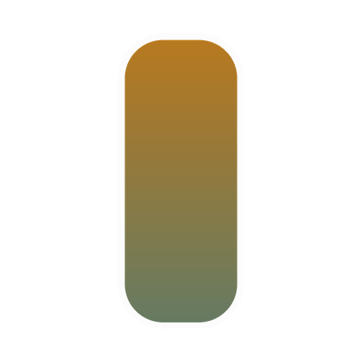
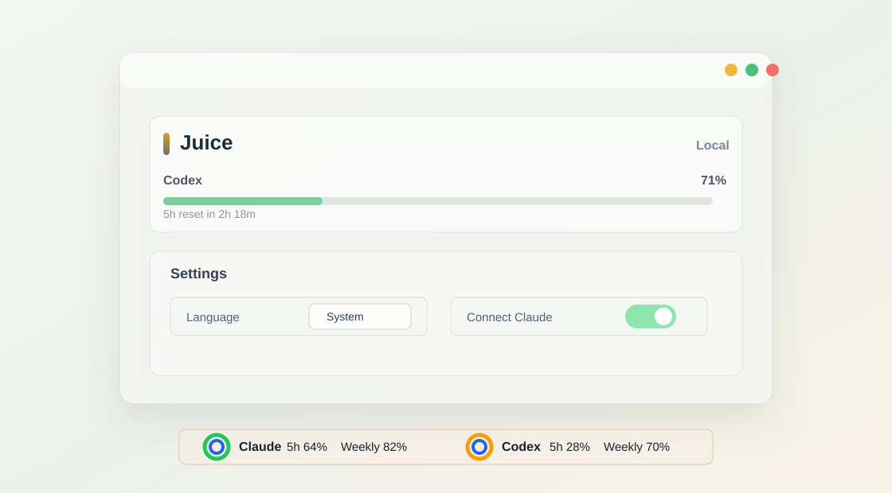

# Juice



Windows 11용 로컬 Claude/Codex 사용량 모니터입니다. Juice는 Claude Code와 Codex가 이 PC에 남기는 로컬 상태를 읽어 작업표시줄 위의 작은 bar와 설정 패널에 5시간/주간 한도 잔여량을 표시합니다.



## 한국어

### 핵심 개념

Juice v1은 단일 PC 로컬 모니터입니다. 계정 서버, 클라우드 동기화, 원격 PC 조회 기능이 없으며 LLM API 키도 사용하지 않습니다. 다른 PC에서 보려면 그 PC에도 Juice를 설치하고 Claude/Codex 로컬 수집을 별도로 완료해야 합니다.

표시되는 퍼센트는 공식 구독 한도 API가 아니라 로컬에서 관측한 Claude statusline JSON과 Codex session JSONL 기반 근사치입니다.

### 설치

1. [Releases](https://github.com/Lv2dev/agent-juice/releases)에서 최신 `Juice_*_x64-setup.exe`를 받습니다.
2. 설치 후 Windows tray의 Juice 아이콘을 클릭해 설정창을 엽니다.
3. Claude는 설치본 실행 시 자동 연결을 시도합니다. 표시되지 않으면 설정의 `Claude 연결`로 다시 연결한 뒤, 이 PC에서 Claude Code를 한 번 사용합니다.
4. Codex를 표시하려면 이 PC에서 Codex를 한 번 사용합니다.

### 사용법

- 작업표시줄 bar는 Claude와 Codex의 5h/주간 잔여량을 보여줍니다.
- bar는 도구별로 독립적으로 드래그해 위치를 조정할 수 있습니다.
- tray 메뉴에서 bar 표출을 일시중지하거나 재개할 수 있습니다.
- 설정에서 한국어/영어/시스템 언어, 테마, 폰트, 표시 도구, bar 모드, 링/바 세부값을 바꿀 수 있습니다.
- 전체화면 앱에서 bar를 숨기는 옵션은 기본으로 켜져 있습니다.

### 다른 PC에서 값이 안 보일 때

Juice는 로컬 전용이라 PC 간 데이터를 공유하지 않습니다. 다른 PC에서는 다음을 다시 해야 합니다.

1. 그 PC에 Juice 설치
2. 그 PC에서 Claude Code 로그인 확인
3. Juice가 자동 연결을 시도합니다. 실패했거나 값이 비어 있으면 설정창에서 `Claude 연결` 클릭
4. Claude Code를 한 번 실행해 statusline forward 파일 생성
5. Codex도 그 PC에서 한 번 사용해 session 파일 생성

한 PC의 사용량을 다른 PC에서 보는 기능은 추후 Supabase 기반 다중 PC 버전 범위입니다.

### 문제 해결

- Claude가 비어 있음: 설치본을 다시 실행하거나 `Claude 연결`을 누른 뒤 Claude Code를 한 번 사용하세요.
- Codex가 비어 있음: Codex를 이 PC에서 한 번 사용해야 `~/.codex/sessions` 데이터가 생깁니다.
- 설정창을 최소화한 뒤 안 보임: tray 아이콘을 다시 클릭하세요. 최신 main에는 최소화 복원 경로가 보강되어 있습니다.
- 값이 대시로 보임: 해당 도구가 아직 rate limit 정보를 내보내지 않았거나 오래된 세션일 수 있습니다.

### 개발

```powershell
npm install
npm run tauri -- build
node --test src\*.test.mjs
cargo test --manifest-path src-tauri\Cargo.toml
```

릴리즈 전에는 installer SHA256과 release note를 작성한 뒤 사용자 승인을 받아야 합니다.

## English

### What It Is

Juice is a Windows 11 local usage monitor for Claude Code and Codex. It reads local status files on the current PC and shows remaining 5-hour and weekly usage in a taskbar-aligned bar and a compact settings panel.

Juice v1 is local-only. It does not sync across PCs, does not use a backend account, and does not store LLM API keys. To use Juice on another PC, install it there and let Claude/Codex emit local data on that PC too.

The percentages are local approximations based on Claude statusline JSON and Codex session JSONL, not an official subscription-limit API.

### Install

1. Download the latest `Juice_*_x64-setup.exe` from [Releases](https://github.com/Lv2dev/agent-juice/releases).
2. Install it, then click the Juice tray icon to open Settings.
3. For Claude, the installed app attempts to connect automatically. If Claude remains empty, click `Connect Claude`, then use Claude Code once on this PC.
4. For Codex, use Codex once on this PC.

### Usage

- The taskbar bar shows remaining 5h and weekly usage for Claude and Codex.
- Each tool bar can be dragged independently.
- The tray menu can pause or resume the taskbar bar.
- Settings include Korean/English/system language, theme, font, visible tools, bar mode, and ring/bar details.
- Hiding the bar in fullscreen apps is enabled by default.

### If Another PC Shows No Data

Juice does not share data between PCs in v1. On every PC, repeat the local setup:

1. Install Juice on that PC.
2. Confirm Claude Code is logged in on that PC.
3. Juice attempts to connect automatically. If it fails or stays empty, click `Connect Claude` in Juice Settings.
4. Use Claude Code once so Juice receives statusline data.
5. Use Codex once so Juice can read local session data.

Viewing one PC's usage from another PC is planned for a later multi-PC Supabase version.

### Troubleshooting

- Claude is empty: restart the installed app or click `Connect Claude`, then use Claude Code once.
- Codex is empty: use Codex once on the same PC so `~/.codex/sessions` exists.
- The settings panel was minimized: click the tray icon again. The current main branch restores minimized panels before focusing them.
- Values show dashes: the tool may not have emitted rate-limit data yet, or the session may be stale.

### Development

```powershell
npm install
npm run tauri -- build
node --test src\*.test.mjs
cargo test --manifest-path src-tauri\Cargo.toml
```

Before every release, prepare the installer SHA256 and bilingual release notes, then get explicit user approval.
