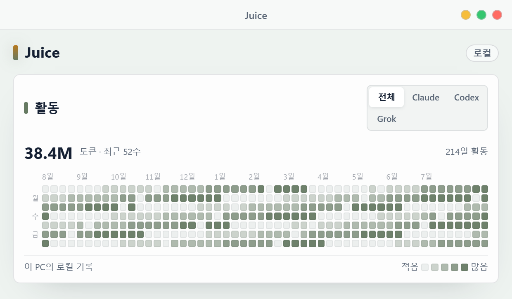
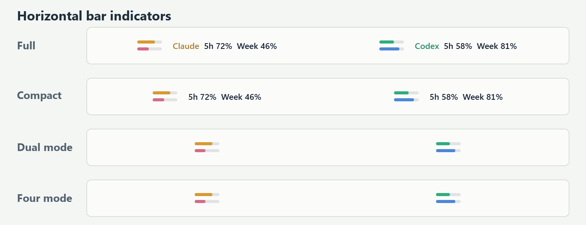

  

  <strong>Claude Code, Codex, Grok Build, Cursor의 잔여량 또는 사용량을 Windows 작업표시줄에서 바로 확인하세요.</strong> 
  기존 로컬 로그인을 사용하는 Windows 11용 경량 사용량 모니터입니다.

  <a href="https://github.com/Lv2dev/agent-juice/releases/latest">최신 릴리즈</a>
  ·
  <a href="https://github.com/Lv2dev/agent-juice/actions/workflows/windows-ci.yml">Windows CI</a>

  

현재 Tauri WebView를 2배 해상도로 직접 렌더링했습니다. 값과 PC 이름은 문서용 샘플입니다.

<a href="#한국어">한국어</a> · <a href="#english">English</a>

## 한국어

### 무엇을 보여주나요?

Juice는 현재 PC에 로그인된 Claude Code의 **5시간/주간 한도**, Codex 계정이 현재 제공하는 **5시간·주간 한도**, Grok Build의 **현재 주간 또는 월간 한도**, Cursor의 **Cursor Models/Other Models 월간 풀**을 읽어 작업표시줄과 설정 패널에 표시합니다. Codex처럼 계정에 한 기간만 존재하면 빈 기간을 만들지 않고 실제 한도만 표시합니다. 잔여량과 사용량 중 원하는 표시 기준을 고를 수 있으며, 별도 Juice 계정, 클라우드 서버, LLM API 키가 필요하지 않습니다.

| 기능 | 동작 |
| --- | --- |
| 잔여량·사용량 선택 | 게이지, 숫자, 임계값을 모두 잔여량 또는 사용량 중 하나의 기준으로 표시합니다. |
| 로컬 로그인 기반 수집 | 현재 PC의 Claude Code 로그인/statusline, 자동 탐색한 Codex Desktop 또는 CLI의 persistent app-server와 rollout, Grok Build 공식 ACP, Cursor GUI 또는 Agent CLI 로그인을 사용합니다. |
| 로그인 상태 안내 | 명시적인 인증 실패가 확인되면 오래된 값을 현재값처럼 표시하지 않고 해당 카드와 바에 `로그인 필요`를 표시합니다. 네트워크·timeout·형식 오류와는 구분합니다. |
| 토큰 활동 | Claude·Grok의 현재 PC 로컬 기록과 Codex·Cursor 계정의 공식 token activity를 일별로 집계해 최근 4~52주 히트맵으로 표시합니다. |
| 실시간 설정 | 저장 버튼 없이 변경 사항이 즉시 저장되고 작업표시줄에 반영됩니다. |
| 도구별 색상 | Claude와 Codex가 제공하는 5h/주간, Grok의 주간/월간, Cursor의 두 월간 풀 기본색과 경고·위험색을 지정합니다. |
| 표현 스타일 | 플랫, 소프트 그림자, 입체, 글로우, 숨쉬기 효과를 원과 가로 바에 공통 적용합니다. |
| 표시기 배경 | 원과 가로 바의 미사용 영역에 같은 테마 적응색과 농도를 적용하며, 색상과 농도를 직접 바꿀 수 있습니다. |
| 도구별 독립 바 | 네 도구를 각각 활성화하거나 끌 수 있습니다. 끄면 해당 바와 사용량 수집이 함께 중단되며, 위치와 모니터는 따로 지정할 수 있습니다. Grok과 Cursor는 기존 사용자를 위해 기본 OFF입니다. |
| 화면 방해 최소화 | 전체화면 또는 최대화 앱에서 숨김, 트레이 일시중지, 우클릭 강제 새로고침을 지원합니다. |
| 원클릭 업데이트 | 하루 한 번 최신 정식 릴리즈를 확인하고, 사용자가 승인하면 서명을 검증한 설치 파일을 내려받아 업데이트 후 재시작합니다. |

### 데이터는 어디서 가져오나요?

| 도구 | 우선 수집원 | 보조 수집원 | 표시 정확도 |
| --- | --- | --- | --- |
| Claude | Claude Code 로컬 로그인의 OAuth usage 조회 | statusline `rate_limits`, 구버전 `/usage` fallback | OAuth 조회는 계정 한도이며, statusline과 fallback 일부 값은 근사치일 수 있습니다. |
| Codex | 자동 탐색한 Codex Desktop 또는 CLI의 공식 app-server `account/rateLimits/read` | `~/.codex/sessions`의 최신 rollout JSONL | 한 번 연결한 app-server를 재사용해 현재 한도를 정확값으로 표시하며, rollout fallback은 근사치입니다. |
| Grok Build | 공식 ACP `_x.ai/billing` | 없음 | ACP가 반환한 현재 단일 주간/월간 크레딧 period를 정확값으로 표시합니다. 세션·프롬프트·모델 호출은 만들지 않습니다. |
| Cursor | Cursor GUI 또는 Agent CLI 로컬 credential로 Dashboard usage 조회 | credential이 없는 구버전 Agent의 bounded `/usage` | 같은 계정의 Auto/API 월간 풀을 정확값으로 표시하며 어느 경로도 모델 프롬프트를 보내지 않습니다. |

Juice는 각 도구의 기존 로컬 로그인 상태를 사용하며 계정 토큰을 별도로 입력받지 않습니다. 도구를 끄면 해당 수집도 중단됩니다. Claude 계정 자동 수집은 Claude가 활성화된 동안 기본으로 켜져 있으며 별도로 끌 수 있고, Grok과 Cursor는 표시줄 탭에서 처음 켠 뒤 자동 수집됩니다. Codex의 한도와 활동 조회는 하나의 persistent stdio connection을 공유합니다.

### 토큰 활동

  

문서용 샘플 데이터입니다. 전체·Claude·Codex·Grok·Cursor를 따로 볼 수 있으며 Codex와 Cursor는 계정 범위입니다.

- 설정창의 사용량 카드 아래에서 `전체 / Claude / Codex / Grok / Cursor` 필터와 날짜별 토큰 활동을 확인할 수 있습니다. 비활성화한 도구의 필터는 숨겨집니다.
- 한 칸은 날짜 하나이며 표시 기간은 4~52주입니다. Claude·Grok과 Cursor event는 Windows 현지 날짜를 사용하고, Codex는 공식 account bucket의 `startDate`를 timezone 추정 없이 그대로 사용합니다. 농도는 기간 내 활동에 맞춘 자동 로그 스케일 또는 사용자가 지정한 단계당 토큰 수를 사용합니다.
- 최초 조회에서는 최근 1년 기록을 백그라운드로 채우고 이후에는 변경분만 갱신합니다. 큰 이력은 카드에 `과거 기록 수집 중`으로 표시됩니다.
- Claude·Grok은 현재 PC의 로컬 기록입니다. Codex는 공식 `account/usage/read`의 계정 전체 daily bucket을 `Codex 계정 사용량`으로, Cursor는 GUI·Agent CLI·Cloud Agent·다른 PC를 포함한 account event를 `Cursor 계정 사용량`으로 구분합니다.
- Codex 공식 bucket이 없거나 일관성 검증에 실패하면 과대 집계되는 rollout 추정치를 대신 표시하지 않고 일부 기록 상태로 비웁니다.
- local activity index와 Cursor account cache는 현재 PC에 원자적으로 저장됩니다. Codex account bucket은 프로세스 메모리에서만 사용하며 어떤 활동 데이터도 Juice 서버로 업로드하지 않습니다.

### 작업표시줄 표시

  

  

같은 4개 모드를 원 대신 위아래 두 줄의 가로 바로 표시합니다. 이중원과 링4는 가로 바를 선택하면 같은 2줄 압축 표시를 사용합니다.

Juice에는 **4가지 바 모드**가 있습니다.

| 모드 | 구성 |
| --- | --- |
| 넉넉 | 도구명, 링, 사용 가능한 한도 값과 리셋까지 남은 시간을 표시합니다. 리셋 시간은 설정에서 끌 수 있습니다. |
| 컴팩트 | 도구명을 줄이고 사용 가능한 한도 값을 중심으로 표시합니다. |
| 이중원 | Claude의 5h/주간, Codex에 현재 존재하는 최대 두 한도, Cursor의 두 월간 풀을 겹치지 않는 원으로 압축하며 한도 하나만 있으면 단일 원을 사용합니다. |
| 링4 | 각 한도를 독립된 단일 링으로 표시하며 Cursor는 두 링, Grok은 실제 period 하나만 만듭니다. |

- 원 대신 위아래 두 줄의 가로 바로 바꿀 수 있습니다.
- 두 기간이 모두 있을 때 5h/주간 표시 순서와 링 숫자, 숫자 윤곽, 링 크기·두께·간격 및 실제 중앙 공간 지름을 0.1px 단위로 조절할 수 있습니다.
- Claude·Codex·Grok·Cursor 바는 서로 다른 투명 창입니다. 각각 직접 드래그하며 현재 연결된 모니터 조합별로 위치가 저장됩니다.
- 최초 실행에서는 표시 중인 바를 작업표시줄 왼쪽부터 서로 겹치지 않게 배치합니다.
- 숨겨 둔 도구를 나중에 켜면 기존 바를 움직이지 않고 작업표시줄의 첫 빈 위치에 배치합니다.
- 기본으로 켜진 `바 겹침 자동 방지`는 값이나 리셋 문구가 길어질 때 같은 작업표시줄의 뒤쪽 바만 임시로 밀어냅니다. 사용자가 저장한 위치와 간격은 바뀌지 않으며 내용이 짧아지면 원래 배치로 돌아갑니다.
- 재부팅이나 첫 실행의 최초 수집 중에는 `로딩 중`을 표시합니다. 지난 리셋 시간이 남아 있고 새 한도를 아직 받지 못한 경우에는 `갱신 대기`로 구분합니다.
- Windows가 잠기거나 모든 디스플레이가 꺼지면 자동 주기 수집을 쉬고, 잠금 해제 또는 화면 ON 시 즉시 한 번 갱신합니다. 사용자가 누른 수동 새로고침은 그대로 동작합니다.
- 바에 마우스를 올리면 도구명과 실제로 존재하는 5h·주간·월간 한도의 초기화까지 남은 시간을 보여줍니다.
- 바 우클릭 메뉴의 `새로고침`은 일반 캐시를 우회해 로컬 수집을 다시 실행합니다.
- 트레이 메뉴에서 전체 바 표출을 일시중지하거나 재개할 수 있습니다.

### 보조 모니터로 이동

  

이동 흐름을 알아보기 쉽게 만든 합성 데모입니다. 실제 바 구조와 모니터별 위치 저장 동작을 기준으로 제작했습니다.

Claude·Codex·Grok·Cursor는 서로 다른 투명 창이므로 하나만 잡아 다른 모니터의 작업표시줄로 옮길 수 있습니다. 기본으로 켜진 **화면 조합별 프로필**은 현재 연결된 모니터 구성을 구분해 도구별 대상 모니터와 작업표시줄 상대 위치를 따로 저장합니다. **표시 구성과 크기·간격 기억**도 기본으로 켜져 있어 노트북 단독, 집, 사무실 조합마다 넉넉/컴팩트/이중원/링4, 원/가로 바, 표현, 링·글자 크기와 간격을 복원합니다.

- 최근 사용한 모니터 조합을 최대 16개까지 유지합니다.
- 모니터 연결이 바뀌는 동안의 일시적인 구성은 저장하지 않아 기존 배치를 보호합니다.
- **색상도 기억**은 별도 옵션이며 기본값은 꺼짐입니다. 켜면 팔레트와 도구·기간·글자·트랙 색상도 조합별로 복원합니다.
- 앱 테마, 언어, 수집주기, 임계값, 도구 활성화와 로그인·수집 상태는 화면 조합과 무관하게 유지됩니다.
- 설정의 **프로필 초기화**는 저장된 조합만 지우며 현재 화면의 바 위치와 표시 설정은 그대로 유지합니다.

### 원·바 표현 스타일

  

원과 위아래 가로 바는 같은 표현 스타일을 공유합니다.
미사용 영역도 하나의 배경 설정을 공유합니다. 기본은 기존 가로 바와 같은 테마 적응색·농도 11%이며, `테마 색상 사용`을 끄면 배경색과 0~100% 농도를 직접 지정할 수 있습니다.

| 스타일 | 표현 |
| --- | --- |
| 플랫 | 그림자와 애니메이션이 없는 기본 스타일입니다. 기존 설치도 플랫을 유지합니다. |
| 소프트 그림자 | 본체 뒤에 낮은 그림자를 더합니다. |
| 입체 | 위쪽 하이라이트와 아래쪽 음영으로 깊이를 만듭니다. |
| 글로우 | 현재 팔레트 색상의 얕은 후광을 표시합니다. |
| 숨쉬기 | 값과 글자는 고정하고 후면 효과의 투명도만 천천히 변화시킵니다. |

숨쉬기는 정상 수집 상태에서만 움직입니다. 값이 없거나 오래된 경우 정지하며, Windows에서 모션 감소를 사용하면 정적인 소프트 효과로 자동 대체됩니다. 모든 효과는 숫자와 기본 stroke 뒤에 렌더링되므로 바 위치나 크기를 흔들지 않습니다.

### 테마·팔레트·도구별 색상

  

- 기본 테마는 Windows 시스템 설정을 따르며 라이트와 다크를 직접 고정할 수 있습니다.
- 9개 팔레트 중 `도구별`을 선택하면 Claude와 Codex가 제공하는 5h/주간, Grok 주간/월간, Cursor Models/Other Models 기본색을 각각 지정할 수 있습니다.
- 공통 경고색과 위험색도 직접 지정하며, `경고 시 색상 변경`과 `위험 시 색상 변경`을 서로 독립적으로 켜거나 끌 수 있습니다.
- 위험 색상 변경만 끄면 위험 구간에서도 경고색을 유지하고, 두 변경을 모두 끄면 모든 구간에서 도구별 기본색을 유지합니다. 색상과 토글은 즉시 저장되어 모든 원·바 모드에 적용됩니다.

### 설정 구성

  

설정 카드는 기능별 5개 탭으로 나뉘며 업데이트와 정보는 별도 카드로 분리됩니다.

| 탭·카드 | 설정할 수 있는 항목 |
| --- | --- |
| 기본 | 시스템/라이트/다크 테마, 시스템/한국어/영어, Windows/Pretendard 폰트, Windows 자동 시작 |
| 수집 | 잔여량/사용량 기준, 경고·위험 임계값, 수집주기, 오래됨 기준, Claude 계정 자동 수집, 토큰 활동 기간·농도 |
| 표시줄 | 4개 바 모드, 한도 순서, 원/가로 바 표시, 겹침 자동 방지, 화면 조합별 위치·표시 구성·크기·간격 프로필과 선택적 색상 기억, 전체화면·최대화 숨김, 도구별 표시·수집 활성화 |
| 색상 | 9개 팔레트, 네 도구·기간별 기본 8색, 경고·위험색과 단계별 토글, 이름·정보·링 숫자 글자색 |
| 세부 | 표현 스타일, 공용 표시기 배경색·농도, 링·숫자·윤곽, 크기·두께·간격·폰트 조절 |
| 업데이트 카드 | 업데이트 자동 확인, 수동 확인, 서명 검증 업데이트·재시작, 릴리즈 페이지 fallback, 최근 확인 결과 |
| 정보 카드 | 프로그램 설명, 현재 버전, 로컬 처리 원칙 |

### 업데이트 확인과 알림

  

- 기본값은 켜짐이며 시작 15초 후, 마지막 성공 확인에서 24시간이 지난 경우에만 최신 정식 GitHub Release를 확인합니다.
- 새 버전은 버전당 한 번 Windows 알림으로 안내하고 설정창에도 계속 확인 가능한 업데이트 띠를 표시합니다.
- `업데이트 확인`은 24시간 캐시를 우회합니다. 자동 확인 실패는 조용히 넘어가고 수동 확인 실패만 설정창에 표시합니다.
- `업데이트 및 재시작`을 누르면 다운로드·서명 확인 진행 상태를 표시하며 공식 릴리즈의 설치 파일을 내려받고, 앱에 내장된 공개키와 설치 파일 버전을 검증한 뒤 passive 설치와 재시작을 수행합니다.
- 다운로드·서명·버전 검증 또는 업데이트 인계가 실패하면 현재 앱과 설정을 유지합니다. 설치가 끝나면 Juice가 설치된 버전을 다시 확인하고 앱을 재시작하며, 공식 Releases 페이지는 수동 설치가 필요한 경우를 위한 fallback으로 남습니다.
- 앱 내 업데이터가 없는 v0.1.10 이하에서는 v0.1.11을 한 번 수동 설치해야 하며, 이후 정식 버전부터 원클릭 업데이트를 사용할 수 있습니다.
- 확인 요청에는 GitHub token, Juice 계정, 사용량 데이터, 사용자 식별값, telemetry가 포함되지 않습니다.

### 정보와 로컬 처리 원칙

`정보` 카드는 현재 버전과 프로그램 역할, 로컬 처리 원칙만 보여줍니다. 업데이트 동작과 상태는 별도의 `업데이트` 카드에 모아 서로 섞이지 않습니다.

### Claude 계정 사용량 자동 수집

  

**Claude 계정 사용량 자동 수집**은 `수집` 탭의 일반 기능이며 기본값은 **켜짐**입니다.

- 옵션을 켜면 Claude Code가 관리하는 로컬 로그인을 사용해 계정의 5시간·주간 usage를 직접 조회합니다. Claude 채팅이나 모델 턴은 전송하지 않습니다.
- OAuth 토큰은 Claude Code 자격 증명 파일에서 호출 시점에만 읽고, 프로세스 인자나 로그에 기록하지 않습니다.
- 명시적인 인증 실패는 legacy CLI를 자동 실행하지 않고 `로그인 필요`로 표시합니다. endpoint 형식이 호환되지 않거나 사용자가 강제 새로고침한 경우에만 bounded `/usage` fallback을 사용할 수 있습니다.
- 정확 OAuth 계정 한도는 statusline의 오래된 계정 값보다 우선합니다. 구버전 `/usage` fallback은 비어 있는 값만 보충하며, endpoint 또는 CLI 형식이 바뀌면 기존 statusline 결과를 유지합니다.
- 기본 수집주기와 Claude 계정 조회 캐시는 모두 60초입니다.
- 표시줄 탭에서 Claude를 끄면 계정 조회와 statusline 수집이 모두 중단되고 기존 Claude statusline 설정이 복원됩니다. 다시 켜면 수집 연결을 자동 복구하고 즉시 새 값을 조회합니다.

### Grok Build 사용량 자동 수집

Grok은 기존 사용자에게 빈 세 번째 바가 갑자기 생기지 않도록 기본값이 **꺼짐**입니다. `표시줄` 탭에서 **Grok 활성화**를 켜면 바 표시, 한도 수집, 토큰 활동 집계가 함께 시작됩니다.

- Juice는 로그인된 Grok Build의 공식 ACP를 한 번 `initialize`한 뒤 persistent connection으로 `_x.ai/billing`만 재사용합니다. 새 대화나 세션, 프롬프트, 모델 턴을 만들지 않으므로 이 조회 자체로 모델 토큰을 소비하지 않습니다.
- ACP가 반환한 현재 period가 주간이면 `주간`, 월간이면 `월간` 한도 하나만 표시합니다. 존재하지 않는 5h 한도나 빈 두 번째 링은 만들지 않습니다.
- 토큰 활동은 현재 PC의 `~/.grok/sessions/**/updates.jsonl`에서 완료된 응답 usage를 읽습니다. 캐시 토큰은 포함하고 output에 포함된 reasoning token은 중복 가산하지 않습니다.
- Juice는 Grok `auth.json`을 직접 읽거나 저장하지 않습니다. 공식 실행 파일을 찾을 수 없거나 미로그인·구버전·timeout인 경우 Grok만 마지막 정상값 또는 빈 상태로 남고 Claude/Codex 수집은 계속됩니다.

### Cursor 사용량과 토큰 활동 자동 수집

Cursor는 기존 사용자에게 새 네 번째 바가 갑자기 생기지 않도록 기본값이 **꺼짐**입니다. `표시줄` 탭에서 **Cursor 활성화**를 켜면 두 월간 풀과 Cursor 계정 토큰 활동을 함께 수집합니다.

- Juice는 먼저 Cursor GUI `state.vscdb`의 필요한 `ItemTable` 키 두 개만 read-only snapshot으로 조회합니다. DB에 큰 `cursorDiskKV`가 있어 파일이 64MB 또는 1GB를 넘어도 전체 테이블을 메모리에 올리지 않습니다.
- GUI credential을 사용할 수 없으면 Cursor Agent CLI의 bounded `auth.json` access token과 `cli-config.json` userId를 사용해 같은 Dashboard usage를 조회합니다. refresh token은 사용하거나 보관하지 않습니다.
- Dashboard의 `Auto`는 **Cursor Models**, `API`는 **Other Models**로 표시합니다. GUI와 CLI는 같은 계정의 월간 풀 하나를 공유합니다.
- Dashboard credential이 없는 구버전 CLI 환경에서만 `%LOCALAPPDATA%\cursor-agent`의 provider-specific runtime을 검증한 뒤 숨은 Windows ConPTY `/usage`를 최후 fallback으로 사용합니다. 일반 `agent` 명령은 사용하지 않습니다.
- PTY fallback은 비어 있는 임시 HOME·workspace·data와 최소 시스템 환경변수만 사용해 hook, MCP, rule, workspace context 또는 다른 도구의 API key를 상속하지 않으며 종료 직후 제거됩니다.
- Dashboard reset은 정확한 시각으로, PTY fallback reset은 원본 월·일 정밀도로 표시합니다. 원천보다 정밀한 값을 임의로 만들지 않습니다.
- 조회는 모델 프롬프트나 새 대화를 만들지 않습니다. Cursor 프로세스 기동 비용을 줄이기 위해 자동 조회는 최소 5분 간격이며 바 우클릭 또는 트레이 새로고침은 즉시 강제 조회합니다.
- GUI/CLI credential은 regular-file, reparse, file identity와 개별 값 크기를 검증한 뒤 호출 시점에만 읽습니다. token·refresh token·raw response·email·conversation ID를 설정, cache, process argument, 로그에 기록하지 않습니다.
- 토큰 활동은 Cursor Dashboard의 account event에서 input/output/cache write/cache read를 합산하고 event 시각을 Windows 현지 날짜로 변환합니다. 현재 PC 전용이 아니라 같은 Cursor 계정 전체 범위입니다.
- private Cursor Dashboard 계약이 바뀌면 Cursor만 stale/partial 또는 로그인 필요 상태가 되며 Claude·Codex·Grok 수집은 계속됩니다.

### 설치와 첫 실행

1. [Releases](https://github.com/Lv2dev/agent-juice/releases/latest)에서 최신 `Juice_*_x64-setup.exe`를 받습니다.
2. 설치 후 Windows 트레이의 Juice 아이콘을 클릭해 설정창을 엽니다.
3. Claude가 활성화되어 있으면 Juice 설치본은 시작할 때 statusline 수집 연결을 비파괴·멱등으로 조정합니다.
4. Claude 자동 수집을 끈 경우 이 PC에서 Claude Code를 한 번 사용해 statusline 데이터를 생성합니다.
5. 이 PC의 Codex Desktop 또는 Codex CLI에 로그인합니다. Juice가 공식 runtime을 자동 탐색하고 하나의 persistent app-server connection으로 정확한 계정 한도와 활동량을 조회하며, rollout 기록은 장애 시 근사 fallback으로 사용합니다.
6. Grok Build를 사용한다면 로컬 로그인을 확인한 뒤 Juice의 표시줄 탭에서 Grok을 활성화합니다.
7. Cursor를 사용한다면 Cursor GUI 또는 Cursor Agent CLI에 로그인한 뒤 Juice의 표시줄 탭에서 Cursor를 활성화합니다.

### 주요 동작

- **트레이 아이콘:** Juice 아이콘 하나만 표시하며 설정창 열기, 바 일시중지/재개, 종료를 제공합니다.
- **테마:** 기본값은 시스템 테마이며 라이트와 다크를 직접 선택할 수 있습니다.
- **언어:** 시스템 언어를 따르거나 한국어/영어를 고정할 수 있습니다.
- **폰트:** Windows 작업표시줄과 맞춘 시스템 폰트가 기본이며 Pretendard를 선택할 수 있습니다.
- **팔레트:** 도구별, 신호등, 바다, 숲, 노을, 색각 보정, 오로라, 단색, 사용자 지정을 제공합니다. 도구별은 네 도구·기간별 여덟 기본색과 경고·위험색을 지정하고 단계별 전환을 따로 끌 수 있으며, 단색은 정상 상태를 한 색으로 통일합니다.
- **전체화면 숨김:** 신규 설치 기본값은 꺼짐입니다. 켜면 같은 모니터의 전체화면 앱을 감지할 때 해당 작업표시줄 바를 숨깁니다. 최대화 창 숨김은 별도 옵션입니다.
- **다중 모니터:** 각 바를 원하는 모니터 작업표시줄로 직접 끌어 놓으면 모니터와 상대 위치를 기억합니다.
- **오래됨 표시:** 마지막 기록이 설정한 시간보다 오래되면 값이 오래된 상태임을 표시합니다.
- **업데이트:** 최신 정식 릴리즈를 하루 한 번 확인하고, 사용자가 승인한 경우에만 서명 검증·설치·재시작을 진행합니다.

### 다른 PC에서 값이 안 보일 때

Juice v1은 별도 Juice 서버로 PC 간 데이터를 동기화하지 않습니다. 다른 PC에서는 그 PC에 Juice를 설치하고 사용할 Claude Code·Codex·Grok Build·Cursor의 로컬 로그인을 각각 확인해야 합니다. 단, Cursor 활동 필터는 Cursor 계정 자체가 제공하는 event라 같은 계정의 다른 PC·Cloud Agent 사용도 포함합니다.

1. Juice에서 Claude가 활성화되어 있는지 확인해 statusline 자동 연결과 수집을 시작합니다.
2. 기본 Claude 자동 수집을 유지하거나 Claude Code를 한 번 사용해 statusline forward 파일을 생성합니다.
3. Codex Desktop 또는 Codex CLI 로그인을 확인합니다. Juice는 둘 중 사용 가능한 공식 app-server runtime을 자동 탐색합니다.
4. exact 조회가 일시적으로 실패할 때 사용할 rollout JSONL은 해당 PC에서 Codex를 사용한 적이 있는 경우에만 생성됩니다.
5. Grok을 사용한다면 Grok Build 로그인을 확인하고 Juice에서 Grok을 활성화합니다.
6. Cursor를 사용한다면 Cursor GUI 또는 Cursor Agent CLI 로그인을 확인하고 Juice에서 Cursor를 활성화합니다.

한 PC의 사용량을 다른 PC에서 보는 기능은 후속 다중 PC 버전 범위입니다.

### 문제 해결

- **로그인 필요가 표시됨:** 해당 Claude Code·Codex Desktop/CLI·Grok Build·Cursor GUI/Agent에 다시 로그인한 뒤 Juice에서 강제 새로고침하세요. 다음 정상 수집에서 자동으로 해제됩니다.
- **Claude가 비어 있음:** 표시줄 탭에서 Claude가 활성화되어 있고 Claude 계정 자동 수집이 켜져 있는지 확인하거나, Juice를 다시 실행한 뒤 Claude Code를 한 번 사용하세요.
- **Codex가 비어 있음:** 현재 PC의 Codex Desktop 또는 CLI 설치·로그인을 확인하고 강제 새로고침하세요. Juice는 Desktop versioned runtime을 우선 탐색하고 CLI로 fallback합니다.
- **Grok이 비어 있음:** 표시줄 탭에서 Grok을 활성화하고 현재 PC의 Grok Build 설치·로그인을 확인하세요. Grok은 기본 OFF이며 공식 ACP billing을 사용할 수 있을 때 표시됩니다.
- **Cursor가 비어 있음:** 표시줄 탭에서 Cursor를 활성화하고 Cursor GUI 또는 Agent CLI 로그인을 확인한 뒤 강제 새로고침하세요. Juice는 GUI credential, CLI credential, bounded `/usage` 순서로 시도합니다.
- **값이 대시로 보임:** 해당 도구가 아직 한도 정보를 내보내지 않았거나 기록이 오래됐을 수 있습니다.
- **설정창을 최소화한 뒤 안 보임:** 트레이의 Juice 아이콘을 다시 클릭하세요.
- **바가 안 보임:** 전체화면/최대화 숨김, 트레이 일시중지, 도구별 표시 설정과 저장된 대상 모니터를 확인하세요.

### 개인정보와 한계

- Juice가 저장하는 설정과 수집 결과는 현재 PC에만 남으며 별도 Juice 서버로 전송하지 않습니다.
- Claude 계정 자동 수집은 로컬 Claude Code OAuth token을 Anthropic의 Claude usage endpoint에만 보내 계정 한도를 조회합니다.
- Grok 한도 수집은 로그인된 공식 Grok Build 실행 파일의 로컬 ACP만 호출하며 Juice가 Grok 인증 token이나 `auth.json`을 읽지 않습니다.
- Cursor 한도는 GUI 또는 Agent CLI의 local access token을 고정 Cursor Dashboard usage endpoint에만 전달합니다. refresh token은 사용·보관하지 않으며, credential 기반 조회가 불가능할 때만 Agent PTY `/usage`를 사용합니다.
- Cursor 토큰 활동은 같은 account Dashboard의 event를 읽으며 계정 전체 범위입니다. Juice는 날짜별 네 token component 합계만 local cache에 남기고 email·model·conversation/request ID와 raw response를 저장하지 않습니다.
- Codex 한도와 토큰 활동은 로그인된 공식 Desktop/CLI app-server의 persistent stdio connection으로 `account/rateLimits/read`와 `account/usage/read`를 직렬 조회합니다. 계정 token을 직접 읽지 않고 raw response도 저장하지 않습니다.
- 업데이트 확인은 고정된 GitHub `latest.json` 주소로 표준 HTTPS 요청만 전송합니다. 사용자가 설치를 승인하면 해당 manifest가 지정한 서명된 설치 파일만 내려받으며, 계정 token, 사용량, PC 식별값은 보내지 않습니다.
- LLM API 키나 Juice 전용 계정을 저장하지 않습니다.
- Claude OAuth usage endpoint는 Claude Code 내부 계약이라 향후 CLI 변경의 영향을 받을 수 있습니다. 실패하면 statusline과 구버전 `/usage` fallback만 유지합니다.
- 별도 Juice 로그인이나 외부 토큰 저장소는 사용하지 않습니다.
- Cursor Dashboard endpoint는 공개 개인용 API가 아닌 Cursor 내부 계약이므로 향후 변경될 수 있습니다. 실패는 Cursor에만 격리됩니다.

---

## English

### What does Juice show?

Juice reads Claude Code's **5-hour and weekly limits**, whichever **5-hour or weekly windows the Codex account currently provides**, the **current weekly or monthly limit** from Grok Build, and the **Cursor Models/Other Models monthly pools** from Cursor. When Codex exposes only one window, Juice renders that real limit without an empty placeholder. It displays either remaining or used percentages in the Windows taskbar and a compact settings panel, with no Juice account, cloud backend, or LLM API key.

| Feature | Behavior |
| --- | --- |
| Remaining or used values | Uses one selected basis across gauges, numbers, and thresholds. |
| Local-login collection | Uses the local Claude Code login/statusline, an auto-detected Codex Desktop or CLI persistent app-server plus rollout data, official Grok Build ACP, and an existing Cursor GUI or Agent CLI login. |
| Sign-in status | When an explicit authentication failure is confirmed, Juice shows `Sign in required` on that card and bar instead of presenting stale values as current. Network, timeout, and format errors remain distinct. |
| Token activity | Aggregates local Claude/Grok records and official Codex/Cursor account activity by date for a 4 to 52 week heatmap. |
| Live settings | Changes are saved and applied without a Save button. |
| Per-tool colors | Assign separate base colors to the Claude and Codex 5-hour/weekly windows they provide, Grok weekly/monthly, and Cursor's two monthly pools, with customizable warning and danger colors. |
| Visual styles | Applies Flat, Soft shadow, Depth, Glow, or Breathe to rings and horizontal bars. |
| Indicator background | Uses one theme-adaptive color and opacity for unused ring and bar areas, with optional custom color and opacity. |
| Independent tool bars | All four tools can be enabled independently. Disabling one stops both its bar and collection; each bar can be moved and assigned to a monitor separately. Grok and Cursor default to off for existing users. |
| Low-interruption behavior | Supports fullscreen/maximized hiding, tray pause/resume, and force refresh from the context menu. |
| One-click updates | Checks the latest stable release once a day and, after user approval, downloads a signed installer, verifies it, updates Juice, and restarts. |

### Where does the data come from?

| Tool | Preferred source | Fallback source | Accuracy |
| --- | --- | --- | --- |
| Claude | OAuth usage lookup through the local Claude Code login | statusline `rate_limits`, then legacy `/usage` fallback | OAuth values are account limits; some statusline and fallback values may be approximate. |
| Codex | Official `account/rateLimits/read` through an auto-detected Codex Desktop or CLI app-server | Latest rollout JSONL under `~/.codex/sessions` | Reuses one app-server connection for exact current limits; rollout fallback is approximate. |
| Grok Build | Official ACP `_x.ai/billing` | None | Shows the exact current single weekly/monthly credit period returned by ACP without creating a session, prompt, or model call. |
| Cursor | Dashboard usage through local Cursor GUI or Agent CLI credentials | Bounded `/usage` for legacy Agents without usable credentials | Shows the same account Auto/API monthly pools without sending a model prompt. |

Juice reuses each tool's existing local login and never asks you to enter account tokens. Disabling a tool also stops its collection. Claude account auto-collection is on by default while Claude is enabled and can be disabled separately; Grok and Cursor start collecting after you first enable them in the Taskbar tab. Codex limit and activity requests share one persistent stdio connection.

### Token activity

  

Documentation sample data. All, Claude, Codex, Grok, and Cursor views are available; Codex and Cursor use account scope.

- The card below the usage summaries provides `All / Claude / Codex / Grok / Cursor` filters and daily token activity. Filters for disabled tools stay hidden.
- Each cell is one date. Claude/Grok and Cursor events use the Windows local date, while Codex preserves the official account bucket `startDate` without guessing its timezone boundary. Choose a 4 to 52 week range and either an automatic logarithmic intensity scale or a custom token count per level.
- On first view, Juice backfills up to one year in the background and then refreshes only changing ranges. Large histories show `Collecting past records` while backfill continues.
- Claude and Grok use records from this PC. Codex uses official account-wide `account/usage/read` daily buckets labeled `Codex account usage`; Cursor uses account events across Cursor GUI, Agent CLI, Cloud Agents, automations, and other PCs labeled `Cursor account usage`.
- If official Codex buckets are unavailable or fail consistency checks, Juice shows a partial empty Codex view instead of falling back to the overcounted rollout estimate.
- The local activity index and Cursor account cache are stored atomically on this PC. Codex account buckets remain process-memory only, and no activity data is uploaded to a Juice server.

### Taskbar display

  

  

The same four modes use two stacked horizontal bars instead of rings. Dual ring and Four rings use the same compact two-line indicator when bars are selected.

Juice provides **four bar modes**.

| Mode | Layout |
| --- | --- |
| Full | Shows the tool name, ring, every available limit, and time remaining until reset. Reset times can be disabled in Settings. |
| Compact | Hides the tool name and prioritizes the available limit values. |
| Dual ring | Compresses Claude's 5-hour/weekly limits, up to two currently available Codex windows, and Cursor's two monthly pools; a provider with one real limit uses one ring. |
| Four rings | Uses one standalone ring per real limit, so Cursor creates two while Grok creates only one. |

- Switch from rings to two stacked horizontal bars.
- When both periods exist, adjust their order along with numbers, number outline, ring size, thickness, spacing, and the real center opening in 0.1px steps.
- Claude, Codex, Grok, and Cursor use separate transparent windows, so each can be dragged independently and remembered for the current monitor setup.
- On first launch, visible bars are placed from the left edge of the taskbar without overlapping.
- Enabling a previously hidden tool places it in the first free taskbar position without moving existing bars.
- `Prevent bar overlap` is enabled by default. When values or reset text grow, Juice temporarily moves only the trailing bar on the same taskbar. Saved positions and spacing remain unchanged, and the original layout returns when content shrinks.
- During the first collection after startup or reboot, the bar shows `Loading`. If a stored reset time has passed but a new limit has not arrived yet, it shows `Waiting for refresh`.
- Automatic polling pauses while Windows is locked or every display is off, then refreshes once immediately after unlock or display-on. Explicit manual refresh remains available.
- Hovering a bar shows the tool name and time remaining until each available 5-hour, weekly, or monthly limit resets.
- The taskbar context menu `Refresh` action bypasses the normal cache and recollects local status.
- Pause or resume all taskbar bars from the Juice tray menu.

### Move to another monitor

  

This synthetic demo makes the movement easy to follow. It reflects the real bar structure and per-monitor position persistence.

Claude, Codex, Grok, and Cursor are separate transparent windows, so any one bar can be dragged to another monitor's taskbar without moving the others. **Profiles by monitor setup** stores each tool's target monitor and relative taskbar position for every connected-monitor setup. **Remember presentation, size, and spacing** is also on by default, restoring Full/Compact/Dual/Quad, rings or horizontal bars, effects, ring and text sizes, and spacing for familiar laptop-only, home, or office setups.

- Juice keeps up to 16 recently used monitor setups.
- Transient configurations observed while monitors are connecting are not saved over a stable layout.
- **Remember colors too** is a separate opt-in setting. It restores palette and tool, period, text, and track colors per setup.
- App theme, language, collection interval, thresholds, tool activation, and provider login or collection state remain global.
- **Reset profiles** clears saved setups without changing the bars or presentation currently on screen.

### Ring and bar visual styles

  

Rings and stacked horizontal bars share one visual style.
Their unused areas also share one background setting. It defaults to the previous horizontal-bar appearance with a theme-adaptive color at 11% opacity. Turn off `Use theme color` to choose a custom background color and 0–100% opacity.

| Style | Appearance |
| --- | --- |
| Flat | The default with no shadow or animation. Existing installs remain Flat. |
| Soft shadow | Adds a restrained shadow behind the primary stroke. |
| Depth | Combines an upper highlight with lower shading. |
| Glow | Adds a shallow halo using the current palette color. |
| Breathe | Keeps geometry and text fixed while slowly changing only the rear effect opacity. |

Breathe runs only for live data. It stops for empty or stale values and becomes a static soft effect when Windows reduced motion is enabled. Effects render behind the crisp stroke and numbers, so they never resize or move the taskbar bar.

### Theme, palettes, and per-tool colors

  

- The default theme follows Windows, with explicit light and dark overrides.
- With the `Per tool` palette, the available Claude and Codex 5-hour/weekly windows, Grok weekly/monthly, and Cursor Models/Other Models base colors can be assigned independently.
- Shared warning and danger colors are customizable, and `Recolor on warning` and `Recolor on danger` can be toggled independently.
- Disabling only danger recoloring keeps the warning color in the danger range; disabling both keeps each per-tool base color throughout. Colors and toggles save immediately and apply to every ring and bar mode.

### Settings layout

  

The settings card is split into five task-focused tabs. Updates and About remain separate cards.

| Tab or card | Controls |
| --- | --- |
| General | System/light/dark theme, system/Korean/English language, Windows/Pretendard font, Windows autostart |
| Collection | Remaining/usage basis, warning/danger thresholds, collection interval, stale threshold, Claude account collection, token activity range and intensity |
| Taskbar | Four modes, limit order, ring/horizontal-bar display, overlap prevention, monitor-setup profiles for position, presentation, size, spacing, and optional colors, fullscreen/maximized hiding, per-tool display and collection |
| Colors | Nine palettes, eight tool/period base colors, warning/danger colors and toggles, name/info/ring-number text colors |
| Details | Visual style, shared indicator background and opacity, ring/numbers/outline, size, thickness, spacing, and typography |
| Updates card | Automatic and manual checks, signed update and restart, Releases fallback, and the latest check result |
| About card | Product description, current version, and local-processing policy |

### Update checks and notifications

  

- Enabled by default. Juice checks the latest stable GitHub Release 15 seconds after startup only when 24 hours have passed since the last successful check.
- A new version produces one Windows notification per version and a persistent update band in Settings.
- `Check for updates` bypasses the 24-hour cache. Automatic failures stay quiet; manual failures are shown in Settings.
- `Update and restart` shows download and signature-verification progress, fetches the installer from the official release, verifies its signature and embedded product version, and then performs a passive install and restart.
- If download, signature, version validation, or updater handoff fails, the current app and settings remain intact. After installation, Juice verifies the installed version again and restarts the app; the official Releases page remains available as a manual-install fallback.
- Versions up to v0.1.10 do not contain the in-app updater, so v0.1.11 must be installed manually once. Later stable releases can then use one-click updates.
- Requests include no GitHub token, Juice account, usage data, user identifier, or telemetry.

### About and local processing

The `About` card contains only the current version, product purpose, and local-processing policy. Update behavior and status live in the separate `Updates` card.

### Automatic Claude account usage collection

  

**Claude account usage auto-collection** is a regular option in the `Collection` tab and is **on by default**.

- When enabled, Juice uses the local Claude Code login to read the account 5-hour and weekly usage directly. It sends no Claude chat or model turn.
- OAuth tokens are read only at request time from Claude Code credentials and are never placed in process arguments or logs.
- Explicit authentication failures show `Sign in required` without automatically starting the legacy CLI. A bounded `/usage` fallback remains only for incompatible endpoint formats or a user-forced refresh.
- Exact OAuth account limits take priority over stale statusline account values. Legacy `/usage` only fills missing values; if the endpoint or CLI format changes, Juice keeps the statusline result.
- The default collection interval and Claude account cache are both 60 seconds.
- Disabling Claude in the Taskbar tab stops account and statusline collection and restores the previous Claude statusline configuration. Enabling it reconnects collection and requests fresh data immediately.

### Automatic Grok Build usage collection

Grok defaults to **off** so existing users do not suddenly receive an empty third bar. Enabling **Grok** in the `Taskbar` tab starts its bar, limit collection, and token activity together.

- Juice initializes the logged-in Grok Build official ACP once and reuses one persistent connection only for `_x.ai/billing`. It creates no conversation, session, prompt, or model turn, so the lookup itself consumes no model tokens.
- A weekly ACP period appears as one `Weekly` limit and a monthly period as one `Monthly` limit. Juice does not invent a 5-hour slot or render an empty second ring.
- Token activity comes from completed response usage under `~/.grok/sessions/**/updates.jsonl`. Cache tokens are included, while reasoning tokens already contained in output are not added twice.
- Juice never reads or stores Grok `auth.json`. If the official executable is unavailable, logged out, too old, malformed, or times out, only Grok remains on its last known or empty state; Claude and Codex collection continue.

### Automatic Cursor usage and token activity collection

Cursor defaults to **off** so existing users do not suddenly receive an empty fourth bar. Enabling **Cursor** in the `Taskbar` tab starts its two monthly pools and account token activity together.

- Juice first opens Cursor GUI `state.vscdb` as a read-only snapshot and queries only the two required `ItemTable` keys. Large unrelated `cursorDiskKV` content does not cause the whole database to be loaded or rejected, even when the file exceeds 64 MB or 1 GB.
- When GUI credentials are unavailable, Juice reads the bounded Cursor Agent CLI `auth.json` access token and `cli-config.json` userId and calls the same Dashboard usage endpoint. It never uses or retains the refresh token.
- Dashboard Auto maps to **Cursor Models** and API maps to **Other Models**. GUI and CLI share the same monthly account pools.
- Only legacy CLI environments without usable Dashboard credentials use hidden ConPTY `/usage` as the final fallback. Juice validates the provider-specific runtime and never invokes a generic `agent` command.
- PTY fallback uses empty temporary HOME, workspace, and data directories plus a minimal environment allowlist, so hooks, MCP, rules, workspace context, and unrelated API keys are not inherited.
- Dashboard resets retain their exact timestamp; PTY fallback resets retain their original month/day precision. Juice never invents precision absent from the source.
- The lookup creates no model prompt or new conversation. Automatic Cursor collection has a five-minute minimum cadence; taskbar or tray refresh forces an immediate lookup.
- GUI and CLI credential files are checked for regular-file identity, reparse points, and bounded individual values. Juice records no token, refresh token, raw response, email, or conversation ID in settings, cache, process arguments, or logs.
- Token activity sums input, output, cache-write, and cache-read values from Cursor account events and converts each event timestamp to the Windows local date. This is account-wide rather than current-PC-only.
- If the private Cursor Dashboard contract changes, only Cursor becomes stale/partial or requires sign-in; Claude, Codex, and Grok continue collecting.

### Install and first run

1. Download the latest `Juice_*_x64-setup.exe` from [Releases](https://github.com/Lv2dev/agent-juice/releases/latest).
2. Install it, then click the Juice tray icon to open Settings.
3. When Claude is enabled, the installed app non-destructively and idempotently reconciles its statusline collection at startup.
4. If Claude auto-collection is off, use Claude Code once on this PC so statusline data is emitted.
5. Sign in to Codex Desktop or the Codex CLI on this PC. Juice discovers the official runtime and uses one persistent app-server connection for exact account limits and activity; existing rollout records remain an approximate fallback.
6. If you use Grok Build, confirm its local login and then enable Grok in Juice's Taskbar tab.
7. If you use Cursor, sign in to Cursor GUI or Cursor Agent CLI and enable Cursor in Juice's Taskbar tab.

### Key behavior

- **Tray:** One Juice icon provides panel open, taskbar pause/resume, and quit actions.
- **Theme:** Follows the system by default, with explicit light and dark choices.
- **Language:** Follows the system or locks the UI to Korean or English.
- **Font:** Uses the Windows taskbar-style system font by default, with Pretendard available.
- **Palette:** Choose Per tool, Traffic, Ocean, Forest, Sunset, Color-blind safe, Aurora, Monochrome, or Custom. Per tool exposes eight tool/period base colors plus warning and danger colors with independent recolor toggles; Monochrome unifies normal values.
- **Fullscreen hiding:** Off by default on a new installation. When enabled, it hides each bar while a fullscreen app covers its target monitor. Maximized-window hiding is a separate option.
- **Multiple monitors:** Drag each bar onto a monitor's taskbar to remember that monitor and relative position.
- **Stale state:** Marks data as old after the configured time since the last record.
- **Updates:** Checks the latest stable release once a day and performs signature verification, installation, and restart only after user approval.

### If another PC shows no data

Juice v1 has no Juice server and does not synchronize its cache between PCs. Install Juice and verify the local Claude Code, Codex, Grok Build, and Cursor logins on every PC. The Cursor activity filter is the exception in scope: Cursor account events include other PCs and Cloud Agents on the same account.

1. Confirm that Claude is enabled in Juice so automatic statusline connection and collection can start.
2. Keep the default Claude auto-collection enabled or use Claude Code once to create statusline forward data.
3. Confirm a Codex Desktop or Codex CLI login. Juice automatically discovers either official app-server runtime.
4. Rollout JSONL fallback exists only after Codex has produced local records on that PC.
5. If you use Grok, confirm the Grok Build login and enable Grok in Juice.
6. If you use Cursor, sign in to Cursor GUI or Cursor Agent CLI, then enable Cursor in Juice.

Viewing one PC's usage from another PC belongs to a later multi-PC version.

### Troubleshooting

- **Sign in required is shown:** Sign in again to the affected Claude Code, Codex Desktop/CLI, Grok Build, or Cursor GUI/Agent account, then force a refresh in Juice. The state clears automatically after the next successful collection.
- **Claude is empty:** Confirm that Claude is enabled in the Taskbar tab and account auto-collection is on, or restart Juice and use Claude Code once.
- **Codex is empty:** Confirm the local Codex Desktop or CLI installation and login, then force a refresh. Juice prefers the Desktop versioned runtime and falls back to the CLI.
- **Grok is empty:** Enable Grok in the Taskbar tab and confirm the local Grok Build installation and login. Grok defaults to off and appears when official ACP billing is available.
- **Cursor is empty:** Enable Cursor in the Taskbar tab, confirm a Cursor GUI or Agent CLI login, then force a refresh. Juice tries GUI credentials, CLI credentials, and bounded `/usage` in that order.
- **Values are dashes:** The tool may not have emitted limit data yet, or the record may be stale.
- **The minimized panel is missing:** Click the Juice tray icon again.
- **The taskbar bar is missing:** Check fullscreen/maximized hiding, tray pause, per-tool visibility, and the remembered target monitor.

### Privacy and limitations

- Settings and collected results stored by Juice remain on the current PC and are not sent to a separate Juice server.
- Claude account auto-collection sends the local Claude Code OAuth token only to Anthropic's Claude usage endpoint to read account limits.
- Grok limit collection calls only the logged-in official Grok Build local ACP; Juice never reads its authentication token or `auth.json`.
- Cursor limits send the GUI or Agent CLI local access token only to the fixed Cursor Dashboard usage endpoint. Juice never uses or retains the refresh token and invokes Agent PTY `/usage` only when credential-based lookup is unavailable.
- Cursor token activity is account-wide. Juice stores only daily totals of the four token components and discards email, model, conversation/request IDs, and raw responses.
- Codex limits and token activity serialize `account/rateLimits/read` and `account/usage/read` over one persistent stdio connection to the logged-in official Desktop/CLI app-server. Juice never reads the account token directly and never stores raw responses.
- Update checks send only a standard HTTPS request to the fixed GitHub `latest.json` endpoint. After user approval, Juice downloads only the signed installer named by that manifest. It sends no account token, usage data, or PC identifier.
- Juice stores no LLM API key and requires no Juice account.
- The Claude OAuth usage endpoint is an internal Claude Code contract and may change with future CLI versions. Juice falls back to statusline and legacy `/usage` data.
- Juice uses no separate login flow or external token store.
- Cursor Dashboard is an internal Cursor contract rather than a public individual API and may change. Failures remain isolated to Cursor.
