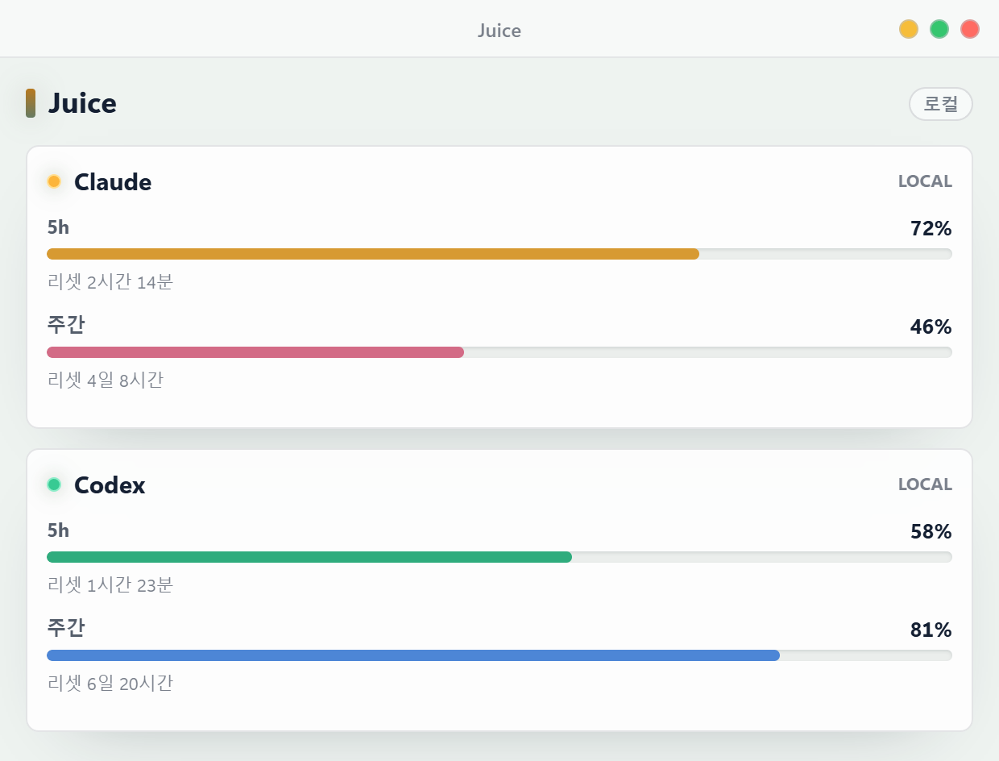
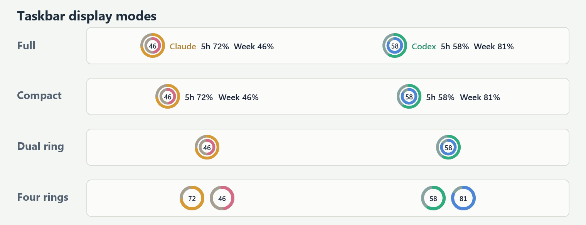
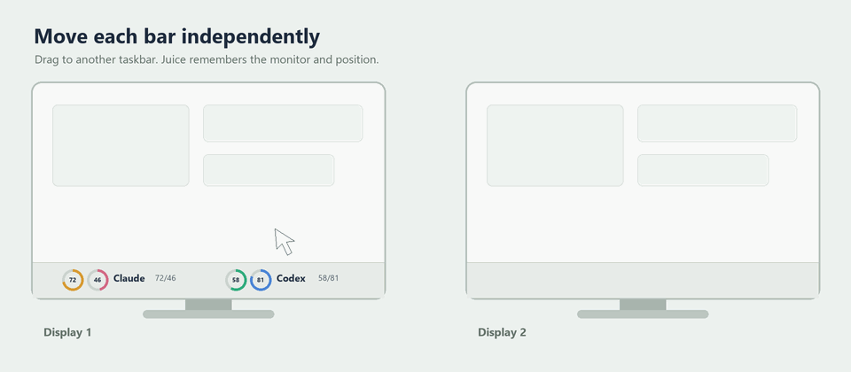
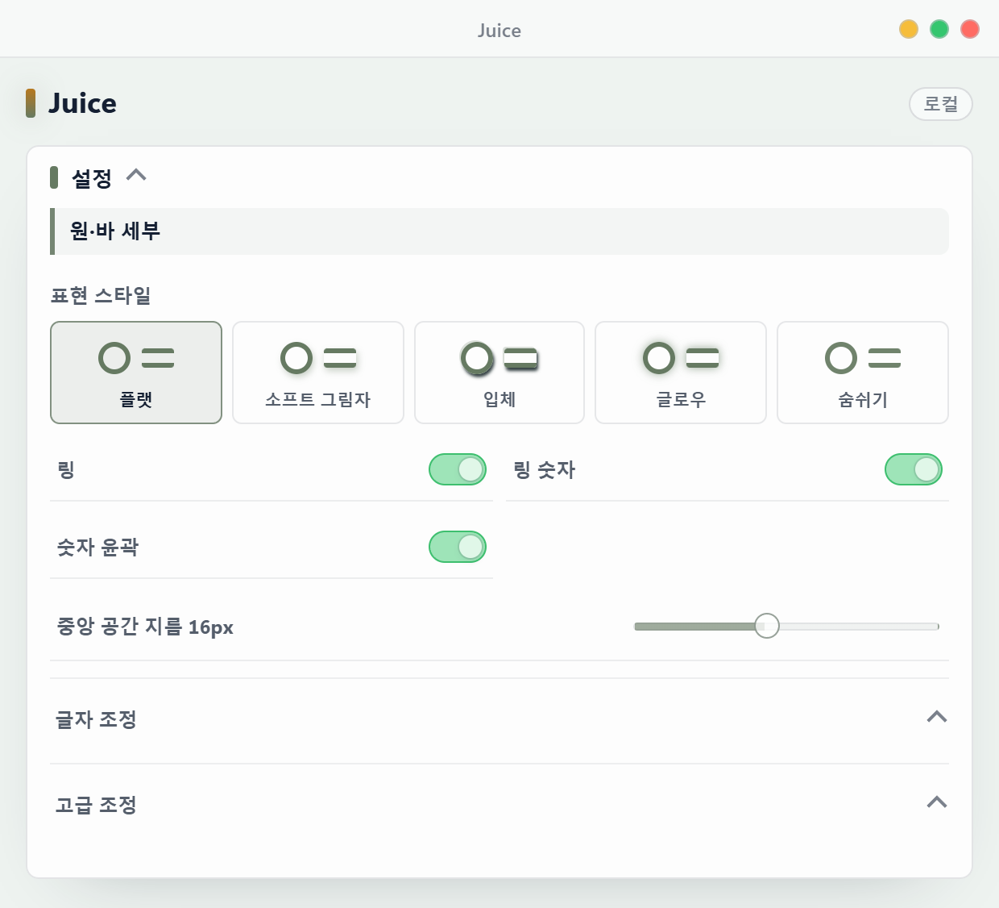
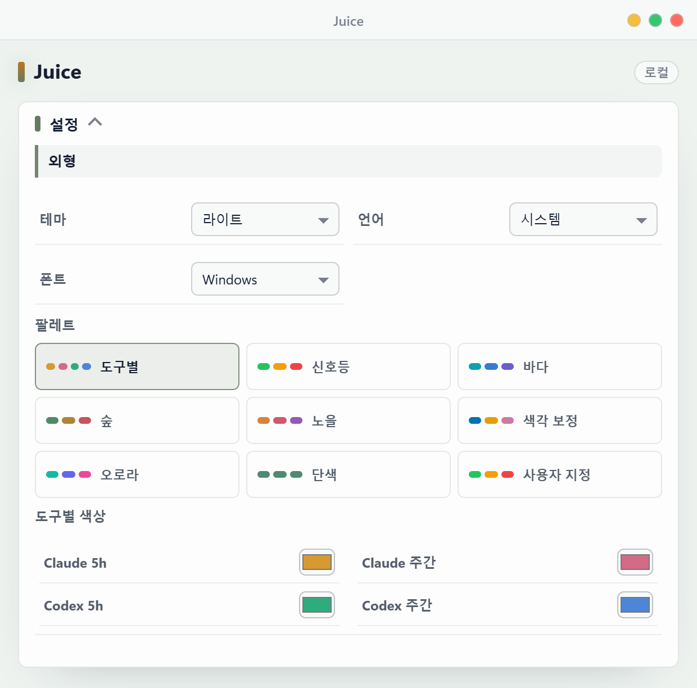
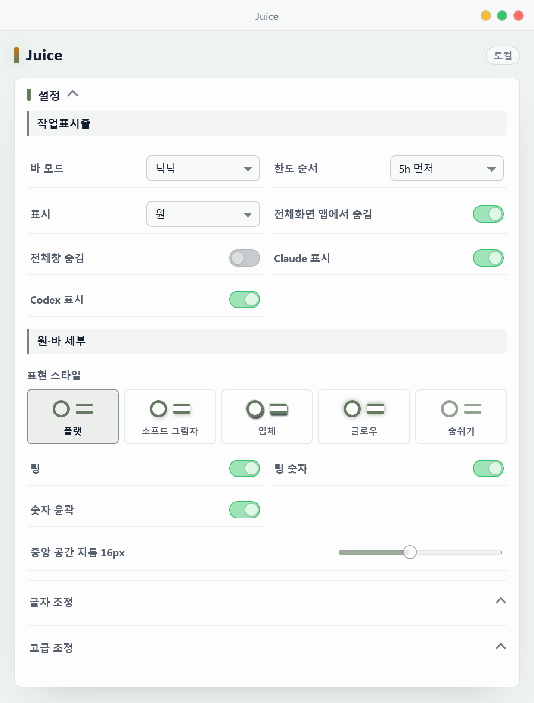
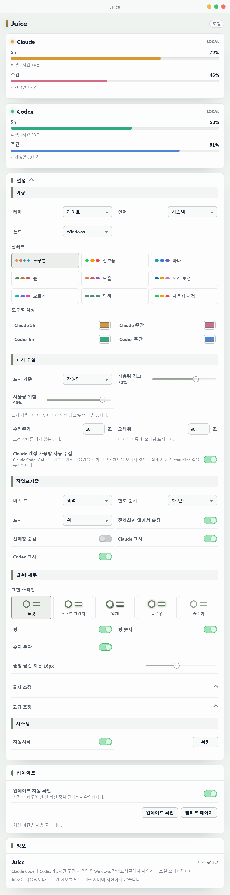
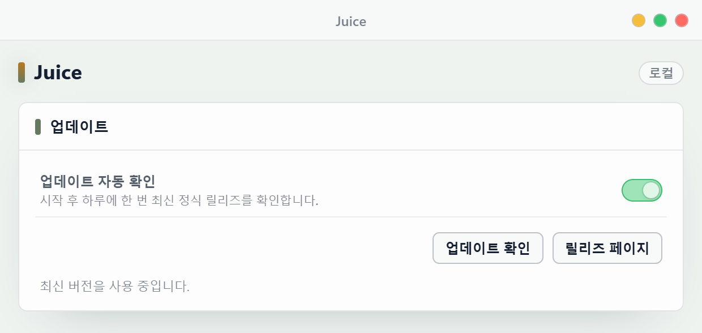
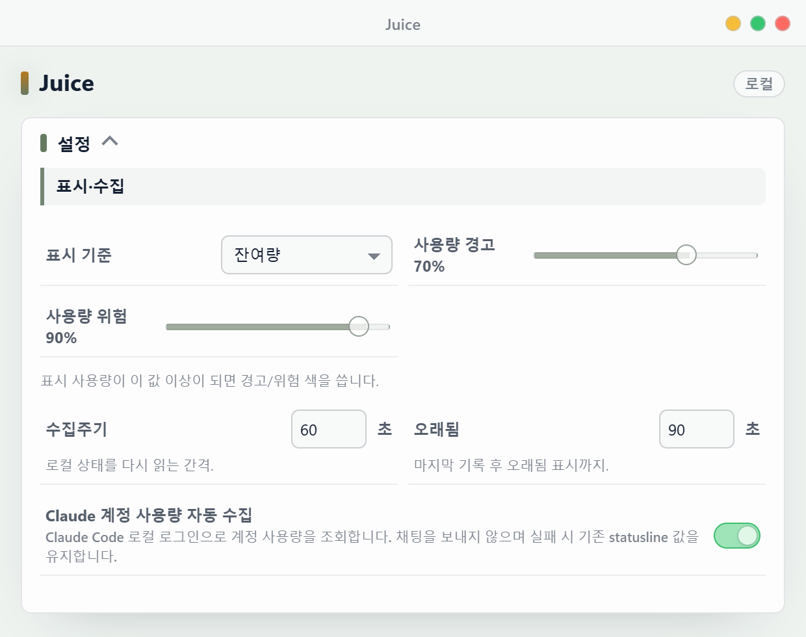

  

  <strong>Claude Code와 Codex의 잔여량 또는 사용량을 Windows 작업표시줄에서 바로 확인하세요.</strong> 
  로컬 CLI 상태만 읽는 Windows 11용 경량 사용량 모니터입니다.

  <a href="https://github.com/Lv2dev/agent-juice/releases/latest">최신 릴리즈</a>
  ·
  <a href="https://github.com/Lv2dev/agent-juice/actions/workflows/windows-ci.yml">Windows CI</a>

  

현재 Tauri WebView를 2배 해상도로 직접 렌더링했습니다. 값과 PC 이름은 문서용 샘플입니다.

<a href="#한국어">한국어</a> · <a href="#english">English</a>

## 한국어

### 무엇을 보여주나요?

Juice는 현재 PC에 로그인된 Claude Code와 Codex CLI의 **5시간 한도와 주간 한도**를 읽어 작업표시줄과 설정 패널에 표시합니다. 잔여량과 사용량 중 원하는 표시 기준을 고를 수 있으며, 별도 Juice 계정, 클라우드 서버, LLM API 키가 필요하지 않습니다.

| 기능 | 동작 |
| --- | --- |
| 잔여량·사용량 선택 | 게이지, 숫자, 임계값을 모두 잔여량 또는 사용량 중 하나의 기준으로 표시합니다. |
| 로컬 우선 수집 | 현재 PC의 Claude Code 로그인/statusline과 Codex app-server/rollout만 사용합니다. |
| 실시간 설정 | 저장 버튼 없이 변경 사항이 즉시 저장되고 작업표시줄에 반영됩니다. |
| 도구별 색상 | Claude와 Codex의 5h·주간 정상색을 각각 지정하고, 경고·위험 의미색은 그대로 유지합니다. |
| 표현 스타일 | 플랫, 소프트 그림자, 입체, 글로우, 숨쉬기 효과를 원과 가로 바에 공통 적용합니다. |
| 도구별 독립 바 | Claude와 Codex를 각각 표시하거나 숨기고, 원하는 위치와 모니터로 따로 이동할 수 있습니다. |
| 화면 방해 최소화 | 전체화면 또는 최대화 앱에서 숨김, 트레이 일시중지, 우클릭 강제 새로고침을 지원합니다. |
| 업데이트 알림 | 하루 한 번 최신 정식 릴리즈를 확인하고 자동 설치 없이 알림과 릴리즈 링크만 제공합니다. |

### 데이터는 어디서 가져오나요?

| 도구 | 우선 수집원 | 보조 수집원 | 표시 정확도 |
| --- | --- | --- | --- |
| Claude | Claude Code 로컬 로그인의 OAuth usage 조회 | statusline `rate_limits`, 구버전 `/usage` fallback | OAuth 조회는 계정 한도이며, statusline과 fallback 일부 값은 근사치일 수 있습니다. |
| Codex | 공식 Codex app-server `account/rateLimits/read` | `~/.codex/sessions`의 최신 rollout JSONL | app-server 값은 정확값으로, rollout fallback은 근사치로 표시합니다. |

Juice는 두 도구의 기존 로컬 로그인 상태를 사용하며 계정 토큰을 별도로 입력받지 않습니다. Claude 계정 조회는 기본으로 켜져 있고 설정에서 끌 수 있습니다.

### 작업표시줄 표시

  

Juice에는 **4가지 바 모드**가 있습니다.

| 모드 | 구성 |
| --- | --- |
| 넉넉 | 도구명, 링, 선택한 기준의 5h/주간 값을 모두 표시합니다. |
| 컴팩트 | 도구명을 줄이고 두 한도 값을 중심으로 표시합니다. |
| 이중원 | 5h와 주간을 겹치지 않는 두 개의 원으로 압축합니다. |
| 링4 | 도구별 한도 두 개를 독립된 단일 링으로 표시합니다. |

- 원 대신 위아래 두 줄의 가로 바로 바꿀 수 있습니다.
- 5h/주간 표시 순서, 링 숫자, 숫자 윤곽, 링 크기·두께·간격과 실제 중앙 공간 지름을 0.1px 단위로 조절할 수 있습니다.
- Claude와 Codex 바는 서로 다른 투명 창입니다. 각각 직접 드래그하며 모니터별 위치가 저장됩니다.
- 바 우클릭 메뉴의 `새로고침`은 일반 캐시를 우회해 로컬 수집을 다시 실행합니다.
- 트레이 메뉴에서 전체 바 표출을 일시중지하거나 재개할 수 있습니다.

### 보조 모니터로 이동

  

이동 흐름을 알아보기 쉽게 만든 합성 데모입니다. 실제 바 구조와 모니터별 위치 저장 동작을 기준으로 제작했습니다.

Claude와 Codex는 서로 다른 투명 창이므로 한쪽만 잡아 다른 모니터의 작업표시줄로 옮길 수 있습니다. 놓은 모니터와 상대 위치는 도구별로 저장되며 다음 실행에서도 복원됩니다.

### 원·바 표현 스타일

  

원과 위아래 가로 바는 같은 표현 스타일을 공유합니다.

| 스타일 | 표현 |
| --- | --- |
| 플랫 | 그림자와 애니메이션이 없는 기본 스타일입니다. 기존 설치도 플랫을 유지합니다. |
| 소프트 그림자 | 본체 뒤에 낮은 그림자를 더합니다. |
| 입체 | 위쪽 하이라이트와 아래쪽 음영으로 깊이를 만듭니다. |
| 글로우 | 현재 팔레트 색상의 얕은 후광을 표시합니다. |
| 숨쉬기 | 값과 글자는 고정하고 후면 효과의 투명도만 천천히 변화시킵니다. |

숨쉬기는 정상 수집 상태에서만 움직입니다. 값이 없거나 오래된 경우 정지하며, Windows에서 모션 감소를 사용하면 정적인 소프트 효과로 자동 대체됩니다. 모든 효과는 숫자와 기본 stroke 뒤에 렌더링되므로 바 위치나 크기를 흔들지 않습니다.

### 테마·팔레트·도구별 색상

  

- 기본 테마는 Windows 시스템 설정을 따르며 라이트와 다크를 직접 고정할 수 있습니다.
- 9개 팔레트 중 `도구별`을 선택하면 Claude 5h, Claude 주간, Codex 5h, Codex 주간의 정상색을 각각 지정할 수 있습니다.
- 색상은 즉시 저장되고 모든 바 모드에 함께 적용됩니다. 경고·위험 구간은 현재 팔레트의 의미색을 유지해 상태 인지가 흐려지지 않습니다.

### 설정 구성

  

설정창은 실제 앱과 같은 순서로 구성됩니다.

| 섹션 | 설정할 수 있는 항목 |
| --- | --- |
| 외형 | 시스템/라이트/다크 테마, 시스템/한국어/영어, Windows/Pretendard 폰트, 9개 팔레트와 도구별 4색 지정 |
| 표시·수집 | 잔여량/사용량 기준, 같은 기준의 경고·위험 임계값, 수집주기, 오래됨 표시 기준, Claude 계정 자동 수집 |
| 작업표시줄 | 4개 바 모드, 한도 순서, 원/바 표시, 전체화면·최대화 숨김, 도구별 표시 |
| 원·바 세부 | 링, 숫자, 윤곽과 고급 크기·두께·간격·폰트 조절 |
| 시스템 | Windows 자동시작과 Claude statusline 원본 복원 |
| 업데이트 | 업데이트 자동 확인, 수동 확인, 릴리즈 페이지, 최근 확인 결과 |
| 정보 | 프로그램 설명, 현재 버전, 로컬 처리 원칙 |

  
전체 설정 구성 보기

  

    
  

### 업데이트 확인과 알림

  

- 기본값은 켜짐이며 시작 15초 후, 마지막 성공 확인에서 24시간이 지난 경우에만 최신 정식 GitHub Release를 확인합니다.
- 새 버전은 버전당 한 번 Windows 알림으로 안내하고 설정창에도 계속 확인 가능한 업데이트 띠를 표시합니다.
- `업데이트 확인`은 24시간 캐시를 우회합니다. 자동 확인 실패는 조용히 넘어가고 수동 확인 실패만 설정창에 표시합니다.
- Juice는 설치 파일을 자동으로 받거나 실행하지 않습니다. 사용자가 누른 경우에만 허용된 공식 Releases 페이지를 기본 브라우저로 엽니다.
- 확인 요청에는 GitHub token, Juice 계정, 사용량 데이터, 사용자 식별값, telemetry가 포함되지 않습니다.

### 정보와 로컬 처리 원칙

`정보`는 현재 버전과 프로그램 역할, 로컬 처리 원칙만 보여줍니다. 업데이트 동작과 상태는 별도의 `업데이트` 섹션에 모아 서로 섞이지 않습니다.

### Claude 계정 사용량 자동 수집

  

**Claude 계정 사용량 자동 수집**은 일반 `표시·수집` 기능이며 기본값은 **켜짐**입니다.

- 옵션을 켜면 Claude Code가 관리하는 로컬 로그인을 사용해 계정의 5시간·주간 usage를 직접 조회합니다. Claude 채팅이나 모델 턴은 전송하지 않습니다.
- OAuth 토큰은 Claude Code 자격 증명 파일에서 호출 시점에만 읽고, 프로세스 인자나 로그에 기록하지 않습니다.
- 인증 갱신이 필요하면 0토큰 `/usage` 호출로 Claude Code의 갱신을 유도한 뒤 한 번 재시도합니다. 구버전 CLI에서는 `/usage` 퍼센트 출력을 fallback으로 사용합니다.
- 정확 OAuth 계정 한도는 statusline의 오래된 계정 값보다 우선합니다. 구버전 `/usage` fallback은 비어 있는 값만 보충하며, endpoint 또는 CLI 형식이 바뀌면 기존 statusline 결과를 유지합니다.
- 기본 수집주기와 Claude 계정 조회 캐시는 모두 60초입니다.

### 설치와 첫 실행

1. [Releases](https://github.com/Lv2dev/agent-juice/releases/latest)에서 최신 `Juice_*_x64-setup.exe`를 받습니다.
2. 설치 후 Windows 트레이의 Juice 아이콘을 클릭해 설정창을 엽니다.
3. Juice 설치본은 시작할 때 Claude statusline 연결을 비파괴·멱등으로 시도합니다.
4. Claude 자동 수집을 끈 경우 이 PC에서 Claude Code를 한 번 사용해 statusline 데이터를 생성합니다.
5. 이 PC의 Codex CLI 로그인을 확인합니다. 공식 app-server 조회가 실패할 때를 대비하려면 Codex도 한 번 사용해 rollout fallback 데이터를 만듭니다.

### 주요 동작

- **트레이 아이콘:** Juice 아이콘 하나만 표시하며 설정창 열기, 바 일시중지/재개, 종료를 제공합니다.
- **테마:** 기본값은 시스템 테마이며 라이트와 다크를 직접 선택할 수 있습니다.
- **언어:** 시스템 언어를 따르거나 한국어/영어를 고정할 수 있습니다.
- **폰트:** Windows 작업표시줄과 맞춘 시스템 폰트가 기본이며 Pretendard를 선택할 수 있습니다.
- **팔레트:** 도구별, 신호등, 바다, 숲, 노을, 색각 보정, 오로라, 단색, 사용자 지정을 제공합니다. 도구별은 네 정상색을 따로 지정하고, 단색은 정상 상태를 한 색으로 통일하며 두 모드 모두 경고·위험 의미색은 유지합니다.
- **전체화면 숨김:** 같은 모니터의 전체화면 앱을 감지하면 해당 작업표시줄 바를 숨깁니다. 최대화 창 숨김은 별도 옵션입니다.
- **다중 모니터:** 각 바를 원하는 모니터 작업표시줄로 직접 끌어 놓으면 모니터와 상대 위치를 기억합니다.
- **오래됨 표시:** 마지막 기록이 설정한 시간보다 오래되면 값이 오래된 상태임을 표시합니다.
- **업데이트:** 최신 정식 릴리즈를 하루 한 번 확인하며 자동 다운로드나 자동 설치는 하지 않습니다.

### 다른 PC에서 값이 안 보일 때

Juice v1은 단일 PC 로컬 모니터라 PC 간 데이터를 공유하지 않습니다. 다른 PC에서는 그 PC에 Juice를 설치하고 Claude Code/Codex CLI 로그인을 각각 확인해야 합니다.

1. Juice를 실행해 Claude statusline 자동 연결을 시도하게 합니다.
2. 기본 Claude 자동 수집을 유지하거나 Claude Code를 한 번 사용해 statusline forward 파일을 생성합니다.
3. Codex CLI 로그인을 확인합니다.
4. app-server fallback이 필요하다면 Codex를 한 번 사용해 rollout JSONL을 생성합니다.

한 PC의 사용량을 다른 PC에서 보는 기능은 후속 다중 PC 버전 범위입니다.

### 문제 해결

- **Claude가 비어 있음:** Claude 계정 자동 수집이 켜져 있는지 확인하거나, Juice를 다시 실행한 뒤 Claude Code를 한 번 사용하세요.
- **Codex가 비어 있음:** 현재 PC의 Codex CLI 로그인을 확인하세요. app-server 조회가 실패한다면 Codex를 한 번 사용해 rollout fallback 데이터를 만드세요.
- **값이 대시로 보임:** 해당 도구가 아직 한도 정보를 내보내지 않았거나 기록이 오래됐을 수 있습니다.
- **설정창을 최소화한 뒤 안 보임:** 트레이의 Juice 아이콘을 다시 클릭하세요.
- **바가 안 보임:** 전체화면/최대화 숨김, 트레이 일시중지, 도구별 표시 설정과 저장된 대상 모니터를 확인하세요.

### 개인정보와 한계

- Juice가 저장하는 설정과 수집 결과는 현재 PC에만 남으며 별도 Juice 서버로 전송하지 않습니다.
- Claude 계정 자동 수집은 로컬 Claude Code OAuth token을 Anthropic의 Claude usage endpoint에만 보내 계정 한도를 조회합니다.
- 업데이트 확인을 켜면 고정된 GitHub Release API로 표준 HTTPS 요청만 전송합니다. 계정 token, 사용량, PC 식별값은 보내지 않습니다.
- LLM API 키나 Juice 전용 계정을 저장하지 않습니다.
- Claude OAuth usage endpoint는 Claude Code 내부 계약이라 향후 CLI 변경의 영향을 받을 수 있습니다. 실패하면 statusline과 구버전 `/usage` fallback만 유지합니다.
- 별도 Juice 로그인이나 외부 토큰 저장소는 사용하지 않습니다.

---

## English

### What does Juice show?

Juice reads the **5-hour and weekly limits** from Claude Code and the Codex CLI logged in on the current PC, then displays either remaining or used percentages in the Windows taskbar and a compact settings panel. It requires no Juice account, cloud backend, or LLM API key.

| Feature | Behavior |
| --- | --- |
| Remaining or used values | Uses one selected basis across gauges, numbers, and thresholds. |
| Local-first collection | Uses the local Claude Code login/statusline and Codex app-server/rollout data. |
| Live settings | Changes are saved and applied without a Save button. |
| Per-tool colors | Assign separate normal colors to Claude and Codex 5-hour/weekly values while preserving warning and danger semantics. |
| Visual styles | Applies Flat, Soft shadow, Depth, Glow, or Breathe to rings and horizontal bars. |
| Independent tool bars | Claude and Codex can be shown, hidden, moved, and assigned to monitors separately. |
| Low-interruption behavior | Supports fullscreen/maximized hiding, tray pause/resume, and force refresh from the context menu. |
| Update notices | Checks the latest stable release once a day and offers notifications and a release link without automatic installation. |

### Where does the data come from?

| Tool | Preferred source | Fallback source | Accuracy |
| --- | --- | --- | --- |
| Claude | OAuth usage lookup through the local Claude Code login | statusline `rate_limits`, then legacy `/usage` fallback | OAuth values are account limits; some statusline and fallback values may be approximate. |
| Codex | Official Codex app-server `account/rateLimits/read` | Latest rollout JSONL under `~/.codex/sessions` | App-server values are marked exact; rollout fallback is approximate. |

Juice reuses each tool's existing local login and never asks you to enter account tokens. Claude account collection is enabled by default and can be disabled in Settings.

### Taskbar display

  

Juice provides **four bar modes**.

| Mode | Layout |
| --- | --- |
| Full | Tool name, ring, and both limits in the selected display basis. |
| Compact | Hides the tool name and prioritizes the two limit values. |
| Dual ring | Compresses 5-hour and weekly limits into two non-overlapping rings. |
| Four rings | Uses one standalone ring for each tool limit. |

- Switch from rings to two stacked horizontal bars.
- Adjust limit order, numbers, number outline, ring size, thickness, spacing, and the real center opening in 0.1px steps.
- Claude and Codex use separate transparent windows, so each can be dragged independently and remembered per monitor.
- The taskbar context menu `Refresh` action bypasses the normal cache and recollects local status.
- Pause or resume all taskbar bars from the Juice tray menu.

### Move to another monitor

  

This synthetic demo makes the movement easy to follow. It reflects the real bar structure and per-monitor position persistence.

Claude and Codex are separate transparent windows, so either bar can be dragged to another monitor's taskbar without moving the other. Juice remembers the target monitor and relative position for each tool and restores them on the next run.

### Ring and bar visual styles

  

Rings and stacked horizontal bars share one visual style.

| Style | Appearance |
| --- | --- |
| Flat | The default with no shadow or animation. Existing installs remain Flat. |
| Soft shadow | Adds a restrained shadow behind the primary stroke. |
| Depth | Combines an upper highlight with lower shading. |
| Glow | Adds a shallow halo using the current palette color. |
| Breathe | Keeps geometry and text fixed while slowly changing only the rear effect opacity. |

Breathe runs only for live data. It stops for empty or stale values and becomes a static soft effect when Windows reduced motion is enabled. Effects render behind the crisp stroke and numbers, so they never resize or move the taskbar bar.

### Theme, palettes, and per-tool colors

  

- The default theme follows Windows, with explicit light and dark overrides.
- With the `Per tool` palette, Claude 5-hour, Claude weekly, Codex 5-hour, and Codex weekly normal colors can be assigned independently.
- Colors save immediately and apply to every taskbar mode. Warning and danger ranges retain the palette's semantic colors so state changes remain recognizable.

### Settings layout

  

| Section | Controls |
| --- | --- |
| Appearance | System/light/dark theme, system/Korean/English language, Windows/Pretendard font, nine palettes, and four per-tool colors |
| Display & collection | Remaining/usage basis, matching warning/danger thresholds, collection interval, stale threshold, Claude account collection |
| Taskbar | Four modes, limit order, ring/bar display, fullscreen/maximized hiding, visible tools |
| Ring & bar details | Ring, numbers, outline, plus advanced size, thickness, spacing, and font controls |
| System | Windows autostart and restoration of the original Claude statusline command |
| Updates | Automatic and manual checks, Releases page, and the latest check result |
| About | Product description, current version, and local-processing policy |

  
View the complete settings layout

  

    
  

### Update checks and notifications

  

- Enabled by default. Juice checks the latest stable GitHub Release 15 seconds after startup only when 24 hours have passed since the last successful check.
- A new version produces one Windows notification per version and a persistent update band in Settings.
- `Check for updates` bypasses the 24-hour cache. Automatic failures stay quiet; manual failures are shown in Settings.
- Juice never downloads or runs an installer automatically. It opens only the allowlisted official Releases page after a user action.
- Requests include no GitHub token, Juice account, usage data, user identifier, or telemetry.

### About and local processing

`About` contains only the current version, product purpose, and local-processing policy. Update behavior and status live in the separate `Updates` section.

### Automatic Claude account usage collection

  

**Claude account usage auto-collection** is a regular Display & collection option and is **on by default**.

- When enabled, Juice uses the local Claude Code login to read the account 5-hour and weekly usage directly. It sends no Claude chat or model turn.
- OAuth tokens are read only at request time from Claude Code credentials and are never placed in process arguments or logs.
- If authentication needs renewal, Juice runs the zero-token `/usage` command to let Claude Code refresh it, retries once, and retains legacy percentage parsing for older CLIs.
- Exact OAuth account limits take priority over stale statusline account values. Legacy `/usage` only fills missing values; if the endpoint or CLI format changes, Juice keeps the statusline result.
- The default collection interval and Claude account cache are both 60 seconds.

### Install and first run

1. Download the latest `Juice_*_x64-setup.exe` from [Releases](https://github.com/Lv2dev/agent-juice/releases/latest).
2. Install it, then click the Juice tray icon to open Settings.
3. The installed app attempts a non-destructive, idempotent Claude statusline connection at startup.
4. If Claude auto-collection is off, use Claude Code once on this PC so statusline data is emitted.
5. Confirm that the Codex CLI is logged in on this PC. Use Codex once if rollout fallback data may be needed when app-server collection is unavailable.

### Key behavior

- **Tray:** One Juice icon provides panel open, taskbar pause/resume, and quit actions.
- **Theme:** Follows the system by default, with explicit light and dark choices.
- **Language:** Follows the system or locks the UI to Korean or English.
- **Font:** Uses the Windows taskbar-style system font by default, with Pretendard available.
- **Palette:** Choose Per tool, Traffic, Ocean, Forest, Sunset, Color-blind safe, Aurora, Monochrome, or Custom. Per tool exposes four independent normal colors; Monochrome unifies normal values. Both preserve warning and danger semantics.
- **Fullscreen hiding:** Hides each bar when a fullscreen app covers its target monitor. Maximized-window hiding is a separate option.
- **Multiple monitors:** Drag each bar onto a monitor's taskbar to remember that monitor and relative position.
- **Stale state:** Marks data as old after the configured time since the last record.
- **Updates:** Checks the latest stable release once a day without automatic download or installation.

### If another PC shows no data

Juice v1 is a local single-PC monitor and does not share data between PCs. Install Juice and verify Claude Code/Codex CLI login separately on every PC.

1. Run Juice so it can attempt automatic Claude statusline connection.
2. Keep the default Claude auto-collection enabled or use Claude Code once to create statusline forward data.
3. Confirm the Codex CLI login.
4. Use Codex once if rollout JSONL fallback data is needed.

Viewing one PC's usage from another PC belongs to a later multi-PC version.

### Troubleshooting

- **Claude is empty:** Confirm that Claude account auto-collection is enabled, or restart Juice and use Claude Code once.
- **Codex is empty:** Confirm the local Codex CLI login. If app-server collection fails, use Codex once to create rollout fallback data.
- **Values are dashes:** The tool may not have emitted limit data yet, or the record may be stale.
- **The minimized panel is missing:** Click the Juice tray icon again.
- **The taskbar bar is missing:** Check fullscreen/maximized hiding, tray pause, per-tool visibility, and the remembered target monitor.

### Privacy and limitations

- Settings and collected results stored by Juice remain on the current PC and are not sent to a separate Juice server.
- Claude account auto-collection sends the local Claude Code OAuth token only to Anthropic's Claude usage endpoint to read account limits.
- When update checks are enabled, Juice sends only a standard HTTPS request to the fixed GitHub Release API. It sends no account token, usage data, or PC identifier.
- Juice stores no LLM API key and requires no Juice account.
- The Claude OAuth usage endpoint is an internal Claude Code contract and may change with future CLI versions. Juice falls back to statusline and legacy `/usage` data.
- Juice uses no separate login flow or external token store.
