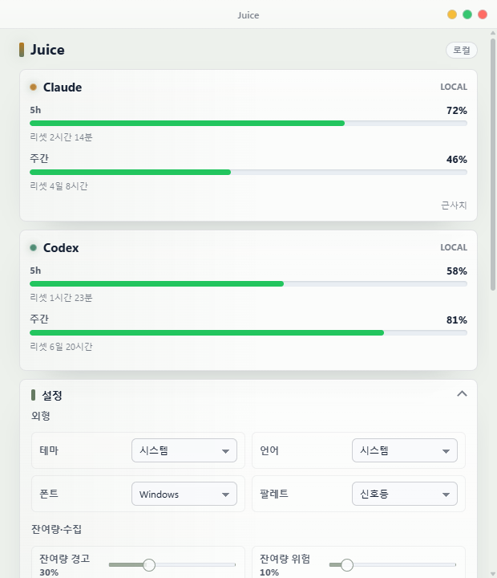
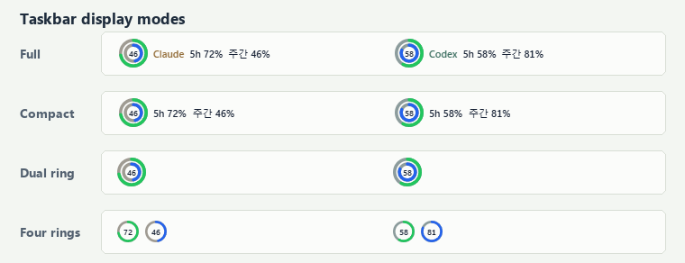
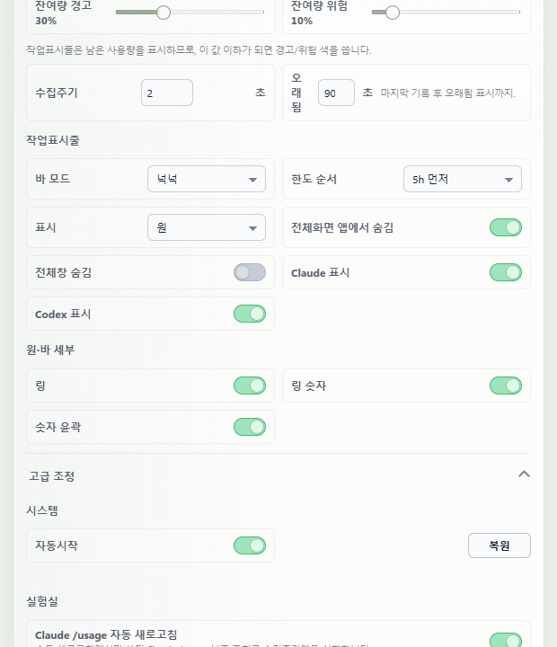
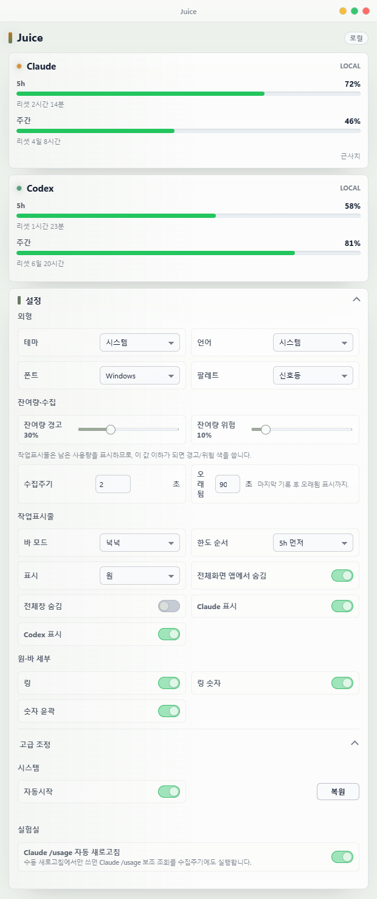
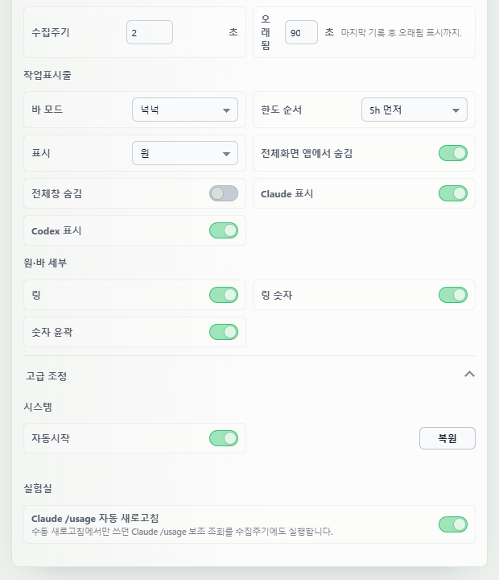

  

  <strong>Claude Code와 Codex의 남은 사용량을 Windows 작업표시줄에서 바로 확인하세요.</strong> 
  로컬 CLI 상태만 읽는 Windows 11용 경량 사용량 모니터입니다.

  <a href="https://github.com/Lv2dev/agent-juice/releases/latest">최신 릴리즈</a>
  ·
  <a href="https://github.com/Lv2dev/agent-juice/actions/workflows/windows-ci.yml">Windows CI</a>

  

현재 Tauri WebView를 직접 렌더링한 화면입니다. 값과 PC 이름은 문서용 샘플입니다.

<a href="#한국어">한국어</a> · <a href="#english">English</a>

## 한국어

### 무엇을 보여주나요?

Juice는 현재 PC에 로그인된 Claude Code와 Codex CLI의 **5시간 한도와 주간 한도 잔여량**을 읽어 작업표시줄과 설정 패널에 표시합니다. 별도 Juice 계정, 클라우드 서버, LLM API 키가 필요하지 않습니다.

| 기능 | 동작 |
| --- | --- |
| 5시간·주간 잔여량 | 사용률을 그대로 보여주지 않고 `100 - 사용률`로 계산한 **남은 사용량**을 표시합니다. |
| 로컬 우선 수집 | 현재 PC의 Claude statusline과 Codex app-server/rollout 파일만 사용합니다. |
| 실시간 설정 | 저장 버튼 없이 변경 사항이 즉시 저장되고 작업표시줄에 반영됩니다. |
| 도구별 독립 바 | Claude와 Codex를 각각 표시하거나 숨기고, 원하는 위치와 모니터로 따로 이동할 수 있습니다. |
| 화면 방해 최소화 | 전체화면 또는 최대화 앱에서 숨김, 트레이 일시중지, 우클릭 강제 새로고침을 지원합니다. |

### 데이터는 어디서 가져오나요?

| 도구 | 우선 수집원 | 보조 수집원 | 표시 정확도 |
| --- | --- | --- | --- |
| Claude | Claude Code statusline의 `rate_limits.five_hour` / `seven_day` | 수동 새로고침과 실험실의 Claude `/usage` | statusline 값과 로컬 `/usage` 출력 특성상 일부 값은 근사치일 수 있습니다. |
| Codex | 공식 Codex app-server `account/rateLimits/read` | `~/.codex/sessions`의 최신 rollout JSONL | app-server 값은 정확값으로, rollout fallback은 근사치로 표시합니다. |

Juice는 두 도구의 기존 로컬 로그인 상태를 사용합니다. 계정 토큰을 별도로 입력받거나 비공식 consumer API를 호출하지 않습니다.

### 작업표시줄 표시

  

Juice에는 **4가지 바 모드**가 있습니다.

| 모드 | 구성 |
| --- | --- |
| 넉넉 | 도구명, 링, 5h/주간 잔여량을 모두 표시합니다. |
| 컴팩트 | 도구명을 줄이고 두 한도 값을 중심으로 표시합니다. |
| 이중원 | 5h와 주간을 겹치지 않는 두 개의 원으로 압축합니다. |
| 링4 | 도구별 한도 두 개를 독립된 단일 링으로 표시합니다. |

- 원 대신 위아래 두 줄의 가로 바로 바꿀 수 있습니다.
- 5h/주간 표시 순서, 링 숫자, 숫자 윤곽, 링 크기·두께·간격·중앙 공간을 조절할 수 있습니다.
- Claude와 Codex 바는 서로 다른 투명 창입니다. 각각 직접 드래그하며 모니터별 위치가 저장됩니다.
- 바 우클릭 메뉴의 `새로고침`은 일반 캐시를 우회해 로컬 수집을 다시 실행합니다.
- 트레이 메뉴에서 전체 바 표출을 일시중지하거나 재개할 수 있습니다.

### 설정 구성

  

설정창은 실제 앱과 같은 순서로 구성됩니다.

| 섹션 | 설정할 수 있는 항목 |
| --- | --- |
| 외형 | 시스템/라이트/다크 테마, 시스템/한국어/영어, Windows/Pretendard 폰트, 팔레트 |
| 잔여량·수집 | 잔여량 경고·위험 기준, 수집주기, 오래됨 표시 기준 |
| 작업표시줄 | 4개 바 모드, 한도 순서, 원/바 표시, 전체화면·최대화 숨김, 도구별 표시 |
| 원·바 세부 | 링, 숫자, 윤곽과 고급 크기·두께·간격·폰트 조절 |
| 시스템 | Windows 자동시작과 Claude statusline 원본 복원 |
| 실험실 | Claude `/usage` 자동 보조 새로고침 |

  
전체 설정 구성 보기

  

    
  

### Claude `/usage` 자동 새로고침

  

실험실의 **Claude `/usage` 자동 새로고침**은 기본값은 **꺼짐**입니다.

- 작업표시줄 바의 수동 `새로고침`은 Claude `/usage`를 보조 조회해 `Current session`을 5시간, `Current week (all models)`를 주간 fallback으로 사용합니다.
- 실험실 옵션을 켜면 수동 새로고침에서만 쓰던 `/usage` 보조 조회를 주기 수집에서도 실행합니다. 중복 호출을 피하기 위해 60초 캐시를 사용합니다.
- Claude statusline의 5시간/주간 값이 있으면 덮어쓰지 않습니다. `/usage`는 비어 있는 한도만 보충합니다.
- `/usage` 실행 실패, timeout, 출력 형식 변경이 발생하면 기존 statusline 결과만 유지합니다.
- 로컬 실측에서는 모델 턴과 비용이 발생하지 않았지만 CLI 동작 변경 가능성이 있어 실험실 기능으로 분리했습니다.

### 설치와 첫 실행

1. [Releases](https://github.com/Lv2dev/agent-juice/releases/latest)에서 최신 `Juice_*_x64-setup.exe`를 받습니다.
2. 설치 후 Windows 트레이의 Juice 아이콘을 클릭해 설정창을 엽니다.
3. Juice 설치본은 시작할 때 Claude statusline 연결을 비파괴·멱등으로 시도합니다.
4. 이 PC에서 Claude Code를 한 번 사용해 statusline 데이터를 생성합니다.
5. 이 PC의 Codex CLI 로그인을 확인합니다. 공식 app-server 조회가 실패할 때를 대비하려면 Codex도 한 번 사용해 rollout fallback 데이터를 만듭니다.

### 주요 동작

- **트레이 아이콘:** Juice 아이콘 하나만 표시하며 설정창 열기, 바 일시중지/재개, 종료를 제공합니다.
- **테마:** 기본값은 시스템 테마이며 라이트와 다크를 직접 선택할 수 있습니다.
- **언어:** 시스템 언어를 따르거나 한국어/영어를 고정할 수 있습니다.
- **폰트:** Windows 작업표시줄과 맞춘 시스템 폰트가 기본이며 Pretendard를 선택할 수 있습니다.
- **전체화면 숨김:** 같은 모니터의 전체화면 앱을 감지하면 해당 작업표시줄 바를 숨깁니다. 최대화 창 숨김은 별도 옵션입니다.
- **다중 모니터:** 각 바를 원하는 모니터 작업표시줄로 직접 끌어 놓으면 모니터와 상대 위치를 기억합니다.
- **오래됨 표시:** 마지막 기록이 설정한 시간보다 오래되면 값이 오래된 상태임을 표시합니다.

### 다른 PC에서 값이 안 보일 때

Juice v1은 단일 PC 로컬 모니터라 PC 간 데이터를 공유하지 않습니다. 다른 PC에서는 그 PC에 Juice를 설치하고 Claude Code/Codex CLI 로그인을 각각 확인해야 합니다.

1. Juice를 실행해 Claude statusline 자동 연결을 시도하게 합니다.
2. Claude Code를 한 번 사용해 statusline forward 파일을 생성합니다.
3. Codex CLI 로그인을 확인합니다.
4. app-server fallback이 필요하다면 Codex를 한 번 사용해 rollout JSONL을 생성합니다.

한 PC의 사용량을 다른 PC에서 보는 기능은 후속 다중 PC 버전 범위입니다.

### 문제 해결

- **Claude가 비어 있음:** Juice를 다시 실행한 뒤 Claude Code를 한 번 사용하세요.
- **Codex가 비어 있음:** 현재 PC의 Codex CLI 로그인을 확인하세요. app-server 조회가 실패한다면 Codex를 한 번 사용해 rollout fallback 데이터를 만드세요.
- **값이 대시로 보임:** 해당 도구가 아직 한도 정보를 내보내지 않았거나 기록이 오래됐을 수 있습니다.
- **설정창을 최소화한 뒤 안 보임:** 트레이의 Juice 아이콘을 다시 클릭하세요.
- **바가 안 보임:** 전체화면/최대화 숨김, 트레이 일시중지, 도구별 표시 설정과 저장된 대상 모니터를 확인하세요.

### 개인정보와 한계

- 모든 수집과 표시는 현재 PC 안에서 처리됩니다.
- LLM API 키나 Juice 전용 계정을 저장하지 않습니다.
- Claude `/usage` 보조값과 rollout fallback은 로컬 관측 기반 근사치일 수 있습니다.
- 소비자 구독의 정확한 잔여 토큰을 읽는 별도 비공식 로그인/API는 사용하지 않습니다.

---

## English

### What does Juice show?

Juice reads the **remaining 5-hour and weekly limits** from Claude Code and the Codex CLI logged in on the current PC, then displays them in the Windows taskbar and a compact settings panel. It requires no Juice account, cloud backend, or LLM API key.

| Feature | Behavior |
| --- | --- |
| Remaining limits | Converts usage into `100 - used percent` so the UI consistently shows what remains. |
| Local-first collection | Reads only local Claude statusline data and Codex app-server/rollout data. |
| Live settings | Changes are saved and applied without a Save button. |
| Independent tool bars | Claude and Codex can be shown, hidden, moved, and assigned to monitors separately. |
| Low-interruption behavior | Supports fullscreen/maximized hiding, tray pause/resume, and force refresh from the context menu. |

### Where does the data come from?

| Tool | Preferred source | Fallback source | Accuracy |
| --- | --- | --- | --- |
| Claude | Claude Code statusline `rate_limits.five_hour` / `seven_day` | Claude `/usage` during manual refresh or through the Lab option | Statusline and local `/usage` values may be approximate. |
| Codex | Official Codex app-server `account/rateLimits/read` | Latest rollout JSONL under `~/.codex/sessions` | App-server values are marked exact; rollout fallback is approximate. |

Juice reuses each tool's existing local login. It never asks for account tokens or calls an unofficial consumer-account API.

### Taskbar display

  

Juice provides **four bar modes**.

| Mode | Layout |
| --- | --- |
| Full | Tool name, ring, and both remaining limits. |
| Compact | Hides the tool name and prioritizes the two limit values. |
| Dual ring | Compresses 5-hour and weekly limits into two non-overlapping rings. |
| Four rings | Uses one standalone ring for each tool limit. |

- Switch from rings to two stacked horizontal bars.
- Adjust limit order, numbers, number outline, ring size, thickness, spacing, and center gap.
- Claude and Codex use separate transparent windows, so each can be dragged independently and remembered per monitor.
- The taskbar context menu `Refresh` action bypasses the normal cache and recollects local status.
- Pause or resume all taskbar bars from the Juice tray menu.

### Settings layout

  

| Section | Controls |
| --- | --- |
| Appearance | System/light/dark theme, system/Korean/English language, Windows/Pretendard font, palette |
| Remaining limits & collection | Warning/danger thresholds, collection interval, stale threshold |
| Taskbar | Four modes, limit order, ring/bar display, fullscreen/maximized hiding, visible tools |
| Ring & bar details | Ring, numbers, outline, plus advanced size, thickness, spacing, and font controls |
| System | Windows autostart and restoration of the original Claude statusline command |
| Lab | Automatic Claude `/usage` assisted refresh |

  
View the complete settings layout

  

    
  

### Claude `/usage` auto-refresh

  

The experimental **`Claude /usage` auto-refresh** option is **off by default**.

- Manual taskbar `Refresh` runs Claude `/usage` as an assisted lookup. `Current session` maps to the 5-hour fallback and `Current week (all models)` maps to the weekly fallback.
- Enabling the Lab option also runs that assisted lookup during periodic collection, with a 60-second cache to avoid duplicate calls.
- It never overwrites existing statusline limits; `/usage` only fills missing values.
- If `/usage` fails, times out, or changes format, Juice keeps the existing statusline result.
- Local testing observed no model turn or cost, but the option remains experimental to contain future CLI behavior changes.

### Install and first run

1. Download the latest `Juice_*_x64-setup.exe` from [Releases](https://github.com/Lv2dev/agent-juice/releases/latest).
2. Install it, then click the Juice tray icon to open Settings.
3. The installed app attempts a non-destructive, idempotent Claude statusline connection at startup.
4. Use Claude Code once on this PC so statusline data is emitted.
5. Confirm that the Codex CLI is logged in on this PC. Use Codex once if rollout fallback data may be needed when app-server collection is unavailable.

### Key behavior

- **Tray:** One Juice icon provides panel open, taskbar pause/resume, and quit actions.
- **Theme:** Follows the system by default, with explicit light and dark choices.
- **Language:** Follows the system or locks the UI to Korean or English.
- **Font:** Uses the Windows taskbar-style system font by default, with Pretendard available.
- **Fullscreen hiding:** Hides each bar when a fullscreen app covers its target monitor. Maximized-window hiding is a separate option.
- **Multiple monitors:** Drag each bar onto a monitor's taskbar to remember that monitor and relative position.
- **Stale state:** Marks data as old after the configured time since the last record.

### If another PC shows no data

Juice v1 is a local single-PC monitor and does not share data between PCs. Install Juice and verify Claude Code/Codex CLI login separately on every PC.

1. Run Juice so it can attempt automatic Claude statusline connection.
2. Use Claude Code once to create statusline forward data.
3. Confirm the Codex CLI login.
4. Use Codex once if rollout JSONL fallback data is needed.

Viewing one PC's usage from another PC belongs to a later multi-PC version.

### Troubleshooting

- **Claude is empty:** Restart Juice, then use Claude Code once.
- **Codex is empty:** Confirm the local Codex CLI login. If app-server collection fails, use Codex once to create rollout fallback data.
- **Values are dashes:** The tool may not have emitted limit data yet, or the record may be stale.
- **The minimized panel is missing:** Click the Juice tray icon again.
- **The taskbar bar is missing:** Check fullscreen/maximized hiding, tray pause, per-tool visibility, and the remembered target monitor.

### Privacy and limitations

- Collection and display stay on the current PC.
- Juice stores no LLM API key and requires no Juice account.
- Claude `/usage` assisted values and rollout fallback values may be local approximations.
- Juice does not use an unofficial login flow or consumer-account API to scrape subscription balances.
