

  

  <strong>Claude Code, Codex, Grok Build, Cursor, Antigravity의 잔여량 또는 사용량을 Windows 작업표시줄에서 바로 확인하세요.</strong> 
  기존 로컬 로그인을 사용하는 Windows 11용 경량 사용량 모니터입니다.

  <a href="https://github.com/Lv2dev/agent-juice/releases/latest">최신 릴리즈</a>
  ·
  <a href="https://github.com/Lv2dev/agent-juice/actions/workflows/windows-ci.yml">Windows CI</a>

  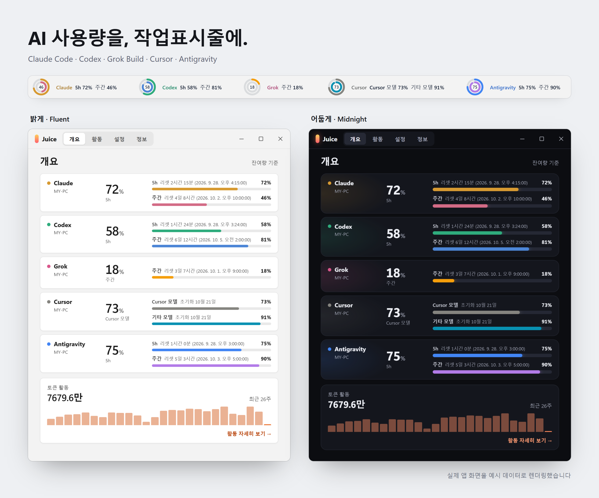

앱의 화면 코드를 사용해 2배 해상도로 렌더링했습니다. 값과 PC 이름은 문서용 샘플입니다.

<a href="#한국어">한국어</a> · <a href="#english">English</a>

## 한국어

### 한눈에 보기

Juice는 이미 로그인해 둔 AI 코딩 도구의 한도를 읽어 **작업표시줄에 도구마다 작은 바**로 띄워 줍니다. 트레이 아이콘을 누르면 열리는 패널에서 도구별 한도와 초기화 시간, 날짜별 토큰 활동을 자세히 볼 수 있습니다. 별도 Juice 계정, 클라우드 서버, LLM API 키가 필요하지 않습니다.

| 도구 | 표시하는 한도 | 기본값 |
| --- | --- | --- |
| Claude | Claude Code 또는 Claude 데스크톱 로그인으로 조회한 **5시간/주간 한도** | 켜짐 |
| Codex | 계정이 현재 제공하는 **5시간·주간 한도** | 켜짐 |
| Grok Build | **현재 주간 또는 월간 한도** 하나 | 꺼짐 |
| Cursor | **Cursor Models/Other Models 월간 풀** | 꺼짐 |
| Antigravity | Desktop 또는 로그인된 CLI의 자동 계정 조회를 통한 **Gemini의 5시간·주간 한도** | 꺼짐 |

Codex처럼 계정에 한 기간만 존재하면 빈 기간을 만들지 않고 실제 한도만 표시합니다. 잔여량과 사용량 중 원하는 표시 기준을 고를 수 있습니다. Antigravity는 Desktop 우선이며, Desktop이 꺼져 있을 때는 로그인된 CLI로 한도를 자동 조회합니다. Antigravity 토큰 활동은 지원하지 않습니다.

### 주요 기능

| 기능 | 동작 |
| --- | --- |
| 잔여량·사용량 선택 | 게이지, 숫자, 임계값을 모두 잔여량 또는 사용량 중 하나의 기준으로 표시합니다. |
| 로컬 로그인 기반 수집 | Claude Code 또는 Claude 데스크톱 로그인, Codex Desktop/CLI의 persistent app-server와 rollout, Grok Build 공식 ACP, Cursor GUI/Agent 로그인을 사용합니다. |
| Antigravity Desktop/CLI 수집 | 실행 중인 Desktop 우선, 미실행 시 CLI의 읽기 전용 계정 명령으로 자동 조회합니다. 터미널 조작이나 모델 프롬프트 없이 동작합니다. |
| 로그인 상태 안내 | 명시적인 인증 실패가 확인되면 오래된 값을 현재값처럼 표시하지 않고 해당 카드와 바에 `로그인 필요`를 표시합니다. 네트워크·timeout·형식 오류와는 구분합니다. |
| 토큰 활동 | Claude·Grok의 현재 PC 로컬 기록과 Codex·Cursor 계정의 공식 token activity를 일별로 집계해 최근 4~52주 히트맵과 요약으로 표시합니다. |
| 세 가지 패널 스킨 | 밝게 보일 때는 Fluent 또는 Paper, 어둡게 보일 때는 Midnight 스타일을 사용합니다. |
| 실시간 설정 | 저장 버튼 없이 변경 사항이 즉시 저장되고 작업표시줄에 반영됩니다. |
| 도구별 색상 | Claude·Codex의 5h/주간, Grok의 주간/월간, Cursor의 두 월간 풀, Antigravity의 5h/주간에 기본색과 경고·위험색을 지정합니다. |
| 표현 스타일 | 플랫, 소프트 그림자, 입체, 글로우, 숨쉬기 효과를 원과 가로 바에 공통 적용합니다. |
| 표시기 배경 | 원과 가로 바의 미사용 영역에 같은 테마 적응색과 농도를 적용하며, 색상과 농도를 직접 바꿀 수 있습니다. |
| 도구별 독립 바 | 다섯 도구를 각각 활성화하거나 끌 수 있습니다. 끄면 해당 바와 사용량 수집이 함께 중단되며, 위치와 모니터는 따로 지정할 수 있습니다. Grok, Cursor, Antigravity는 기본 OFF입니다. |
| 화면 방해 최소화 | 전체화면 또는 최대화 앱에서 숨김, 트레이 일시중지, 우클릭 강제 새로고침을 지원합니다. |
| 원클릭 업데이트 | 하루 한 번 최신 정식 릴리즈를 확인하고, 사용자가 승인하면 서명을 검증한 설치 파일을 내려받아 업데이트 후 재시작합니다. |

### 화면 둘러보기

패널은 위쪽 탭으로 **개요 · 활동 · 설정 · 정보** 네 화면을 오갑니다. 탭은 방향키와 Home·End로도 이동할 수 있습니다.

#### 개요

  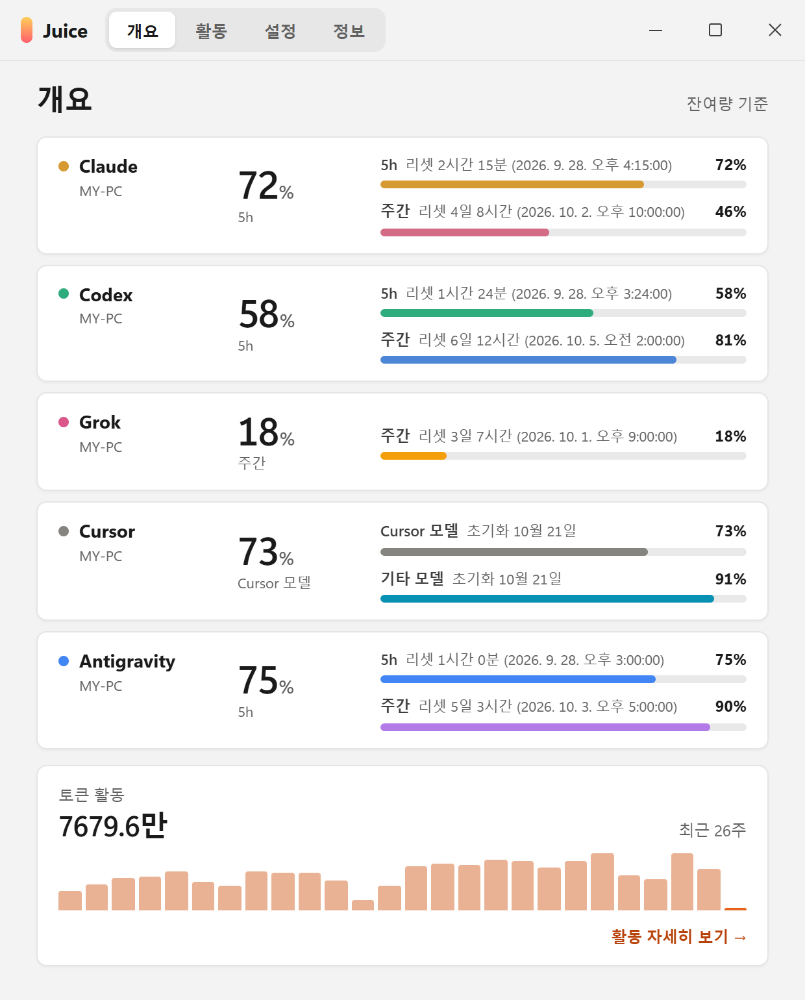

- 도구마다 이름과 PC, 기간별 게이지와 초기화까지 남은 시간을 보여줍니다. 큰 숫자는 **가장 제약이 큰 한도**(잔여량은 가장 낮은 기간, 사용량은 가장 높은 기간)와 그 기간명입니다. 한도가 하나뿐이면 해당 한도를 씁니다. 리셋 날짜는 별도 줄에서 줄바꿈됩니다.
- 제목 옆에는 현재 표시 기준(잔여량 또는 사용량)이 표시됩니다. 경고·위험 임계값에 들어간 게이지는 설정한 경고·위험색으로 바뀝니다.
- `로그인 필요`, 앱 실행 필요, 아직 값이 없는 상태는 숫자 대신 안내 문구로 표시합니다. 오래된 기록은 문구로 구분하며, 개요의 한도 숫자와 게이지는 흐리게 만들지 않습니다. Codex의 로컬 세션 기록 시각과 계정 한도의 조회 상태는 다를 수 있습니다.
- 아래쪽의 주간 토큰 막대는 최근 기간의 주별 합계이며 `활동 자세히 보기`로 활동 화면으로 이동합니다.

#### 토큰 활동

  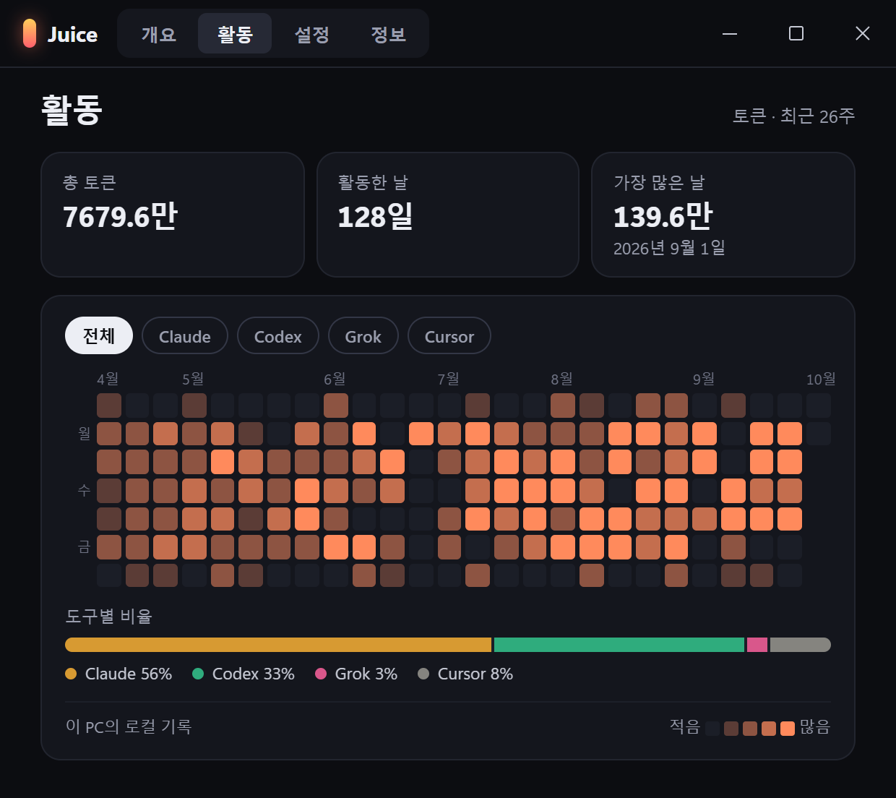

문서용 샘플 데이터입니다. 전체·Claude·Codex·Grok·Cursor를 따로 볼 수 있으며 Codex와 Cursor는 계정 범위입니다.

- 활동 화면 위쪽에 총 토큰, 활동한 날, 가장 많은 날을 요약하고, `전체 / Claude / Codex / Grok / Cursor` 필터로 날짜별 토큰 활동을 확인할 수 있습니다. 아래쪽에는 활성화된 도구의 토큰 비율을 표시합니다. 비활성화한 도구의 필터는 숨겨집니다.
- 한 칸은 날짜 하나이며 표시 기간은 4~52주입니다. Claude·Grok과 Cursor event는 Windows 현지 날짜를 사용하고, Codex는 공식 account bucket의 `startDate`를 timezone 추정 없이 그대로 사용합니다. 농도는 기간 내 활동에 맞춘 자동 로그 스케일 또는 사용자가 지정한 단계당 토큰 수를 사용합니다.
- 작은 창이나 Windows의 큰 글자 설정에서도 칸과 라벨을 읽을 수 있도록 최소 크기를 유지합니다. 긴 기간은 가로로 스크롤하며, 활동 탭을 열면 최근 날짜부터 보여줍니다.
- 최초 조회에서는 최근 1년 기록을 백그라운드로 채우고 이후에는 변경분만 갱신합니다. 큰 이력은 `과거 기록 수집 중`으로 표시됩니다.
- Claude·Grok은 현재 PC의 로컬 기록입니다. Codex는 공식 `account/usage/read`의 계정 전체 daily bucket을 `Codex 계정 사용량`으로, Cursor는 GUI·Agent CLI·Cloud Agent·다른 PC를 포함한 account event를 `Cursor 계정 사용량`으로 구분합니다.
- Codex 공식 bucket이 없거나 일관성 검증에 실패하면 과대 집계되는 rollout 추정치를 대신 표시하지 않고 일부 기록 상태로 비웁니다.
- Cursor 잔디는 계정의 날짜별 사용 기록 API만 사용하므로 같은 계정으로 다른 PC에서 사용한 기록도 포함합니다. 페이지 개수·조회 범위·첫 페이지 재확인·계정 검증은 유지하며 별도 요약 API와 합계가 다르다는 이유로 기록 전체를 지우지는 않습니다.
- local activity index와 Cursor account cache는 현재 PC에 원자적으로 저장됩니다. Codex account bucket은 프로세스 메모리에서만 사용하며 어떤 활동 데이터도 Juice 서버로 업로드하지 않습니다.

#### 설정 구성

  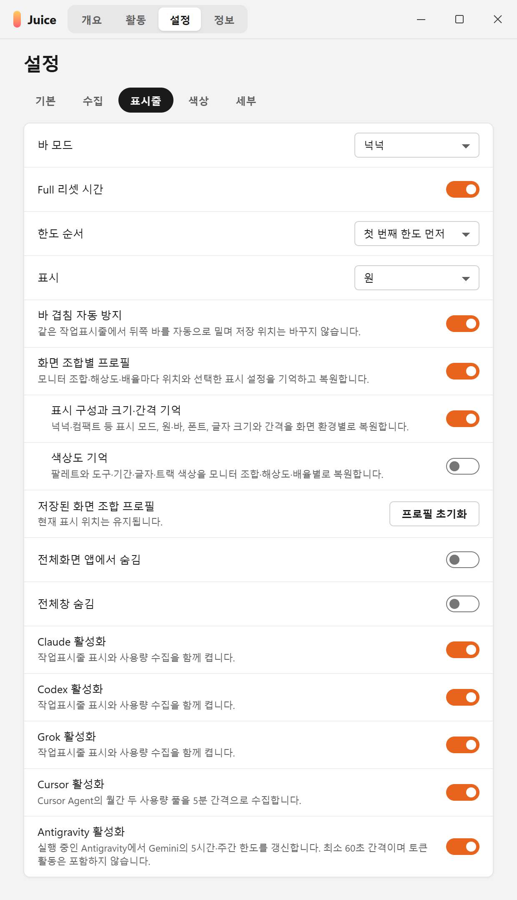

설정은 Windows 설정 앱처럼 기능별 5개 탭의 행 목록입니다. 변경하면 바로 저장되며, 업데이트와 앱 정보는 `정보` 탭에 모여 있습니다.

설정 상단의 **작업표시줄 미리보기**에서 도구를 골라 색상·표시 모드·링·글자·간격 변경을 바로 확인할 수 있습니다. 기존 수집 값이 없으면 `예시`로 구분하며, 미리보기 자체는 추가 수집이나 작업표시줄 이동을 수행하지 않습니다. 저장 오류는 모든 탭에 공통으로 표시되고 확인 버튼으로 닫을 수 있습니다.

| 탭 | 설정할 수 있는 항목 |
| --- | --- |
| 기본 | 시스템/라이트/다크 테마, 라이트 스타일(Fluent/Paper), 시스템/한국어/영어, Windows/Pretendard 폰트, Windows 자동 시작 |
| 수집 | 잔여량/사용량 기준, 경고·위험 임계값, 수집주기, 오래됨 기준, Claude 계정 자동 수집, 토큰 활동 기간·농도 |
| 표시줄 | 4개 바 모드, 한도 순서, 원/가로 바 표시, 겹침 자동 방지, 화면 조합별 위치·표시 구성·크기·간격 프로필과 선택적 색상 기억, 전체화면·최대화 숨김, 도구별 표시·수집 활성화 |
| 색상 | 9개 팔레트, 다섯 도구의 한도별 기본 10색, 경고·위험색과 단계별 토글, 이름·정보·링 숫자 글자색 |
| 표시기·글자 | 표현 스타일, 공용 표시기 배경색·농도, 링·숫자·윤곽, 크기·두께·간격·폰트 조절 |
| 정보 탭 | 업데이트 자동 확인, 수동 확인, 서명 검증 업데이트·재시작, 릴리즈 페이지 fallback, 최근 확인 결과, 프로그램 설명·현재 버전·로컬 처리 원칙 |

#### 패널 스킨: Fluent · Paper · Midnight

  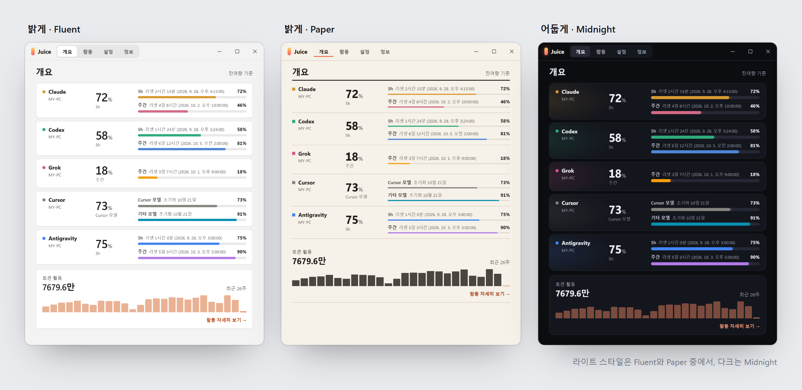

- 테마는 시스템/라이트/다크 중에서 고르고, 밝게 보일 때의 모습은 `기본` 탭의 **라이트 스타일**에서 Fluent 또는 Paper로 정합니다. 어둡게 보일 때는 항상 Midnight입니다.
- 테마가 시스템이면 Windows가 밝을 때는 선택한 라이트 스타일로, 어두울 때는 Midnight로 자동 전환됩니다.
- Fluent는 Windows 11 기본 앱처럼 카드로, Paper는 크림색 바탕에 가는 선과 굵은 숫자로, Midnight는 어두운 배경의 빛나는 게이지로 표시합니다.
- 스킨은 패널에만 적용되며 작업표시줄 바의 모양은 바뀌지 않습니다. 화면 조합별 프로필과 무관한 전역 설정입니다.

### 작업표시줄 표시

  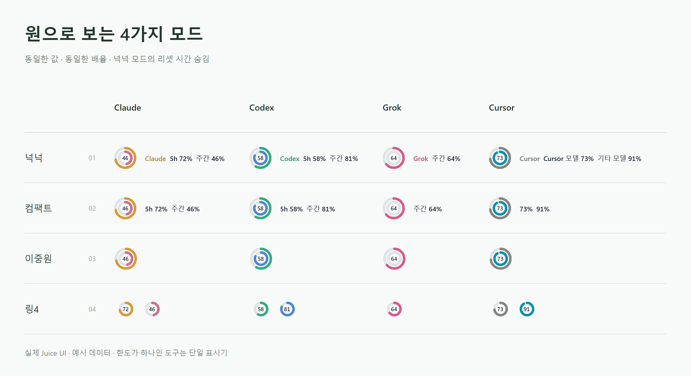

  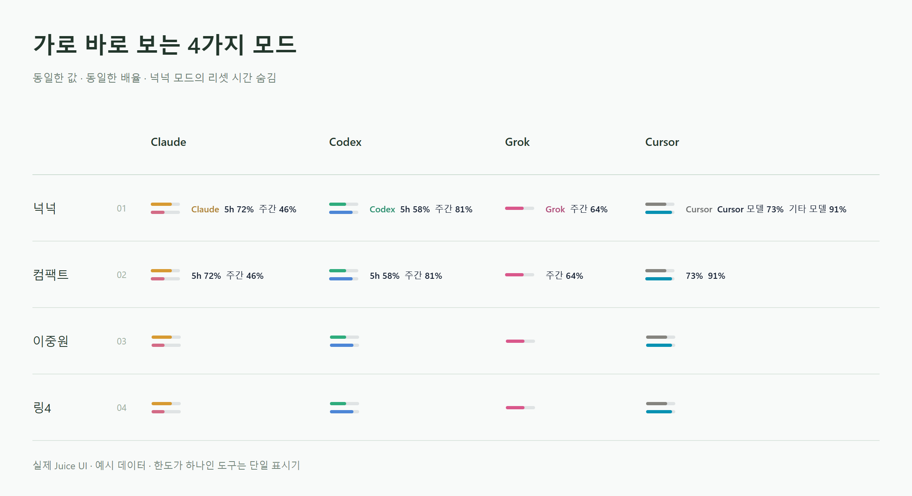

같은 4개 모드를 원 대신 위아래 두 줄의 가로 바로 표시합니다. 이중원과 링4는 가로 바를 선택하면 같은 2줄 압축 표시를 사용합니다.

Juice에는 **4가지 바 모드**가 있습니다.

| 모드 | 구성 |
| --- | --- |
| 넉넉 | 도구명, 링, 사용 가능한 한도 값과 리셋까지 남은 시간을 표시합니다. 리셋 시간은 설정에서 끌 수 있습니다. |
| 컴팩트 | 도구명을 줄이고 사용 가능한 한도 값을 중심으로 표시합니다. |
| 이중원 | Claude의 5h/주간, Codex에 현재 존재하는 최대 두 한도, Cursor의 두 월간 풀을 겹치지 않는 원으로 압축하며 한도 하나만 있으면 단일 원을 사용합니다. |
| 링4 | 각 한도를 독립된 단일 링으로 표시하며 Cursor는 두 링, Grok은 실제 period 하나만 만듭니다. |

- 원 대신 위아래 두 줄의 가로 바로 바꿀 수 있습니다.
- 두 기간이 모두 있을 때 5h/주간 표시 순서와 링 숫자, 숫자 윤곽, 링 크기·두께·간격 및 실제 중앙 공간 지름을 0.1px 단위로 조절할 수 있습니다.
- Claude·Codex·Grok·Cursor 바는 서로 다른 투명 창입니다. 각각 직접 드래그하며 현재 연결된 모니터 조합별로 위치가 저장됩니다.
- 최초 실행에서는 표시 중인 바를 작업표시줄 왼쪽부터 서로 겹치지 않게 배치합니다.
- 숨겨 둔 도구를 나중에 켜면 기존 바를 움직이지 않고 작업표시줄의 첫 빈 위치에 배치합니다.
- 기본으로 켜진 `바 겹침 자동 방지`는 값이나 리셋 문구가 길어질 때 같은 작업표시줄의 뒤쪽 바만 임시로 밀어냅니다. 사용자가 저장한 위치와 간격은 바뀌지 않으며 내용이 짧아지면 원래 배치로 돌아갑니다.
- 재부팅이나 첫 실행의 최초 수집 중에는 `로딩 중`을 표시합니다. 지난 리셋 시간이 남아 있고 새 한도를 아직 받지 못한 경우에는 `갱신 대기`로 구분합니다.
- Windows가 잠기거나 모든 디스플레이가 꺼지면 자동 주기 수집을 쉬고, 잠금 해제 또는 화면 ON 시 즉시 한 번 갱신합니다. 사용자가 누른 수동 새로고침은 그대로 동작합니다.
- 바에 마우스를 올리면 도구명과 실제로 존재하는 5h·주간·월간 한도의 초기화까지 남은 시간을 보여줍니다.
- hover에는 기간별 **잔여량과 사용량**, 초기화 날짜·시각, 마지막 기록 시각·경과 시간, 정상·경고·위험·오래됨 상태와 근사치 여부, PC 표시명도 함께 표시합니다. 설정한 표시 기준을 먼저 보여주며, 날짜만 제공되는 한도에 임의의 시각을 붙이지 않습니다.
- 마지막 기록은 데이터에 담긴 기록 시각이며 최근 네트워크 조회 시각과는 다를 수 있습니다. 로그인 필요·최초 로딩에서는 이전 수치를 노출하지 않고, hover 자체가 추가 사용량 조회나 외부 프로세스를 실행하지 않습니다.
- 바 우클릭 메뉴의 `새로고침`은 일반 캐시를 우회해 로컬 수집을 다시 실행합니다.
- 트레이 메뉴에서 전체 바 표출을 일시중지하거나 재개할 수 있습니다.

#### 보조 모니터로 이동

  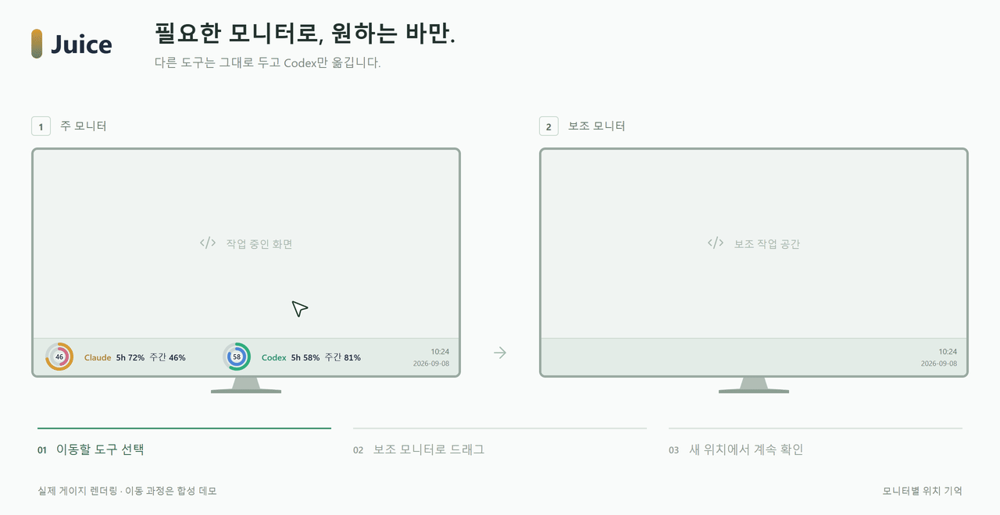

이동 흐름을 알아보기 쉽게 만든 합성 데모입니다. 실제 바 구조와 모니터별 위치 저장 동작을 기준으로 제작했습니다.

Claude·Codex·Grok·Cursor는 서로 다른 투명 창이므로 하나만 잡아 다른 모니터의 작업표시줄로 옮길 수 있습니다. 기본으로 켜진 **화면 조합별 프로필**은 현재 연결된 모니터 구성을 구분해 도구별 대상 모니터와 작업표시줄 상대 위치를 따로 저장합니다. **표시 구성과 크기·간격 기억**도 기본으로 켜져 있어 노트북 단독, 집, 사무실 조합마다 넉넉/컴팩트/이중원/링4, 원/가로 바, 표현, 링·글자 크기와 간격을 복원합니다.

- 최근 사용한 모니터 조합을 최대 16개까지 유지합니다.
- 같은 모니터 조합이라도 **해상도와 Windows 디스플레이 배율**이 다르면 별도 환경으로 기억합니다. 표시 구성 기억이 켜져 있으면 폰트도 함께 복원하며, 기존 모니터 ID 기반 프로필은 새 환경의 초기값으로 보존합니다. 밝게/어둡게 테마와 Windows 접근성 텍스트 크기는 이 환경 프로필로 변경하지 않습니다.
- 모니터 연결이 바뀌는 동안의 일시적인 구성은 저장하지 않아 기존 배치를 보호합니다.
- **색상도 기억**은 별도 옵션이며 기본값은 꺼짐입니다. 켜면 팔레트와 도구·기간·글자·트랙 색상도 조합별로 복원합니다.
- 앱 테마, 라이트 스타일, 언어, 수집주기, 임계값, 도구 활성화와 로그인·수집 상태는 화면 조합과 무관하게 유지됩니다.
- 설정의 **프로필 초기화**는 저장된 조합만 지우며 현재 화면의 바 위치와 표시 설정은 그대로 유지합니다.

### 설치와 첫 실행

1. [Releases](https://github.com/Lv2dev/agent-juice/releases/latest)에서 최신 `Juice_*_x64-setup.exe`를 받습니다.
2. 설치 후 Windows 트레이의 Juice 아이콘을 클릭해 패널을 엽니다.
3. Claude가 활성화되어 있으면 Juice 설치본은 시작할 때 statusline 수집 연결을 비파괴·멱등으로 조정합니다.
4. Claude 자동 수집을 끈 경우 이 PC에서 Claude Code를 한 번 사용해 statusline 데이터를 생성합니다.
5. 이 PC의 Codex Desktop 또는 Codex CLI에 로그인합니다. Juice가 공식 runtime을 자동 탐색하고 하나의 persistent app-server connection으로 정확한 계정 한도와 활동량을 조회하며, rollout 기록은 장애 시 근사 fallback으로 사용합니다.
6. Grok Build를 사용한다면 로컬 로그인을 확인한 뒤 Juice의 표시줄 탭에서 Grok을 활성화합니다.
7. Cursor를 사용한다면 Cursor GUI 또는 Cursor Agent CLI에 로그인한 뒤 Juice의 표시줄 탭에서 Cursor를 활성화합니다.
8. Antigravity를 사용한다면 표시줄 탭에서 활성화합니다. Desktop만으로도 사용할 수 있습니다. CLI는 `1.1.11` 이상에 한 번 로그인하면 자동 조회하며 별도의 상태줄 설정이나 명령 입력이 필요하지 않습니다.

### 수집 방식과 세부 동작

아래는 도구별 수집 경로와 설정 항목의 자세한 동작입니다.

#### 데이터는 어디서 가져오나요?

| 도구 | 우선 수집원 | 보조 수집원 | 표시 정확도 |
| --- | --- | --- | --- |
| Claude | Claude Code 로그인 우선, 없거나 만료되면 Claude 데스크톱의 기존 로그인으로 계정 조회 | Code 경로에서만 statusline `rate_limits`, 구버전 `/usage` fallback | GUI 경로는 계정·조직을 확인하며 Code 세션 한도와 합치지 않습니다. |
| Codex | 자동 탐색한 Codex Desktop 또는 CLI의 공식 app-server `account/rateLimits/read` | `~/.codex/sessions`의 최신 rollout JSONL | 한 번 연결한 app-server를 재사용해 현재 한도를 정확값으로 표시하며, rollout fallback은 근사치입니다. |
| Grok Build | 공식 ACP `_x.ai/billing` | 없음 | ACP가 반환한 현재 단일 주간/월간 크레딧 period를 정확값으로 표시합니다. 세션·프롬프트·모델 호출은 만들지 않습니다. |
| Cursor | Cursor GUI 또는 Agent CLI 로컬 credential로 Dashboard usage 조회 | credential이 없는 구버전 Agent의 bounded `/usage` | 같은 계정의 Auto/API 월간 풀을 정확값으로 표시하며 어느 경로도 모델 프롬프트를 보내지 않습니다. |
| Antigravity | 실행 중인 Desktop을 통한 기간별 한도 갱신 | Desktop 미실행 시 로그인된 CLI의 읽기 전용 계정 조회 | Gemini의 5시간·주간 잔여량과 리셋 시각을 표시합니다. Claude/GPT 등 3p 한도는 제외하며 두 수집원을 섞지 않습니다. |

Juice는 각 도구의 기존 로컬 로그인 상태를 사용하며 계정 토큰을 별도로 입력받지 않습니다. 도구를 끄면 해당 수집도 중단됩니다. Claude 계정 자동 수집은 Claude가 활성화된 동안 기본으로 켜져 있으며 별도로 끌 수 있고, Grok과 Cursor는 표시줄 탭에서 처음 켠 뒤 자동 수집됩니다. Codex의 한도와 활동 조회는 하나의 persistent stdio connection을 공유합니다.

#### Claude 계정 사용량 자동 수집

  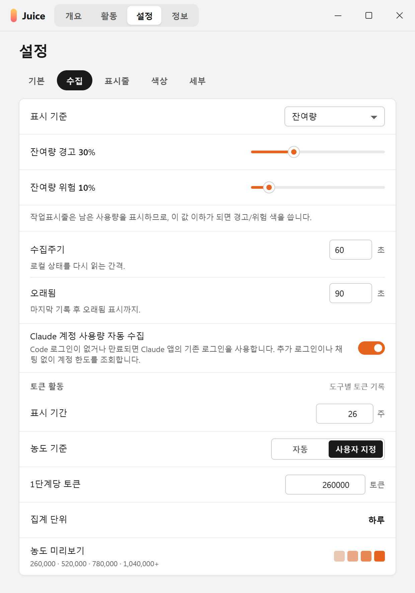

**Claude 계정 사용량 자동 수집**은 `수집` 탭의 일반 기능이며 기본값은 **켜짐**입니다.

- 유효한 로컬 Claude Code 로그인이 있으면 우선 사용합니다. Code 로그인이 없거나 만료되면 Claude 데스크톱이 저장한 기존 로그인으로 계정의 5시간·주간 usage를 조회합니다. 추가 로그인이나 채팅 전송은 필요하지 않습니다.
- Windows 일반 설치와 Microsoft Store 설치의 기본 Claude 프로필을 확인합니다. 앱이 생성한 호환되는 유효 인증 캐시가 필요하며, 캐시가 없거나 만료되었다면 Claude 앱을 열어 로그인 상태를 확인하세요. Juice는 인증 갱신이나 권한 추가를 대신하지 않습니다.
- 데스크톱 인증은 동일 Windows 사용자의 표준 암호화 API로 메모리에서만 읽습니다. CLI·PowerShell을 반복 실행하거나 토큰을 인자·로그·별도 인증 파일에 저장하지 않습니다.
- GUI 경로는 서버의 계정·조직이 인증 캐시와 일치하는지 확인합니다. 복수 프로필·조직이 모호하거나 조회 중 인증 파일이 바뀌면 값을 표시하지 않습니다. Code와 GUI의 한도를 합산하지 않고, GUI 조회 실패 시 오래된 Code statusline 값으로 대체하지 않습니다.
- 명시적인 인증 실패는 legacy CLI를 자동 실행하지 않고 `로그인 필요`로 표시합니다. endpoint 형식이 호환되지 않거나 사용자가 강제 새로고침한 경우에만 bounded `/usage` fallback을 사용할 수 있습니다.
- 정확 OAuth 계정 한도는 statusline의 오래된 계정 값보다 우선합니다. 구버전 `/usage` fallback은 비어 있는 값만 보충하며, endpoint 또는 CLI 형식이 바뀌면 기존 statusline 결과를 유지합니다.
- 기본 수집주기는 60초이며, Claude 계정 자동 조회는 요청을 줄이기 위해 최소 5분 간격으로 실행합니다. GUI 계정·조직 또는 수집 소스가 바뀌면 이전 값을 지웁니다. 같은 계정의 설정 변경이나 토큰 갱신만으로 성공 값을 지우지는 않습니다.
- 일시적인 조회 실패 시 마지막 성공 값을 유지합니다. `조회 제한`(429)은 바에 문구를 추가하지 않고 hover와 패널에서만 안내합니다. hover에서 마지막 수집 시각도 확인할 수 있습니다. 값이 한 번도 없으면 `–`로 표시합니다. GUI·Code 모두 429 이후 최소 5분부터 점차 대기 시간을 늘리며, 수동 새로고침이나 CLI 폴백으로 대기를 우회하지 않습니다. 로그인 필요·응답 해석 오류·인증 캐시 오류는 계속 구분해 표시합니다.
- 응답의 리셋 시각 형식을 읽지 못해도 유효한 한도 퍼센트는 표시합니다. 알 수 없는 리셋 시각을 추정하지 않습니다.
- GUI 일반 채팅의 토큰 활동 잔디는 포함하지 않습니다. Claude 활동 집계는 기존 Code 로컬 기록 범위입니다. GUI 인증 저장 형식은 내부 구현이므로 앱 업데이트에 따라 지원이 달라질 수 있습니다.
- 표시줄 탭에서 Claude를 끄면 계정 조회와 statusline 수집이 모두 중단되고 기존 Claude statusline 설정이 복원됩니다. 다시 켜면 수집 연결을 자동 복구하고 즉시 새 값을 조회합니다.

#### Grok Build 사용량 자동 수집

Grok은 기존 사용자에게 빈 세 번째 바가 갑자기 생기지 않도록 기본값이 **꺼짐**입니다. `표시줄` 탭에서 **Grok 활성화**를 켜면 바 표시, 한도 수집, 토큰 활동 집계가 함께 시작됩니다.

- Juice는 로그인된 Grok Build의 공식 ACP를 한 번 `initialize`한 뒤 persistent connection으로 `_x.ai/billing`만 재사용합니다. 새 대화나 세션, 프롬프트, 모델 턴을 만들지 않으므로 이 조회 자체로 모델 토큰을 소비하지 않습니다.
- ACP가 반환한 현재 period가 주간이면 `주간`, 월간이면 `월간` 한도 하나만 표시합니다. 존재하지 않는 5h 한도나 빈 두 번째 링은 만들지 않습니다.
- 토큰 활동은 현재 PC의 `~/.grok/sessions/**/updates.jsonl`에서 완료된 응답 usage를 읽습니다. 캐시 토큰은 포함하고 output에 포함된 reasoning token은 중복 가산하지 않습니다.
- Juice는 Grok `auth.json`을 직접 읽거나 저장하지 않습니다. 공식 실행 파일을 찾을 수 없거나 미로그인·구버전·timeout인 경우 Grok만 마지막 정상값 또는 빈 상태로 남고 Claude/Codex 수집은 계속됩니다.

#### Antigravity Desktop/CLI 한도

`표시줄` 탭의 **Antigravity 활성화**를 켜면 **Gemini의 5시간·주간** 잔여량과 각 리셋 시각을 표시합니다. Antigravity의 Claude/GPT 등 서드파티(3p) 모델 한도는 표시하지 않으며, 기존 Claude Code나 Codex의 한도와도 합치지 않습니다.

- Windows 기본 사용자 설치 경로의 새 Antigravity Desktop과 `agy` CLI를 지원합니다. 별도 Antigravity IDE는 대상이 아니며, CLI 설치는 필수가 아닙니다. 기존 Desktop 수집 동작은 유지합니다.
- Desktop이 실행 중이면 GUI를 우선하고, GUI가 꺼져 있을 때만 CLI를 사용합니다. GUI 조회 실패를 CLI 값으로 덮거나 두 수집원을 합치지 않습니다. CLI는 설치하고 한 번 로그인하면 터미널을 열어 두지 않아도 됩니다. GUI 앱을 대신 실행하거나 사용자 대화에 메시지를 보내지 않습니다.
- Desktop 자동 수집은 설정된 수집주기를 따르되 최소 60초 간격입니다. GUI의 자동·수동 조회는 실행 중인 앱에 기간별 한도의 갱신을 요청하며, 채팅이나 모델 요청은 보내지 않습니다.
- CLI `1.1.11` 이상에서 공식 읽기 전용 `agy --print /usage --output-format json`을 백그라운드로 실행합니다. CLI가 스스로 처리하는 계정 조회이며 모델 턴을 시작하지 않습니다. 구조화된 `command.name=usage`, 모델 토큰과 턴 수 `0`, Gemini 기간별 데이터까지 검증한 응답만 사용합니다.
- 사용자가 `/usage`나 `/statusline on`을 입력할 필요가 없으며, CLI settings 파일의 사전 생성이나 statusline 설정도 필요하지 않습니다. 표시를 켜면 최초 조회가 시작되고, 자동 조회는 수집주기를 따르되 최소 5분 간격입니다. 빠르게 반복한 수동 새로고침은 30초 간격으로 제한합니다.
- 기존 버전의 Juice statusline 연결이 있으면 자기 연동만 해제하고 기존 설정을 복원합니다. custom statusline의 명령과 옵션은 유지하며 새 연결을 등록하지 않습니다. 이미 열린 사용자 CLI는 종료하거나 조작하지 않습니다.
- 검증한 설치 경로의 실행 파일을 직접 호출하므로 Node, PATH 검색이나 명령 셸, 8.3 짧은 경로에 의존하지 않습니다. 공백·한글 경로를 지원하고 숨김 실행, 출력 크기 제한, 타임아웃과 자식 프로세스 정리를 적용합니다.
- 응답 원문, 이메일, 인증 정보, 대화 본문은 저장하지 않습니다. 한도 숫자와 초기화 시각만 표시하며 CLI 조회 실패나 로그인 해제에서는 이전 계정의 값을 현재값으로 재사용하지 않습니다. 재조회 대기 중 캐시를 읽어도 수집 시각을 새로 만들지 않습니다.
- 한도 응답에 없는 기간은 표시하지 않습니다. GUI의 구버전 앱이 기간별 조회를 지원하지 않거나 응답을 읽지 못하면, 오래된 모델별 캐시나 CLI 값으로 대체하지 않고 이전 숫자를 지웁니다.
- 컴팩트 모드에서도 `5h`와 `주간`을 구분하며, 두 기간의 색상을 각각 설정할 수 있습니다.
- 링·막대, 네 표시 모드, 색상과 글자 설정, 독립 이동 및 화면 프로필을 지원합니다. Antigravity 토큰 활동 잔디는 아직 포함하지 않습니다.
- GUI는 앱 내부 인터페이스를, CLI는 공식 읽기 전용 명령을 사용합니다. CLI 구버전이나 형식 변경에서는 조회를 거부하며 임의 모델 프롬프트로 대체하지 않습니다. 일반 응답 오류를 Google 계정의 로그아웃으로 취급하지 않습니다.

#### Cursor 사용량과 토큰 활동 자동 수집

Cursor는 기존 사용자에게 새 네 번째 바가 갑자기 생기지 않도록 기본값이 **꺼짐**입니다. `표시줄` 탭에서 **Cursor 활성화**를 켜면 두 월간 풀과 Cursor 계정 토큰 활동을 함께 수집합니다.

- Juice는 먼저 Cursor GUI `state.vscdb`의 필요한 `ItemTable` 키 두 개만 read-only snapshot으로 조회합니다. DB에 큰 `cursorDiskKV`가 있어 파일이 64MB 또는 1GB를 넘어도 전체 테이블을 메모리에 올리지 않습니다.
- GUI credential을 사용할 수 없으면 Cursor Agent CLI의 bounded `auth.json` access token과 `cli-config.json` userId를 사용해 같은 Dashboard usage를 조회합니다. refresh token은 사용하거나 보관하지 않습니다.
- Dashboard의 `Auto`는 **Cursor Models**, `API`는 **Other Models**로 표시합니다. GUI와 CLI는 같은 계정의 월간 풀 하나를 공유합니다.
- Dashboard credential이 없는 구버전 CLI 환경에서만 `%LOCALAPPDATA%\cursor-agent`의 provider-specific runtime을 검증한 뒤 숨은 Windows ConPTY `/usage`를 최후 fallback으로 사용합니다. 일반 `agent` 명령은 사용하지 않습니다.
- PTY fallback은 비어 있는 임시 HOME·workspace·data와 최소 시스템 환경변수만 사용해 hook, MCP, rule, workspace context 또는 다른 도구의 API key를 상속하지 않으며 종료 직후 제거됩니다.
- Dashboard reset은 정확한 시각으로, PTY fallback reset은 원본 월·일 정밀도로 표시합니다. 원천보다 정밀한 값을 임의로 만들지 않습니다.
- 조회는 모델 프롬프트나 새 대화를 만들지 않습니다. Cursor 프로세스 기동 비용을 줄이기 위해 자동 조회는 최소 5분 간격이며 바 우클릭 또는 트레이 새로고침은 즉시 강제 조회합니다.
- GUI/CLI credential은 regular-file, reparse, file identity와 개별 값 크기를 검증한 뒤 호출 시점에만 읽습니다. token·refresh token·raw response·email·conversation ID를 설정, cache, process argument, 로그에 기록하지 않습니다.
- 토큰 활동은 Cursor Dashboard의 account event에서 input/output/cache write/cache read를 합산하고 event 시각을 Windows 현지 날짜로 변환합니다. 현재 PC 전용이 아니라 같은 Cursor 계정 전체 범위입니다.
- private Cursor Dashboard 계약이 바뀌면 Cursor만 stale/partial 또는 로그인 필요 상태가 되며 Claude·Codex·Grok 수집은 계속됩니다.

#### 원·바 표현 스타일

  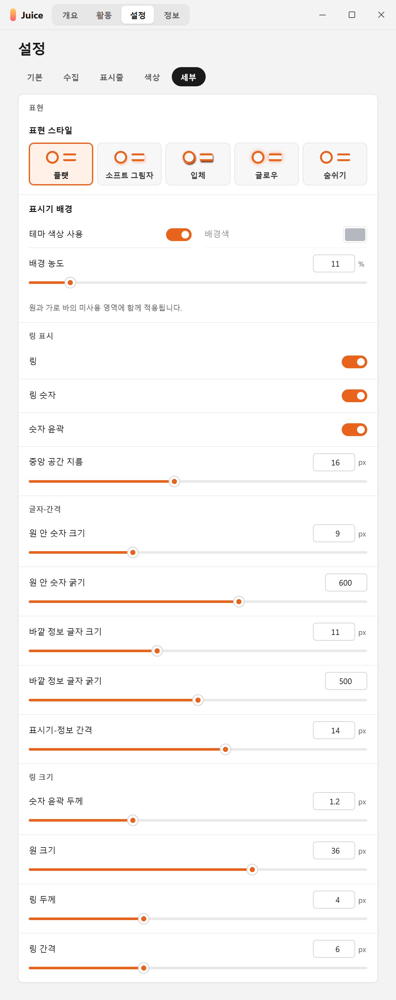

원과 위아래 가로 바는 같은 표현 스타일을 공유합니다.
미사용 영역도 하나의 배경 설정을 공유합니다. 기본은 기존 가로 바와 같은 테마 적응색·농도 11%이며, `테마 색상 사용`을 끄면 배경색과 0~100% 농도를 직접 지정할 수 있습니다.

| 스타일 | 표현 |
| --- | --- |
| 플랫 | 그림자와 애니메이션이 없는 기본 스타일입니다. 기존 설치도 플랫을 유지합니다. |
| 소프트 그림자 | 본체 뒤에 낮은 그림자를 더합니다. |
| 입체 | 위쪽 하이라이트와 아래쪽 음영으로 깊이를 만듭니다. |
| 글로우 | 현재 팔레트 색상의 얕은 후광을 표시합니다. |
| 숨쉬기 | 값과 글자는 고정하고 후면 효과의 투명도만 천천히 변화시킵니다. |

숨쉬기는 정상 수집 상태에서만 움직입니다. 값이 없거나 오래된 경우 정지하며, Windows에서 모션 감소를 사용하면 정적인 소프트 효과로 자동 대체됩니다. 모든 효과는 숫자와 기본 stroke 뒤에 렌더링되므로 바 위치나 크기를 흔들지 않습니다.

#### 테마·팔레트·도구별 색상

  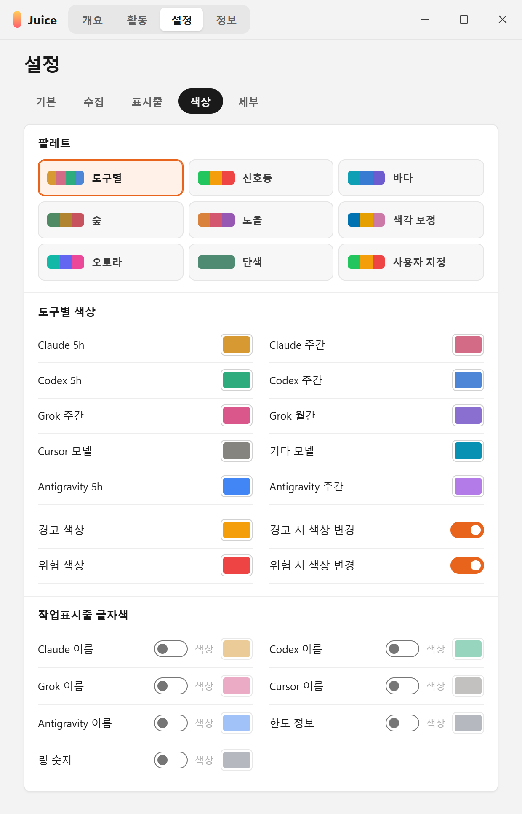

- 기본 테마는 Windows 시스템 설정을 따르며 라이트와 다크를 직접 고정할 수 있습니다. 밝게 보일 때의 패널 모습은 라이트 스타일(Fluent/Paper)로 고릅니다.
- 9개 팔레트 중 `도구별`을 선택하면 Claude와 Codex가 제공하는 5h/주간, Grok 주간/월간, Cursor Models/Other Models 기본색을 각각 지정할 수 있습니다.
- 공통 경고색과 위험색도 직접 지정하며, `경고 시 색상 변경`과 `위험 시 색상 변경`을 서로 독립적으로 켜거나 끌 수 있습니다.
- 위험 색상 변경만 끄면 위험 구간에서도 경고색을 유지하고, 두 변경을 모두 끄면 모든 구간에서 도구별 기본색을 유지합니다. 색상과 토글은 즉시 저장되어 모든 원·바 모드와 패널 게이지에 적용됩니다.

#### 업데이트 확인과 알림

  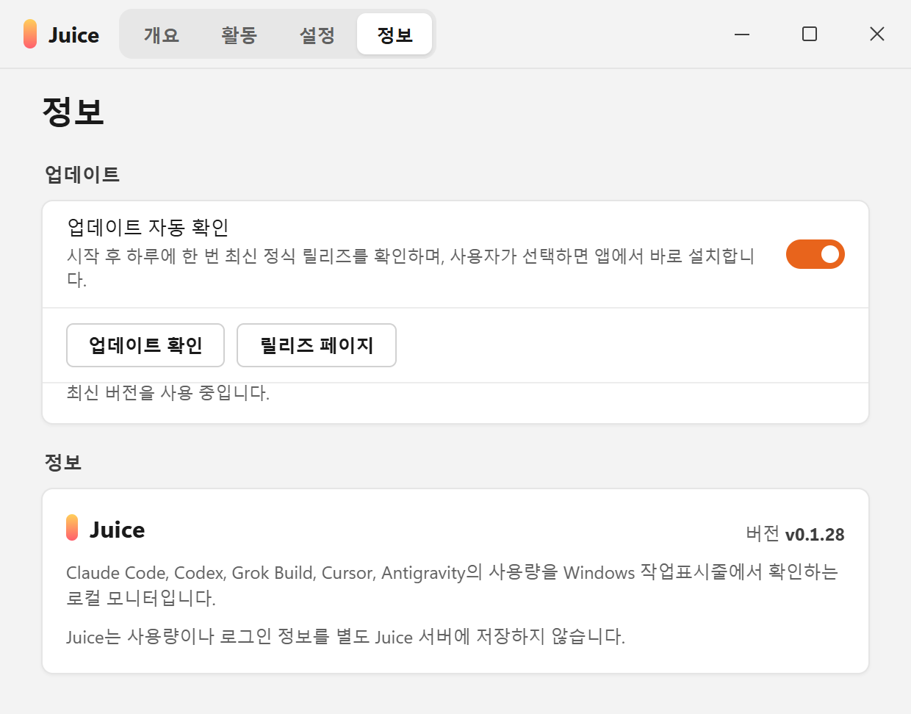

- 기본값은 켜짐이며 시작 15초 후, 마지막 성공 확인에서 24시간이 지난 경우에만 최신 정식 GitHub Release를 확인합니다.
- 새 버전은 버전당 한 번 Windows 알림으로 안내하고 패널 위쪽에도 계속 확인 가능한 업데이트 띠를 표시합니다.
- `업데이트 확인`은 24시간 캐시를 우회합니다. 자동 확인 실패는 조용히 넘어가고 수동 확인 실패만 패널에 표시합니다.
- `업데이트 및 재시작`을 누르면 다운로드·서명 확인 진행 상태를 표시하며 공식 릴리즈의 설치 파일을 내려받고, 앱에 내장된 공개키와 설치 파일 버전을 검증한 뒤 passive 설치와 재시작을 수행합니다.
- 다운로드·서명·버전 검증 또는 업데이트 인계가 실패하면 현재 앱과 설정을 유지합니다. 설치가 끝나면 Juice가 설치된 버전을 다시 확인하고 앱을 재시작하며, 공식 Releases 페이지는 수동 설치가 필요한 경우를 위한 fallback으로 남습니다.
- 앱 내 업데이터가 없는 v0.1.10 이하에서는 v0.1.11을 한 번 수동 설치해야 하며, 이후 정식 버전부터 원클릭 업데이트를 사용할 수 있습니다.
- 확인 요청에는 GitHub token, Juice 계정, 사용량 데이터, 사용자 식별값, telemetry가 포함되지 않습니다.

#### 정보와 로컬 처리 원칙

`정보` 탭은 위쪽의 `업데이트` 묶음과 아래쪽의 `정보` 묶음으로 나뉩니다. `정보` 묶음은 현재 버전과 프로그램 역할, 로컬 처리 원칙만 보여주며 업데이트 동작과 상태는 `업데이트` 묶음에 모아 서로 섞이지 않습니다.

#### 주요 동작

- **트레이 아이콘:** Juice 아이콘 하나만 표시하며 패널 열기, 바 일시중지/재개, 종료를 제공합니다.
- **테마:** 기본값은 시스템 테마이며 라이트와 다크를 직접 선택할 수 있습니다. 라이트 스타일로 Fluent와 Paper 중 하나를 고릅니다.
- **언어:** 시스템 언어를 따르거나 한국어/영어를 고정할 수 있습니다.
- **폰트:** Windows 작업표시줄과 맞춘 시스템 폰트가 기본이며 Pretendard를 선택할 수 있습니다.
- **Windows 텍스트 크기:** 접근성의 텍스트 크기 100~225%를 자동 반영합니다. 패널은 큰 글자에 맞춰 줄바꿈하고 바는 실제 내용에 맞춰 폭을 조정합니다. 작업표시줄 높이와 링 중앙 공간이 제한되는 경우 숫자는 그 안에 맞추며, Juice에 저장한 글자 크기 설정은 그대로 유지됩니다.
- **팔레트:** 도구별, 신호등, 바다, 숲, 노을, 색각 보정, 오로라, 단색, 사용자 지정을 제공합니다. 도구별은 다섯 도구의 한도별 열 가지 기본색과 경고·위험색을 지정하고 단계별 전환을 따로 끌 수 있으며, 단색은 정상 상태를 한 색으로 통일합니다.
- **전체화면 숨김:** 신규 설치 기본값은 꺼짐입니다. 켜면 같은 모니터의 전체화면 앱을 감지할 때 해당 작업표시줄 바를 숨깁니다. 최대화 창 숨김은 별도 옵션입니다.
- **다중 모니터:** 각 바를 원하는 모니터 작업표시줄로 직접 끌어 놓으면 모니터와 상대 위치를 기억합니다.
- **오래됨 표시:** 마지막 기록이 설정한 시간보다 오래되면 hover에 오래됨 상태를 안내합니다. 작업표시줄 글자색은 정상 상태와 같은 자동·사용자 지정 색을 유지하고, 게이지 농도만 낮춥니다.
- **업데이트:** 최신 정식 릴리즈를 하루 한 번 확인하고, 사용자가 승인한 경우에만 서명 검증·설치·재시작을 진행합니다.

### 문제 해결

- **로그인 필요가 표시됨:** 사용 중인 Claude 앱/Code·Codex Desktop/CLI·Grok Build·Cursor GUI/Agent의 로그인 상태를 확인한 뒤 Juice에서 강제 새로고침하세요. 다음 정상 수집에서 자동으로 해제됩니다.
- **Claude가 비어 있음:** Claude 표시와 계정 자동 수집을 켜세요. GUI만 사용하는 경우 Claude 앱의 로그인을 확인하고 강제 새로고침하면 됩니다. 만료·미지원·모호한 GUI 인증을 무조건 로그아웃으로 단정하지는 않습니다.
- **Codex가 비어 있음:** 현재 PC의 Codex Desktop 또는 CLI 설치·로그인을 확인하고 강제 새로고침하세요. Juice는 Desktop versioned runtime을 우선 탐색하고 CLI로 fallback합니다.
- **Grok이 비어 있음:** 표시줄 탭에서 Grok을 활성화하고 현재 PC의 Grok Build 설치·로그인을 확인하세요. Grok은 기본 OFF이며 공식 ACP billing을 사용할 수 있을 때 표시됩니다.
- **Cursor가 비어 있음:** 표시줄 탭에서 Cursor를 활성화하고 Cursor GUI 또는 Agent CLI 로그인을 확인한 뒤 강제 새로고침하세요. Juice는 GUI credential, CLI credential, bounded `/usage` 순서로 시도합니다.
- **Antigravity가 비어 있거나 오래됨:** 표시줄 탭에서 활성화하고 Desktop 또는 CLI 로그인을 확인하세요. Desktop이 실행 중이면 GUI가 우선입니다. CLI `1.1.11` 이상에서는 터미널을 열지 않아도 자동으로 조회합니다. 정보 새로고침은 30초 간격을 지키며, 구버전 CLI는 먼저 업데이트하세요.
- **값이 대시로 보임:** 해당 도구가 아직 한도 정보를 내보내지 않았거나 기록이 오래됐을 수 있습니다.
- **패널을 최소화한 뒤 안 보임:** 트레이의 Juice 아이콘을 다시 클릭하세요.
- **바가 안 보임:** 전체화면/최대화 숨김, 트레이 일시중지, 도구별 표시 설정과 저장된 대상 모니터를 확인하세요.

#### 다른 PC에서 값이 안 보일 때

Juice v1은 별도 Juice 서버로 PC 간 데이터를 동기화하지 않습니다. 다른 PC에서는 그 PC에 Juice를 설치하고 사용할 Claude 앱/Code·Codex·Grok Build·Cursor·Antigravity의 로컬 로그인을 각각 확인해야 합니다. 단, Cursor 활동 필터는 Cursor 계정 자체가 제공하는 event라 같은 계정의 다른 PC·Cloud Agent 사용도 포함합니다.

1. Juice에서 Claude가 활성화되어 있는지 확인해 statusline 자동 연결과 수집을 시작합니다.
2. Claude 계정 자동 수집을 켜고 Code 또는 Claude 앱의 로그인을 확인합니다. GUI 경로에서는 Code 사용이나 statusline 파일 생성이 필요하지 않습니다.
3. Codex Desktop 또는 Codex CLI 로그인을 확인합니다. Juice는 둘 중 사용 가능한 공식 app-server runtime을 자동 탐색합니다.
4. exact 조회가 일시적으로 실패할 때 사용할 rollout JSONL은 해당 PC에서 Codex를 사용한 적이 있는 경우에만 생성됩니다.
5. Grok을 사용한다면 Grok Build 로그인을 확인하고 Juice에서 Grok을 활성화합니다.
6. Cursor를 사용한다면 Cursor GUI 또는 Cursor Agent CLI 로그인을 확인하고 Juice에서 Cursor를 활성화합니다.
7. Antigravity를 사용한다면 Desktop 또는 CLI 로그인을 확인하고 Juice에서 활성화합니다. CLI `1.1.11` 이상이면 별도 명령이나 터미널 대기 없이 계정 한도를 읽습니다.

한 PC의 사용량을 다른 PC에서 보는 기능은 후속 다중 PC 버전 범위입니다.

### 개인정보와 한계

- Juice가 저장하는 설정과 수집 결과는 현재 PC에만 남으며 별도 Juice 서버로 전송하지 않습니다.
- Claude 계정 자동 수집은 로컬 Code/데스크톱 access token을 Anthropic의 고정 usage endpoint에만 보내며, GUI 경로에서는 같은 서버의 profile endpoint로 계정·조직을 검증합니다. refresh token은 사용하거나 저장하지 않습니다.
- Grok 한도 수집은 로그인된 공식 Grok Build 실행 파일의 로컬 ACP만 호출하며 Juice가 Grok 인증 token이나 `auth.json`을 읽지 않습니다.
- Cursor 한도는 GUI 또는 Agent CLI의 local access token을 고정 Cursor Dashboard usage endpoint에만 전달합니다. refresh token은 사용·보관하지 않으며, credential 기반 조회가 불가능할 때만 Agent PTY `/usage`를 사용합니다.
- Cursor 토큰 활동은 같은 account Dashboard의 event를 읽으며 계정 전체 범위입니다. Juice는 날짜별 네 token component 합계만 local cache에 남기고 email·model·conversation/request ID와 raw response를 저장하지 않습니다.
- Codex 한도와 토큰 활동은 로그인된 공식 Desktop/CLI app-server의 persistent stdio connection으로 `account/rateLimits/read`와 `account/usage/read`를 직렬 조회합니다. 계정 token을 직접 읽지 않고 raw response도 저장하지 않습니다.
- Antigravity CLI 계정 조회는 원문, email·text·token, 대화 본문을 저장하지 않습니다. 모델 토큰·턴 수가 `0`인 공식 읽기 전용 응답의 Gemini 한도와 초기화 시각만 사용하며, 로그인 정보는 CLI 내부에 맡깁니다. 이전 버전 statusline 자료와 복원 기록은 다른 수집값과 합치지 않습니다.
- 업데이트 확인은 고정된 GitHub `latest.json` 주소로 표준 HTTPS 요청만 전송합니다. 사용자가 설치를 승인하면 해당 manifest가 지정한 서명된 설치 파일만 내려받으며, 계정 token, 사용량, PC 식별값은 보내지 않습니다.
- LLM API 키나 Juice 전용 계정을 저장하지 않습니다.
- Claude OAuth usage endpoint는 Claude Code 내부 계약이라 향후 CLI 변경의 영향을 받을 수 있습니다. 실패하면 statusline과 구버전 `/usage` fallback만 유지합니다.
- 별도 Juice 로그인이나 외부 토큰 저장소는 사용하지 않습니다.
- Cursor Dashboard endpoint는 공개 개인용 API가 아닌 Cursor 내부 계약이므로 향후 변경될 수 있습니다. 실패는 Cursor에만 격리됩니다.

---

## English

  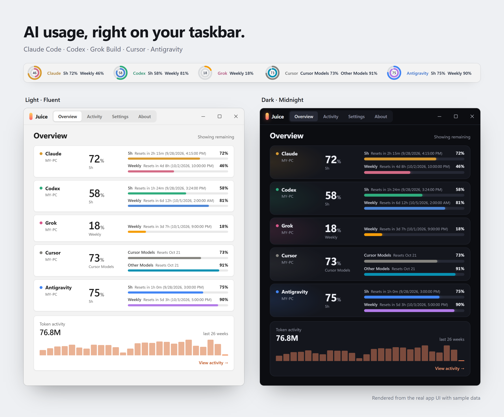

Rendered at 2x resolution using the application's UI code. Values and PC names are sample data.

### At a glance

Juice reads the limits of AI coding tools you are already signed in to and shows them as **a small bar per tool on the Windows taskbar**. Click the tray icon to open a panel with per-tool limits, reset times, and daily token activity. No Juice account, cloud backend, or LLM API key is required.

| Tool | Limits shown | Default |
| --- | --- | --- |
| Claude | **5-hour and weekly limits** through a local Code or desktop login | On |
| Codex | Whichever **5-hour or weekly windows the Codex account currently provides** | On |
| Grok Build | The single **current weekly or monthly limit** | Off |
| Cursor | **Cursor Models/Other Models monthly pools** | Off |
| Antigravity | **Gemini's five-hour and weekly quotas** through Desktop or an automatic CLI account read | Off |

When Codex exposes only one window, Juice renders that real limit without an empty placeholder. Choose either remaining or used percentages. Antigravity prefers Desktop and automatically queries the signed-in CLI while Desktop is closed. Antigravity token activity is not supported.

### Features

| Feature | Behavior |
| --- | --- |
| Remaining or used values | Uses one selected basis across gauges, numbers, and thresholds. |
| Local-login collection | Uses a Claude Code or desktop login, Codex Desktop/CLI persistent app-server and rollout data, official Grok Build ACP, and a Cursor GUI/Agent login. |
| Antigravity Desktop/CLI collection | Prefers the running Desktop and otherwise automatically queries the signed-in CLI with a read-only account command, without terminal interaction or model prompts. |
| Sign-in status | When an explicit authentication failure is confirmed, Juice shows `Sign in required` on that card and bar instead of presenting stale values as current. Network, timeout, and format errors remain distinct. |
| Token activity | Aggregates local Claude/Grok records and official Codex/Cursor account activity by date for a 4 to 52 week heatmap and summary. |
| Three panel skins | Uses Fluent or Paper while the panel is light and Midnight while it is dark. |
| Live settings | Changes are saved and applied without a Save button. |
| Per-tool colors | Assign base colors to Claude/Codex 5-hour and weekly windows, Grok weekly/monthly, Cursor's two monthly pools, and Antigravity's 5-hour and weekly windows, with customizable warning and danger colors. |
| Visual styles | Applies Flat, Soft shadow, Depth, Glow, or Breathe to rings and horizontal bars. |
| Indicator background | Uses one theme-adaptive color and opacity for unused ring and bar areas, with optional custom color and opacity. |
| Independent tool bars | All five tools can be enabled independently. Disabling one stops both its bar and collection; each bar can be moved and assigned to a monitor separately. Grok, Cursor, and Antigravity default to off. |
| Low-interruption behavior | Supports fullscreen/maximized hiding, tray pause/resume, and force refresh from the context menu. |
| One-click updates | Checks the latest stable release once a day and, after user approval, downloads a signed installer, verifies it, updates Juice, and restarts. |

### A tour of the panel

The panel switches between four views with the tabs at the top: **Overview · Activity · Settings · About**. Arrow keys, Home, and End also move between tabs.

#### Overview

  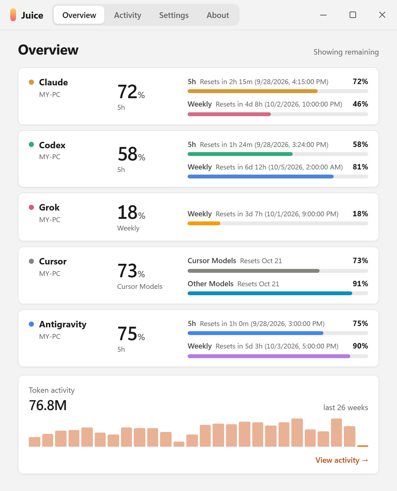

- Each tool shows its name, PC, per-period gauges, and time until reset. The large number and its period identify the **most limiting quota**: the lowest remaining percentage or the highest used percentage. A single-limit tool uses its only quota. Reset dates wrap on a separate line.
- The heading shows the current display basis, remaining or used. Gauges inside the warning or danger threshold switch to your warning or danger colors.
- `Sign in required`, app-not-running, and not-yet-collected states replace the numbers with a short explanation. Old records have a text notice rather than dimmed quota numbers and gauges in Overview. Codex local-session freshness can differ from its account-quota collection state.
- The weekly token bars at the bottom show recent weekly totals, and `View activity` opens the Activity view.

#### Token activity

  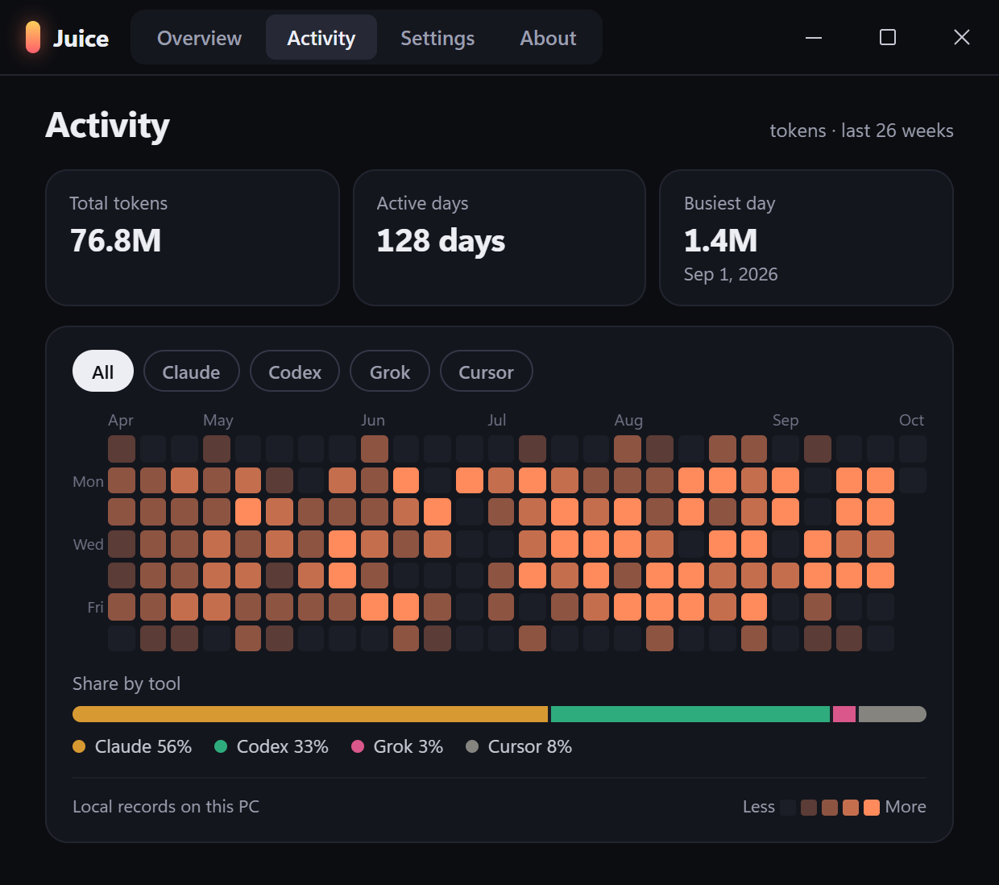

Documentation sample data. All, Claude, Codex, Grok, and Cursor views are available; Codex and Cursor use account scope.

- The Activity view summarizes total tokens, active days, and the busiest day, and provides `All / Claude / Codex / Grok / Cursor` filters with daily token activity. The share of tokens by enabled tool appears below the heatmap. Filters for disabled tools stay hidden.
- Each cell is one date. Claude/Grok and Cursor events use the Windows local date, while Codex preserves the official account bucket `startDate` without guessing its timezone boundary. Choose a 4 to 52 week range and either an automatic logarithmic intensity scale or a custom token count per level.
- Cells keep a readable minimum size in small windows and with enlarged Windows text. Longer periods scroll horizontally; opening Activity starts at the most recent dates.
- On first view, Juice backfills up to one year in the background and then refreshes only changing ranges. Large histories show `Collecting past records` while backfill continues.
- Claude and Grok use records from this PC. Codex uses official account-wide `account/usage/read` daily buckets labeled `Codex account usage`; Cursor uses account events across Cursor GUI, Agent CLI, Cloud Agents, automations, and other PCs labeled `Cursor account usage`.
- If official Codex buckets are unavailable or fail consistency checks, Juice shows a partial empty Codex view instead of falling back to the overcounted rollout estimate.
- Cursor activity uses account-level dated usage events, including usage from other PCs signed into the same account. Page coverage, interval bounds, first-page revalidation, and account checks remain enforced; a separate summary API is not used to discard otherwise valid event history.
- The local activity index and Cursor account cache are stored atomically on this PC. Codex account buckets remain process-memory only, and no activity data is uploaded to a Juice server.

#### Settings layout

  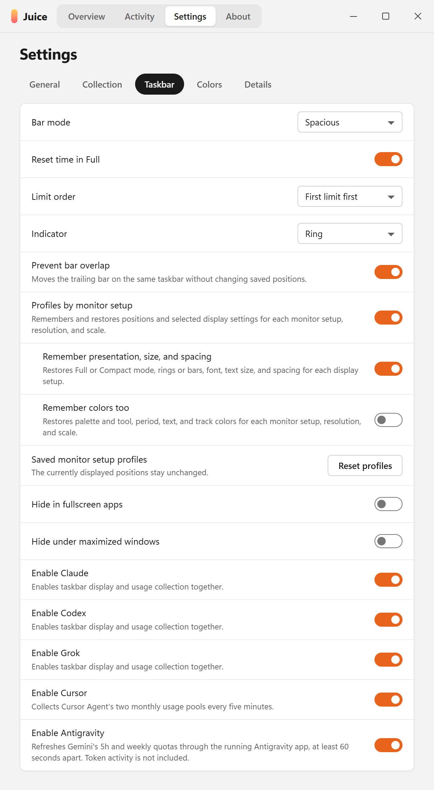

Settings are rows grouped into five task-focused tabs, much like the Windows Settings app. Changes save immediately, and updates and app information live in the `About` tab.

The **Taskbar preview** at the top of Settings lets you choose a tool and see color, mode, ring, text, and spacing changes immediately. It uses existing collected values or clearly labeled sample data, without making extra collection requests or moving the real taskbar bars. Save errors remain visible across tabs and can be dismissed explicitly.

| Tab | Controls |
| --- | --- |
| General | System/light/dark theme, light style (Fluent/Paper), system/Korean/English language, Windows/Pretendard font, Windows autostart |
| Collection | Remaining/usage basis, warning/danger thresholds, collection interval, stale threshold, Claude account collection, token activity range and intensity |
| Taskbar | Four modes, limit order, ring/horizontal-bar display, overlap prevention, monitor-setup profiles for position, presentation, size, spacing, and optional colors, fullscreen/maximized hiding, per-tool display and collection |
| Colors | Nine palettes, ten per-limit base colors across five tools, warning/danger colors and toggles, name/info/ring-number text colors |
| Indicators & text | Visual style, shared indicator background and opacity, ring/numbers/outline, size, thickness, spacing, and typography |
| About tab | Automatic and manual update checks, signed update and restart, Releases fallback, the latest check result, product description, current version, and local-processing policy |

#### Panel skins: Fluent · Paper · Midnight

  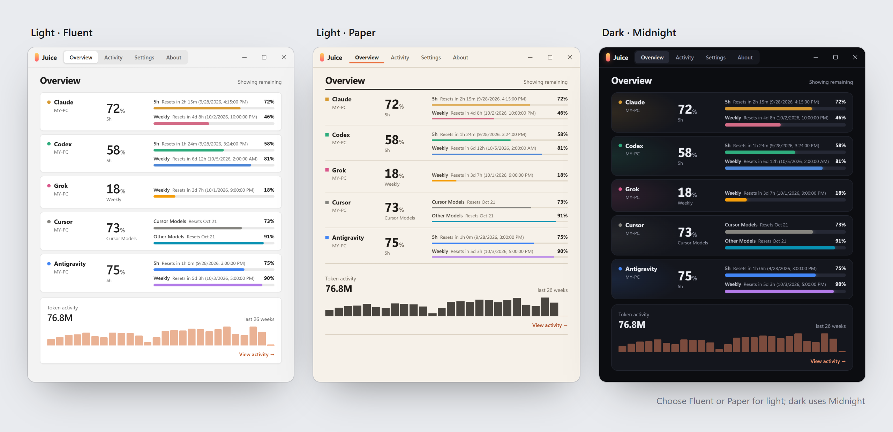

- Choose a system, light, or dark theme, then pick how the panel looks while light under **Light style** in the `General` tab: Fluent or Paper. Dark always uses Midnight.
- With the system theme, the panel uses your light style while Windows is light and Midnight while it is dark.
- Fluent uses cards like Windows 11 apps, Paper uses a cream page with hairlines and bold numbers, and Midnight uses a dark background with glowing gauges.
- Skins apply only to the panel and never change the taskbar bars. The setting is global and not part of monitor-setup profiles.

### Taskbar display

  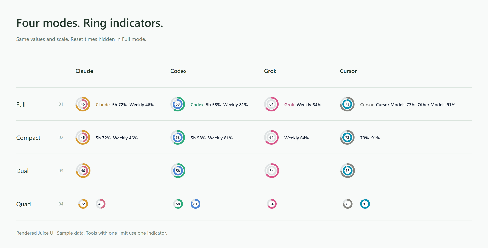

  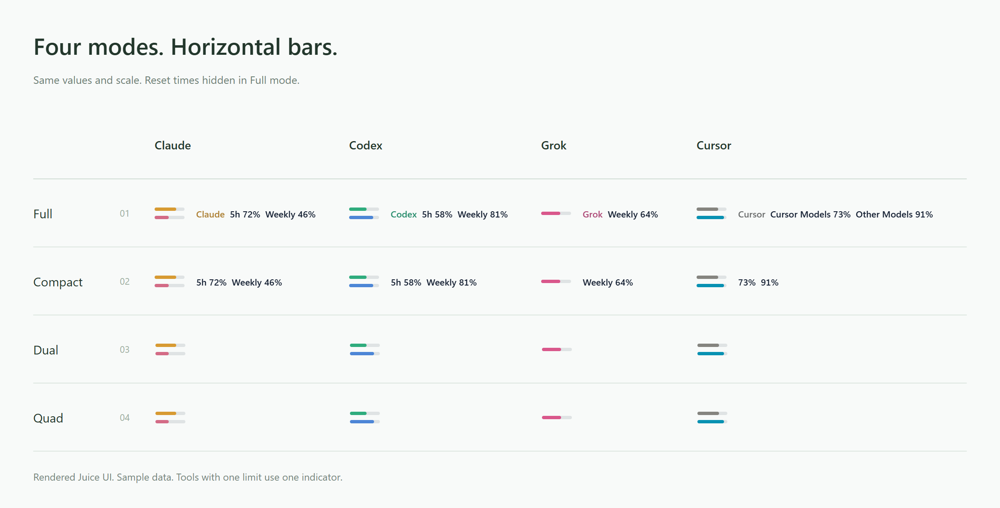

The same four modes use two stacked horizontal bars instead of rings. Dual ring and Four rings use the same compact two-line indicator when bars are selected.

Juice provides **four bar modes**.

| Mode | Layout |
| --- | --- |
| Full | Shows the tool name, ring, every available limit, and time remaining until reset. Reset times can be disabled in Settings. |
| Compact | Hides the tool name and prioritizes the available limit values. |
| Dual ring | Compresses Claude's 5-hour/weekly limits, up to two currently available Codex windows, and Cursor's two monthly pools; a provider with one real limit uses one ring. |
| Four rings | Uses one standalone ring per real limit, so Cursor creates two while Grok creates only one. |

- Switch from rings to two stacked horizontal bars.
- When both periods exist, adjust their order along with numbers, number outline, ring size, thickness, spacing, and the real center opening in 0.1px steps.
- Claude, Codex, Grok, and Cursor use separate transparent windows, so each can be dragged independently and remembered for the current monitor setup.
- On first launch, visible bars are placed from the left edge of the taskbar without overlapping.
- Enabling a previously hidden tool places it in the first free taskbar position without moving existing bars.
- `Prevent bar overlap` is enabled by default. When values or reset text grow, Juice temporarily moves only the trailing bar on the same taskbar. Saved positions and spacing remain unchanged, and the original layout returns when content shrinks.
- During the first collection after startup or reboot, the bar shows `Loading`. If a stored reset time has passed but a new limit has not arrived yet, it shows `Waiting for refresh`.
- Automatic polling pauses while Windows is locked or every display is off, then refreshes once immediately after unlock or display-on. Explicit manual refresh remains available.
- Hovering a bar shows the tool name and time remaining until each available 5-hour, weekly, or monthly limit resets.
- The tooltip also includes **remaining and used percentages**, reset dates and times, the last record timestamp and age, ready/warning/danger/stale state, approximation status, and the PC display name. Your selected display basis comes first. Date-only limits keep their original precision.
- The last record timestamp comes from the data and may differ from the latest network check. Sign-in-required and initial loading states hide previous values. Hovering does not trigger additional usage collection or start external processes.
- The taskbar context menu `Refresh` action bypasses the normal cache and recollects local status.
- Pause or resume all taskbar bars from the Juice tray menu.

#### Move to another monitor

  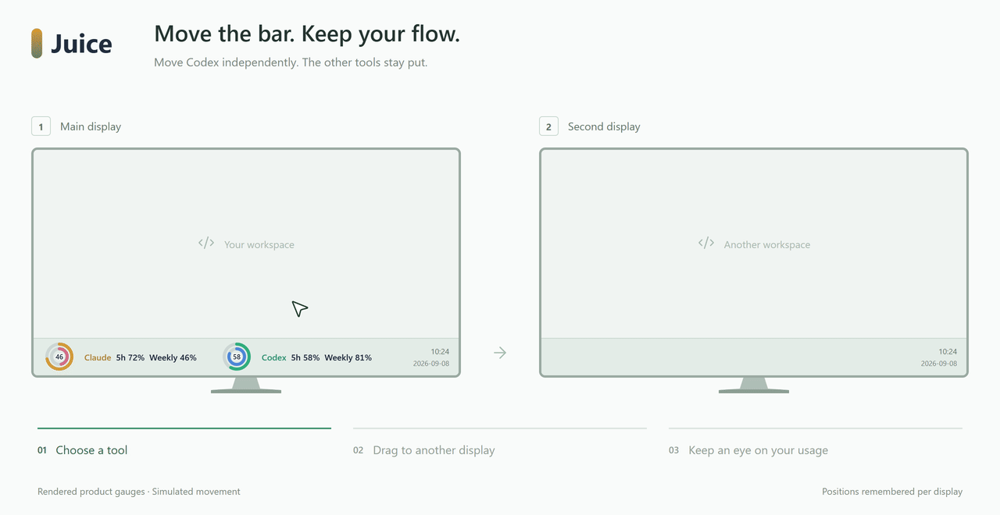

This synthetic demo makes the movement easy to follow. It reflects the real bar structure and per-monitor position persistence.

Claude, Codex, Grok, and Cursor are separate transparent windows, so any one bar can be dragged to another monitor's taskbar without moving the others. **Profiles by monitor setup** stores each tool's target monitor and relative taskbar position for every connected-monitor setup. **Remember presentation, size, and spacing** is also on by default, restoring Full/Compact/Dual/Quad, rings or horizontal bars, effects, ring and text sizes, and spacing for familiar laptop-only, home, or office setups.

- Juice keeps up to 16 recently used monitor setups.
- The same monitors at a different **resolution or Windows display scale** are remembered as separate environments. Presentation memory also restores the font, and existing monitor-ID-only profiles remain available as starting values. Light/dark theme and Windows Accessibility text size are not changed by these profiles.
- Transient configurations observed while monitors are connecting are not saved over a stable layout.
- **Remember colors too** is a separate opt-in setting. It restores palette and tool, period, text, and track colors per setup.
- App theme, light style, language, collection interval, thresholds, tool activation, and provider login or collection state remain global.
- **Reset profiles** clears saved setups without changing the bars or presentation currently on screen.

### Install and first run

1. Download the latest `Juice_*_x64-setup.exe` from [Releases](https://github.com/Lv2dev/agent-juice/releases/latest).
2. Install it, then click the Juice tray icon to open the panel.
3. When Claude is enabled, the installed app non-destructively and idempotently reconciles its statusline collection at startup.
4. If Claude auto-collection is off, use Claude Code once on this PC so statusline data is emitted.
5. Sign in to Codex Desktop or the Codex CLI on this PC. Juice discovers the official runtime and uses one persistent app-server connection for exact account limits and activity; existing rollout records remain an approximate fallback.
6. If you use Grok Build, confirm its local login and then enable Grok in Juice's Taskbar tab.
7. If you use Cursor, sign in to Cursor GUI or Cursor Agent CLI and enable Cursor in Juice's Taskbar tab.
8. If you use Antigravity, enable it in the Taskbar tab. Desktop alone is sufficient. Sign in once to CLI `1.1.11` or later for automatic account reads without statusline setup or command entry.

### Collection and detailed behavior

The sections below describe each tool's collection path and the detailed behavior of the settings.

#### Where does the data come from?

| Tool | Preferred source | Fallback source | Accuracy |
| --- | --- | --- | --- |
| Claude | Local Code login first; existing desktop login when Code login is absent or expired | Code path only: statusline `rate_limits` and legacy `/usage` fallback | Desktop reads validate account and organization without merging Code session limits. |
| Codex | Official `account/rateLimits/read` through an auto-detected Codex Desktop or CLI app-server | Latest rollout JSONL under `~/.codex/sessions` | Reuses one app-server connection for exact current limits; rollout fallback is approximate. |
| Grok Build | Official ACP `_x.ai/billing` | None | Shows the exact current single weekly/monthly credit period returned by ACP without creating a session, prompt, or model call. |
| Cursor | Dashboard usage through local Cursor GUI or Agent CLI credentials | Bounded `/usage` for legacy Agents without usable credentials | Shows the same account Auto/API monthly pools without sending a model prompt. |
| Antigravity | Period quota refresh through the running Desktop | Read-only account lookup through the signed-in CLI while Desktop is closed | Gemini's five-hour and weekly remaining quotas and reset times. Excludes Claude/GPT and other 3p quotas; sources are never mixed. |

Juice reuses each tool's existing local login and never asks you to enter account tokens. Disabling a tool also stops its collection. Claude account auto-collection is on by default while Claude is enabled and can be disabled separately; Grok and Cursor start collecting after you first enable them in the Taskbar tab. Codex limit and activity requests share one persistent stdio connection.

#### Automatic Claude account usage collection

  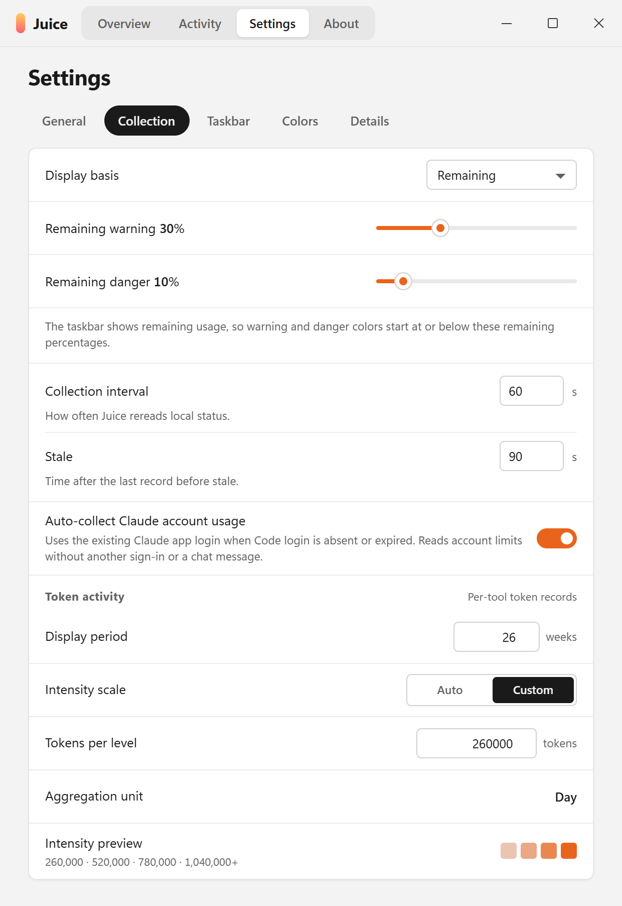

**Claude account usage auto-collection** is a regular option in the `Collection` tab and is **on by default**.

- Juice prefers an available, unexpired local Claude Code login. If it is absent or expired, Juice reads the account's five-hour and weekly usage through the existing Claude desktop login, without another sign-in or chat message.
- Default Windows profiles for regular and Microsoft Store installations are supported. A compatible, valid authentication cache created by Claude is required. If it is absent or expired, open Claude and check its login. Juice does not renew credentials or request additional permissions.
- Desktop credentials are decoded in memory using standard Windows cryptography for the same user. Collection does not repeatedly start a CLI or PowerShell, or put tokens in arguments, logs, or a separate credential file.
- Desktop reads validate the server account and organization against the cache. Ambiguous profiles/organizations or credentials changing during a request suppress the result. Desktop limits are neither summed with Code limits nor replaced by old Code statusline data after a failure.
- Explicit authentication failures show `Sign in required` without automatically starting the legacy CLI. A bounded `/usage` fallback remains only for incompatible endpoint formats or a user-forced refresh.
- Exact OAuth account limits take priority over stale statusline account values. Legacy `/usage` only fills missing values; if the endpoint or CLI format changes, Juice keeps the statusline result.
- The default collection interval is 60 seconds; automatic Claude account queries run no more often than every five minutes to reduce requests. Switching the desktop account, organization or collection source clears previous values. Preference changes or token rotation within the same account do not discard successful values.
- Temporary request failures retain the last successful values. `Rate limited` (429) appears only in the hover details and panel, without adding text to the bar. Hover also shows the last collection time. With no prior values, the bar displays `–`. Both GUI and Code queries back off progressively from at least five minutes after a 429; manual refresh and CLI fallback do not bypass that cooldown. Sign-in requirements, response errors and credential cache errors remain distinct.
- Valid quota percentages remain visible even when the reset timestamp format is unsupported. Unknown reset times are not inferred.
- General GUI chat token activity is not included in the heatmap; Claude activity still comes from local Code records. Desktop credential storage is an internal interface and may change with app updates.
- Disabling Claude in the Taskbar tab stops account and statusline collection and restores the previous Claude statusline configuration. Enabling it reconnects collection and requests fresh data immediately.

#### Automatic Grok Build usage collection

Grok defaults to **off** so existing users do not suddenly receive an empty third bar. Enabling **Grok** in the `Taskbar` tab starts its bar, limit collection, and token activity together.

- Juice initializes the logged-in Grok Build official ACP once and reuses one persistent connection only for `_x.ai/billing`. It creates no conversation, session, prompt, or model turn, so the lookup itself consumes no model tokens.
- A weekly ACP period appears as one `Weekly` limit and a monthly period as one `Monthly` limit. Juice does not invent a 5-hour slot or render an empty second ring.
- Token activity comes from completed response usage under `~/.grok/sessions/**/updates.jsonl`. Cache tokens are included, while reasoning tokens already contained in output are not added twice.
- Juice never reads or stores Grok `auth.json`. If the official executable is unavailable, logged out, too old, malformed, or times out, only Grok remains on its last known or empty state; Claude and Codex collection continue.

#### Antigravity Desktop/CLI quotas

Enable **Antigravity** in the `Taskbar` tab to display **Gemini's five-hour and weekly** quotas with their separate reset times. Antigravity's Claude/GPT and other third-party (3p) model quotas are not displayed or combined with your Claude Code or Codex account limits.

- Supports the new Windows Antigravity Desktop and `agy` CLI in their default per-user installation locations, not the separate Antigravity IDE. Installing the CLI is optional; existing Desktop collection is unchanged.
- A running Desktop takes priority; CLI is used only while the GUI is closed. GUI failures are not replaced with CLI values, and the two sources are never merged. Install the CLI and sign in once; its terminal does not need to stay open. Juice does not launch the GUI or send messages to your conversations.
- Automatic Desktop reads follow your collection interval, with a minimum of 60 seconds. Automatic and manual GUI reads request a period quota refresh through the running app without sending a chat or model request.
- CLI `1.1.11` or later supports the official read-only `agy --print /usage --output-format json` command, which Juice runs in the background. The CLI handles this account read itself without starting a model turn. Juice requires structured `command.name=usage`, zero model tokens and turns, and valid Gemini period quotas.
- You do not need to enter `/usage` or `/statusline on`, create a CLI settings file, or configure its statusline. Enabling the tool starts an initial read. Automatic reads follow your interval with a minimum of 5 minutes; rapid manual refreshes are limited to once every 30 seconds.
- Juice removes only its own statusline connection from older versions and restores the previous settings. Custom commands and options are preserved, and no new connection is registered. It never terminates or operates an already-open user CLI.
- The verified installed executable is launched directly without Node, PATH lookup, a command shell, or 8.3 short paths. Spaces and non-ASCII paths are supported, with hidden execution, output limits, timeouts, and child-process cleanup.
- Raw responses, email, authentication data, and conversation content are not stored. Only quota values and reset times are displayed. Failed reads or sign-outs do not reuse a previous account's values as current data; rereading a cached result does not advance its collection time.
- Periods missing from the response stay hidden. Unsupported GUI versions or failed GUI reads clear the displayed numbers instead of falling back to an older model-quota cache or CLI values.
- Compact mode also labels the two periods as `5h` and `Weekly`. Their colors can be configured separately.
- Rings, bars, all four modes, custom colors and text, independent dragging, and display profiles are supported. Antigravity token activity is not included yet.
- GUI collection uses an internal app interface; CLI collection uses an official read-only command. Unsupported CLI releases or changed response formats fail closed without falling back to a model prompt. Ordinary response errors are not treated as a Google account sign-out.

#### Automatic Cursor usage and token activity collection

Cursor defaults to **off** so existing users do not suddenly receive an empty fourth bar. Enabling **Cursor** in the `Taskbar` tab starts its two monthly pools and account token activity together.

- Juice first opens Cursor GUI `state.vscdb` as a read-only snapshot and queries only the two required `ItemTable` keys. Large unrelated `cursorDiskKV` content does not cause the whole database to be loaded or rejected, even when the file exceeds 64 MB or 1 GB.
- When GUI credentials are unavailable, Juice reads the bounded Cursor Agent CLI `auth.json` access token and `cli-config.json` userId and calls the same Dashboard usage endpoint. It never uses or retains the refresh token.
- Dashboard Auto maps to **Cursor Models** and API maps to **Other Models**. GUI and CLI share the same monthly account pools.
- Only legacy CLI environments without usable Dashboard credentials use hidden ConPTY `/usage` as the final fallback. Juice validates the provider-specific runtime and never invokes a generic `agent` command.
- PTY fallback uses empty temporary HOME, workspace, and data directories plus a minimal environment allowlist, so hooks, MCP, rules, workspace context, and unrelated API keys are not inherited.
- Dashboard resets retain their exact timestamp; PTY fallback resets retain their original month/day precision. Juice never invents precision absent from the source.
- The lookup creates no model prompt or new conversation. Automatic Cursor collection has a five-minute minimum cadence; taskbar or tray refresh forces an immediate lookup.
- GUI and CLI credential files are checked for regular-file identity, reparse points, and bounded individual values. Juice records no token, refresh token, raw response, email, or conversation ID in settings, cache, process arguments, or logs.
- Token activity sums input, output, cache-write, and cache-read values from Cursor account events and converts each event timestamp to the Windows local date. This is account-wide rather than current-PC-only.
- If the private Cursor Dashboard contract changes, only Cursor becomes stale/partial or requires sign-in; Claude, Codex, and Grok continue collecting.

#### Ring and bar visual styles

  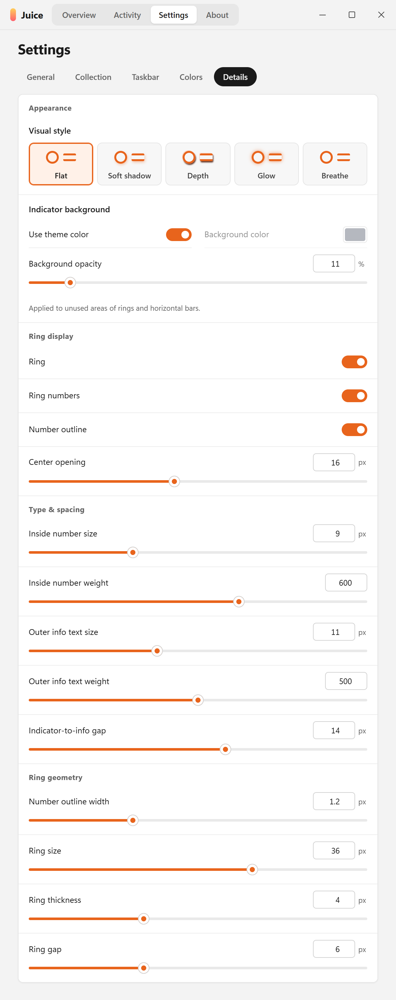

Rings and stacked horizontal bars share one visual style.
Their unused areas also share one background setting. It defaults to the previous horizontal-bar appearance with a theme-adaptive color at 11% opacity. Turn off `Use theme color` to choose a custom background color and 0–100% opacity.

| Style | Appearance |
| --- | --- |
| Flat | The default with no shadow or animation. Existing installs remain Flat. |
| Soft shadow | Adds a restrained shadow behind the primary stroke. |
| Depth | Combines an upper highlight with lower shading. |
| Glow | Adds a shallow halo using the current palette color. |
| Breathe | Keeps geometry and text fixed while slowly changing only the rear effect opacity. |

Breathe runs only for live data. It stops for empty or stale values and becomes a static soft effect when Windows reduced motion is enabled. Effects render behind the crisp stroke and numbers, so they never resize or move the taskbar bar.

#### Theme, palettes, and per-tool colors

  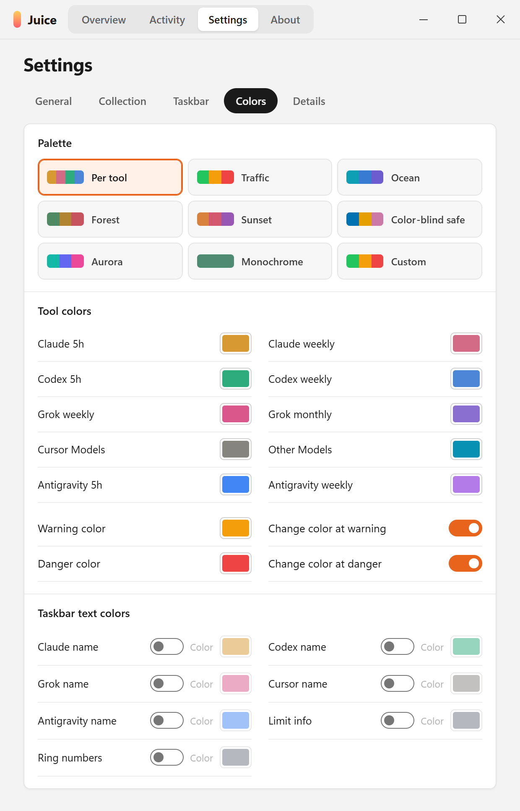

- The default theme follows Windows, with explicit light and dark overrides. Light style (Fluent/Paper) sets how the panel looks while it is light.
- With the `Per tool` palette, the available Claude and Codex 5-hour/weekly windows, Grok weekly/monthly, and Cursor Models/Other Models base colors can be assigned independently.
- Shared warning and danger colors are customizable, and `Recolor on warning` and `Recolor on danger` can be toggled independently.
- Disabling only danger recoloring keeps the warning color in the danger range; disabling both keeps each per-tool base color throughout. Colors and toggles save immediately and apply to every ring and bar mode and to the panel gauges.

#### Update checks and notifications

  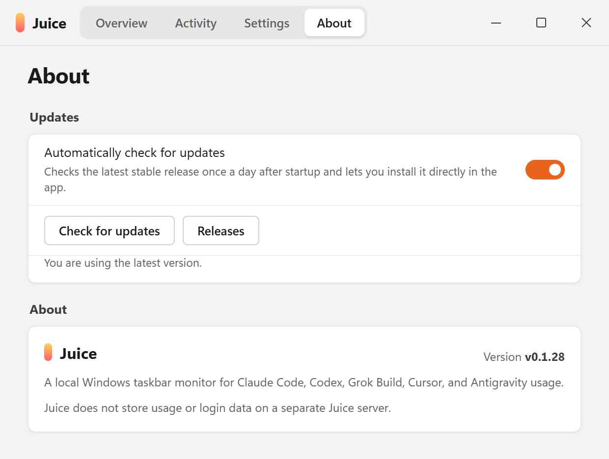

- Enabled by default. Juice checks the latest stable GitHub Release 15 seconds after startup only when 24 hours have passed since the last successful check.
- A new version produces one Windows notification per version and a persistent update band at the top of the panel.
- `Check for updates` bypasses the 24-hour cache. Automatic failures stay quiet; manual failures are shown in the panel.
- `Update and restart` shows download and signature-verification progress, fetches the installer from the official release, verifies its signature and embedded product version, and then performs a passive install and restart.
- If download, signature, version validation, or updater handoff fails, the current app and settings remain intact. After installation, Juice verifies the installed version again and restarts the app; the official Releases page remains available as a manual-install fallback.
- Versions up to v0.1.10 do not contain the in-app updater, so v0.1.11 must be installed manually once. Later stable releases can then use one-click updates.
- Requests include no GitHub token, Juice account, usage data, user identifier, or telemetry.

#### About and local processing

The `About` tab is split into an `Updates` group at the top and an `About` group below. The `About` group contains only the current version, product purpose, and local-processing policy, while update behavior and status stay in the `Updates` group.

#### Key behavior

- **Tray:** One Juice icon provides panel open, taskbar pause/resume, and quit actions.
- **Theme:** Follows the system by default, with explicit light and dark choices. Light style picks Fluent or Paper.
- **Language:** Follows the system or locks the UI to Korean or English.
- **Font:** Uses the Windows taskbar-style system font by default, with Pretendard available.
- **Windows text size:** Automatically follows the Accessibility text size setting from 100% to 225%. The panel reflows for larger text, and bars resize to their measured content. Numbers fit within the available taskbar height and ring center; your saved Juice font-size settings are preserved.
- **Palette:** Choose Per tool, Traffic, Ocean, Forest, Sunset, Color-blind safe, Aurora, Monochrome, or Custom. Per tool exposes ten per-limit base colors plus warning and danger colors with independent recolor toggles; Monochrome unifies normal values.
- **Fullscreen hiding:** Off by default on a new installation. When enabled, it hides each bar while a fullscreen app covers its target monitor. Maximized-window hiding is a separate option.
- **Multiple monitors:** Drag each bar onto a monitor's taskbar to remember that monitor and relative position.
- **Stale state:** The tooltip identifies old records after the configured interval. Taskbar text keeps its normal automatic or custom colors; only the gauge is dimmed.
- **Updates:** Checks the latest stable release once a day and performs signature verification, installation, and restart only after user approval.

### Troubleshooting

- **Sign in required is shown:** Check the affected Claude app/Code, Codex Desktop/CLI, Grok Build, or Cursor GUI/Agent login, then force a refresh in Juice. The state clears after a successful collection.
- **Claude is empty:** Enable Claude and account auto-collection. GUI-only users can check the Claude app login and force a refresh. Expired, unsupported, or ambiguous desktop caches are not automatically treated as a sign-out.
- **Codex is empty:** Confirm the local Codex Desktop or CLI installation and login, then force a refresh. Juice prefers the Desktop versioned runtime and falls back to the CLI.
- **Grok is empty:** Enable Grok in the Taskbar tab and confirm the local Grok Build installation and login. Grok defaults to off and appears when official ACP billing is available.
- **Cursor is empty:** Enable Cursor in the Taskbar tab, confirm a Cursor GUI or Agent CLI login, then force a refresh. Juice tries GUI credentials, CLI credentials, and bounded `/usage` in that order.
- **Antigravity is empty or stale:** Enable it in the Taskbar tab and check the Desktop or CLI login. A running Desktop takes priority. CLI `1.1.11` or later is queried automatically without an open terminal. Manual refreshes use a 30-second minimum gap; update an unsupported CLI first.
- **Values are dashes:** The tool may not have emitted limit data yet, or the record may be stale.
- **The minimized panel is missing:** Click the Juice tray icon again.
- **The taskbar bar is missing:** Check fullscreen/maximized hiding, tray pause, per-tool visibility, and the remembered target monitor.

#### If another PC shows no data

Juice v1 has no Juice server and does not synchronize its cache between PCs. Install Juice and verify the local Claude app/Code, Codex, Grok Build, Cursor, and Antigravity logins on every PC. The Cursor activity filter is the exception in scope: Cursor account events include other PCs and Cloud Agents on the same account.

1. Confirm that Claude is enabled in Juice so automatic statusline connection and collection can start.
2. Enable Claude account auto-collection and check the Code or desktop login. The desktop path does not require Code usage or a statusline file.
3. Confirm a Codex Desktop or Codex CLI login. Juice automatically discovers either official app-server runtime.
4. Rollout JSONL fallback exists only after Codex has produced local records on that PC.
5. If you use Grok, confirm the Grok Build login and enable Grok in Juice.
6. If you use Cursor, sign in to Cursor GUI or Cursor Agent CLI, then enable Cursor in Juice.
7. If you use Antigravity, check its Desktop or CLI login and enable it in Juice. CLI `1.1.11` or later is queried without command entry or an open terminal.

Viewing one PC's usage from another PC belongs to a later multi-PC version.

### Privacy and limitations

- Settings and collected results stored by Juice remain on the current PC and are not sent to a separate Juice server.
- Claude account auto-collection sends the local Code/desktop access token only to Anthropic's fixed usage endpoint; the desktop path also checks the account and organization through the same server's profile endpoint. Refresh tokens are never used or stored.
- Grok limit collection calls only the logged-in official Grok Build local ACP; Juice never reads its authentication token or `auth.json`.
- Cursor limits send the GUI or Agent CLI local access token only to the fixed Cursor Dashboard usage endpoint. Juice never uses or retains the refresh token and invokes Agent PTY `/usage` only when credential-based lookup is unavailable.
- Cursor token activity is account-wide. Juice stores only daily totals of the four token components and discards email, model, conversation/request IDs, and raw responses.
- Codex limits and token activity serialize `account/rateLimits/read` and `account/usage/read` over one persistent stdio connection to the logged-in official Desktop/CLI app-server. Juice never reads the account token directly and never stores raw responses.
- Antigravity CLI account reads store no raw responses, email, text, token, or conversation content. Only Gemini quotas and reset times from a zero-token, zero-turn read-only response are used, and the CLI handles its own login. Old statusline snapshots and restoration records are not merged into another source.
- Update checks send only a standard HTTPS request to the fixed GitHub `latest.json` endpoint. After user approval, Juice downloads only the signed installer named by that manifest. It sends no account token, usage data, or PC identifier.
- Juice stores no LLM API key and requires no Juice account.
- The Claude OAuth usage endpoint is an internal Claude Code contract and may change with future CLI versions. Juice falls back to statusline and legacy `/usage` data.
- Juice uses no separate login flow or external token store.
- Cursor Dashboard is an internal Cursor contract rather than a public individual API and may change. Failures remain isolated to Cursor.
